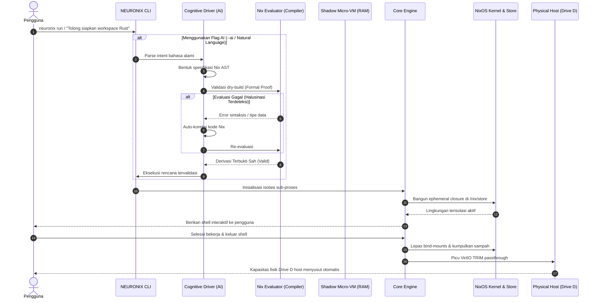

# NEURONIX Specification: System Architecture & Technical Specifications

> **Document ID:** `NRX-ARCH-002`  
> **Status:** APPROVED  
> **Path:** `/home/adamrofc/NEURONIX/Blueprint/02_SYSTEM_ARCHITECTURE.md`  

---

## 1. Architectural Philosophy: The Decoupled Two-Tier Model

Arsitektur **NEURONIX** dibangun di atas pemisahan radikal antara **Mesin Deterministik (Execution Substrate)** dan **Korteks Kognitif (AI Copilot)**. 

Pemisahan ini menjamin bahwa kegagalan, latensi jaringan, atau halusinasi pada lapisan AI **tidak akan pernah bisa merusak atau melumpuhkan stabilitas mesin sistem operasi di bawahnya**.

```text
┌─────────────────────────────────────────────────────────────────────────────┐
│                          USER INTERACTION SURFACE                           │
│       [ Terminal CLI: neuronix ]       [ AI Chat / Natural Language ]       │
└───────────────────────┬───────────────────────────────┬─────────────────────┘
                        │ (Direct Flags)                │ (Natural Language)
                        │                               ▼
                        │             ┌───────────────────────────────────┐
                        │             │   TIER 2: COGNITIVE COPILOT       │
                        │             │   - Natural Language Parser       │
                        │             │   - Nix AST Generator             │
                        │             │   - Compile-Time Dry-Build Guard  │
                        │             │   - Pluggable LLM Backend (MCP)   │
                        │             └─────────────────┬─────────────────┘
                        │                               │ (Validated Plan)
                        ▼                               ▼
┌─────────────────────────────────────────────────────────────────────────────┐
│                        TIER 1: CORE DETERMINISTIC ENGINE                    │
│                                                                             │
│  ┌───────────────────────┐  ┌─────────────────────┐  ┌───────────────────┐  │
│  │   Ephemeral Runner    │  │   Storage Health    │  │   State Manager   │  │
│  │   - Nix-Shell / Bwrap │  │   - Inode Deduper   │  │   - Atomic Switch │  │
│  │   - Dynamic nix-ld    │  │   - VirtIO TRIM     │  │   - Fast Rollback │  │
│  │   - Zero-Garbage Exec │  │   - Min/Max Free    │  │   - Generations   │  │
│  └───────────────────────┘  └─────────────────────┘  └───────────────────┘  │
└───────────────────────────────────────┬─────────────────────────────────────┘
                                        │ (Kernel System Calls & FS Mounts)
                                        ▼
┌─────────────────────────────────────────────────────────────────────────────┐
│                   UNDERLYING SUBSTRATE & HARDWARE VIRTUALIZATION            │
│  - Linux Kernel 6.x (Namespaces, cgroups, tmpfs)                           │
│  - Content-Addressed Inode Store (/nix/store [Read-Only])                  │
│  - Hypervisor Layer (KVM / Quickemu / QEMU / WSL2 Hyper-V)                 │
│  - Physical Host Storage (Drive D / Windows / Arch Linux Host SSD)         │
└─────────────────────────────────────────────────────────────────────────────┘
```

---

## 2. Component Interaction & Execution Flow

Diagram berikut mengilustrasikan alur eksekusi saat pengguna meminta tugas melalui perintah bahasa alami maupun CLI langsung:



---

## 3. Storage Subsystem Specifications

### 3.1 Content-Addressed Store Architecture
Semua paket dan pustaka biner tersimpan di direktori `/nix/store/` dengan format:
$$\texttt{/nix/store/}\langle\text{SHA-256 Hash}\rangle\text{-}\langle\text{Nama Paket}\rangle\text{-}\langle\text{Versi}\rangle$$
- Direktori ini di-mount secara **Read-Only** (`ro`) oleh kernel untuk mencegah mutasi proses yang tak disengaja.
- **In-Kernel Hardlink Deduplication (`auto-optimise-store = true`):** Setiap kali file biner baru dibuat, daemon menghitung *content hash*. Jika ada file dengan isi identik di sistem, file baru dihapus dan digantikan oleh *hardlink inode* ke file yang sudah ada.

### 3.2 Dynamic Disk Guard Thresholds
Untuk mencegah *disk out-of-space panic* saat kompilasi berat, modul storage mengonfigurasi dua batas ambang:
- **`min-free` = `1073741824` (1 GiB):** Ambang batas bawah. Jika sisa ruang disk menyentuh $< 1$ GiB, daemon Nix secara otonom menghentikan build dan memicu *garbage collection* darurat.
- **`max-free` = `3221225472` (3 GiB):** Ambang batas target. Pembersihan darurat akan terus berjalan hingga sisa ruang disk kembali minimal 3 GiB.

### 3.3 VirtIO TRIM Passthrough Pipeline
Pada lingkungan virtualisasi (Quickemu / QEMU / WSL2), file virtual disk (`.qcow2` atau `.vhdx`) bersifat dinamis (*sparse file*):
1. Saat data dihapus di dalam guest OS, blok data pada tabel alokasi internal ditandai kosong, namun ukuran file `.qcow2` di host **tidak mengecil**.
2. **NEURONIX Hypervisor Bridge:** Memanggil utilitas `fstrim -av` melalui protokol `virtio-blk` / `virtio-scsi` dengan opsi `discard=unmap`.
3. Hypervisor QEMU menerima sinyal pembebasan blok dan melakukan *punch hole* (menghapus blok fisik) pada file virtual disk di partisi NTFS/ext4 Drive D host.

---

## 4. Execution & Sandbox Subsystem

### 4.1 Ephemeral Runner Subsystem (`neuronix run`)
- Menggunakan `bwrap` (Bubblewrap) dan `nix-shell` untuk membuat *unprivileged user namespace*.
- Sistem memasang direktori kerja lokal (`$PWD`), sementara pustaka sistem dipetakan secara bersih dari `/nix/store`.
- **Zero Global Mutation:** Tidak ada file yang ditulis ke `/usr/bin` atau `/etc`. Seluruh jejak eksekusi hilang dari memori begitu proses terminal berakhir.

### 4.2 Non-FHS Binary Shim (`nix-ld`)
Untuk memecahkan masalah biner komersial / pihak ketiga (*pre-compiled binaries*):
- Sistem mendaftarkan biner `/run/current-system/sw/share/nix-ld/nix-ld.so` sebagai interpreter default di kernel via `/lib64/ld-linux-x86-64.so.2`.
- `nix-ld` membaca *environment variable* `NIX_LD_LIBRARY_PATH` dan secara otomatis memetakan panggilan pustaka dinamik (`dlopen`, `libc`, `libstdc++`, `glibc`) ke jalur yang sesuai di `/nix/store`.

---

## 5. Technology Stack Specification

| Komponen | Pilihan Teknologi | Alasan Desain Teknis |
| :--- | :--- | :--- |
| **CLI Core Language** | **Rust / Modern POSIX Shell** | Biner kompilasi tunggal (*single static binary*), nol dependensi runtime, eksekusi dalam milidetik, aman memori. |
| **Declarative Substrate** | **NixOS + Nix Flakes (Nix 2.24+)** | Standar emas reproduktibilitas murni, hermetis, dan *content-addressed storage*. |
| **Sandbox & Namespace Engine**| **Bubblewrap (`bwrap`) + Systemd Slices** | Isolasi proses tanpa hak akses root (*unprivileged rootless sandboxing*). |
| **AI Protocol Standard** | **Model Context Protocol (MCP)** | Standar terbuka komunikasi agen AI (kompatibel dengan Antigravity, Claude Code, Cursor, dll.). |
| **Virtualization Backend** | **QEMU / KVM / Quickemu (VirtIO)** | Akselerasi perangkat keras mendekati *bare metal* dengan dukungan passthrough TRIM dan Spice. |
| **Local LLM Driver** | **Ollama / llama.cpp (Opsional)** | Menjalankan model lokal 100% offline (misal: DeepSeek-Coder, Qwen2.5-Coder). |
| **Cloud LLM Driver** | **Google Gemini / OpenAI / Grok API** | Penanganan intensi bahasa alami tingkat tinggi saat koneksi internet aktif. |
