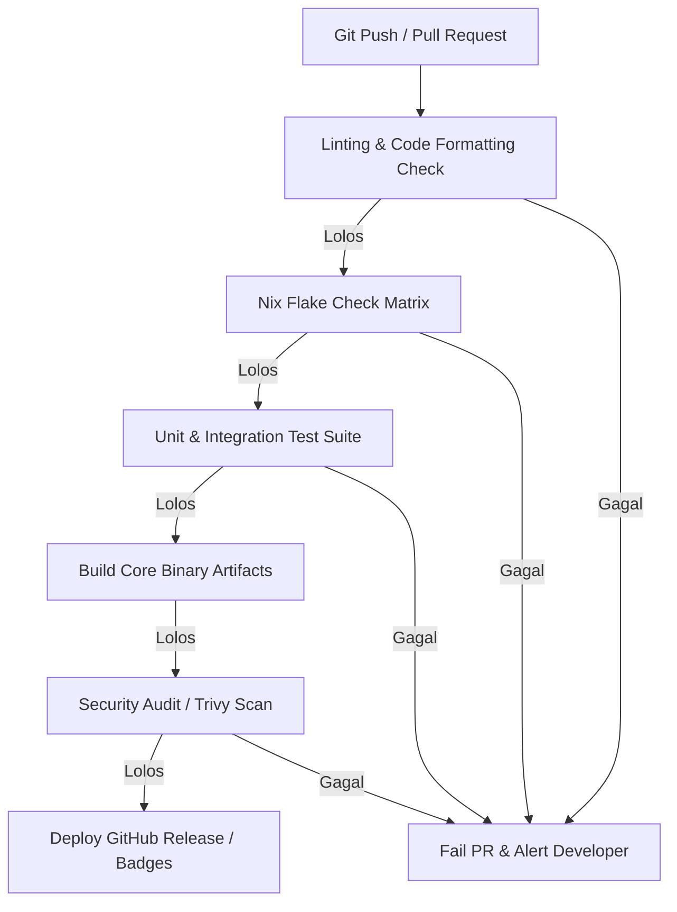

# NEURONIX Specification: Quality Gates, Testing & Validation Protocols

> **Document ID:** `NRX-QUAL-005`  
> **Status:** APPROVED  
> **Path:** `Blueprint/05_QUALITY_GATES_AND_VALIDATION.md`  

---

## 1. The Zero-Bug Quality Assurance Framework

Untuk menghasilkan proyek portofolio bertaraf internasional yang dipercaya oleh tim engineering global, **NEURONIX** menerapkan filosofi **Correctness-by-Construction**:
- Tidak ada fitur yang dianggap selesai (*Done*) hanya karena "kelihatannya jalan".
- Setiap modul wajib lolos pengujian berulang (*automated continuous testing*) dan memiliki bukti telemetri kuantitatif.

---

## 2. Matriks Pengujian Lengkap (Testing Matrix)

| Level Pengujian | Ruang Lingkup | Metode / Perkakas | Batas Ambang Kelulusan (*Pass Threshold*) |
| :--- | :--- | :--- | :--- |
| **Unit Testing** | Parser argumen CLI, pembuat Nix AST, logika pembacaan storage. | Test runner internal (Rust / Bats shell) | 100% test pass; cakupan kode (*coverage*) $\ge 85\%$. |
| **Compiler Static Check** | Struktur Flake, sintaksis Nix expression, validitas tipe data modul. | `nix flake check --all-systems` | Zero warnings, zero syntax errors. |
| **Integration Testing** | Subshell runner (`run`), isolasi Bubblewrap, pemanggilan loader `nix-ld`. | Automated integration script di sub-proses | Proses mampu mengeksekusi biner luar tanpa crash. |
| **Storage Shrink Validation** | Pengurangan ukuran file `.qcow2` di host dan pelepasan inode. | Perbandingan `stat -c %s` dan `df -h` sebelum & sesudah `diet` | Minimal pengurangan blok $\ge 90\%$ dari ukuran data terhapus. |
| **Rollback Regression** | Simulasi kerusakan konfigurasi dan pemulihan generasi. | `neuronix undo` test suite | Sistem kembali ke hash generasi sebelumnya dalam $< 3$ detik. |
| **Security CVE Audit** | Scanner image container hasil ekspor `neuronix export`. | Trivy / Grype scanner | **0 Critical CVE, 0 High CVE**. |

---

## 3. Protokol Verifikasi Pra-Rilis (*Release Gates Checklist*)

Sebelum versi rilis (tag Git) diterbitkan ke publik, tim pengembang wajib menandatangani checklist validasi berikut:

- [ ] **Gate 1: Formally Proven Derivations**  
  Seluruh file `.nix` dan `flake.nix` lolos evaluasi deterministik tanpa flag `--impure`.
- [ ] **Gate 2: Offline Resilience Verified**  
  Mematikan koneksi internet (kabel/Wi-Fi terputus). Menjalankan `neuronix status`, `neuronix diet`, dan `neuronix undo`. Semua perintah wajib sukses tanpa ketergantungan jaringan.
- [ ] **Gate 3: Hypervisor Passthrough Confirmed**  
  Menjalankan `neuronix diet` di dalam VM, lalu mengaudit ukuran fisik file `.qcow2` di partisi Host Physical Storage komputer host. Ukuran file terbukti menyusut.
- [ ] **Gate 4: Non-FHS Binary Compatibility**  
  Menjalankan biner Linux pihak ketiga (misal: biner Node.js / Go resmi non-Nix). Biner wajib tereksekusi mulus berkat modul `nix-ld`.
- [ ] **Gate 5: Documentation Integrity**  
  Dokumen README, diagram alur, dan lisensi terverifikasi valid tanpa ada tautan rusak (*broken links*).

---

## 4. Definition of Done (DoD)

Sebuah fitur atau pull-request resmi dinyatakan **DONE** jika dan hanya jika:
1. **Kode Bersih:** Mengikuti pedoman formatting baku (`nixpkgs-fmt`, `rustfmt`, atau `shfmt`).
2. **Pengujian Otomatis Tersedia:** Memiliki minimal satu unit test dan satu integration test yang menyertai fitur tersebut.
3. **Dokumentasi Terbarui:** Perubahan flag atau perintah CLI sudah tercatat pada panduan manual (`docs/`).
4. **Idempotensi Terbukti:** Menjalankan perintah yang sama 3 kali berturut-turut menghasilkan kondisi sistem yang identik tanpa efek samping (*no side-effects*).
5. **Review Disetujui:** Lolos peninjauan kode (*code review*) dan tidak melanggar 4 Prinsip Arsitektur Utama (The Prime Directives).

---

## 5. Alur Otomasi CI/CD (GitHub Actions)

Setiap kali ada commit atau Pull Request yang masuk ke repositori GitHub, alur CI/CD berikut akan dipicu secara otomatis:

Dengan menerapkan standar kualitas dan validasi yang begitu disiplin ini, repositori **NEURONIX** di GitHub akan dinilai oleh komunitas global sebagai perangkat lunak kelas enterprise dengan reliabilitas setara proyek-proyek open-source legendaris.
