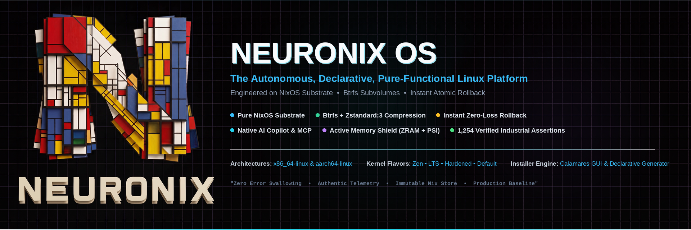

<p align="center">
  
</p>

<p align="center">
  <a href="LICENSE"></a>
  <a href="https://github.com/adamriofc/neuronix/releases/tag/v1.0.3"></a>
  <a href="version.nix"></a>
  <a href="flake.nix"></a>
  <a href="#platform-architecture"></a>
  <a href="#verification--test-harness"></a>
  <a href="#storage-architecture--maintenance"></a>
  <a href="#memory-pressure-management"></a>
  <a href=".github/workflows/ci.yml"></a>
</p>

<p align="center">
  <strong>NEURONIX OS: A Declarative, Developer-First Linux Desktop Built on NixOS</strong><br>
  <em>Try system changes before they touch your workstation &bull; Reproducible developer environments in one command &bull; Safe atomic generation recovery</em>
</p>

<p align="center">
  <strong>BUILD</strong> Reproducible Environments &bull; <strong>TRY</strong> Safe Micro-VM Experimentation &bull; <strong>RECOVER</strong> Fearless Atomic Generations
</p>

---

## Table of Contents

- [Overview](#overview)
- [Primary Purpose, Target Audience & Operational Scenarios](#primary-purpose-target-audience--operational-scenarios)
  - [Design Objectives & Core Utility](#design-objectives--core-utility)
  - [Intended Audience & Professional Roles](#intended-audience--professional-roles)
  - [Optimal Use Cases & Deployment Profiles](#optimal-use-cases--deployment-profiles)
- [Architectural Comparison: Head-to-Head Matrix](#architectural-comparison-head-to-head-matrix)
  - [Scope & Evaluation Baseline](#scope--evaluation-baseline)
  - [Comparative Feature & Architecture Matrix](#comparative-feature--architecture-matrix)
  - [In-Depth Architectural Differentiators](#in-depth-architectural-differentiators)
- [Release Engineering & Version Truth](#release-engineering--version-truth)
- [Feature Status & Assurance Hierarchy](#feature-status--assurance-hierarchy)
- [Platform Architecture](#platform-architecture)
- [Storage Architecture & Maintenance](#storage-architecture--maintenance)
  - [Btrfs Subvolume Topology](#btrfs-subvolume-topology)
  - [Transparent Block Compression (ZSTD:3)](#transparent-block-compression-zstd3)
  - [Auto-TRIM and Storage Reclamation](#auto-trim-and-storage-reclamation)
  - [Btrfs Metadata Balance Timer](#btrfs-metadata-balance-timer)
  - [Filesystem Options: Btrfs vs EXT4](#filesystem-options-btrfs-vs-ext4)
- [Memory Pressure Management](#memory-pressure-management)
  - [ZRAM In-Memory Swap Pool](#zram-in-memory-swap-pool)
  - [Kernel Paging Tuning (vm.swappiness = 180)](#kernel-paging-tuning-vmswappiness--180)
  - [Pressure Stall Information (PSI) & systemd-oomd](#pressure-stall-information-psi--systemd-oomd)
- [Hardware Compatibility Matrix & Profiles](#hardware-compatibility-matrix--profiles)
- [Command-Line Reference (neuronix)](#command-line-reference-neuronix)
- [Core System Components](#core-system-components)
  - [1. Declarative Calamares Installation Engine](#1-declarative-calamares-installation-engine)
  - [2. System Control Center (neuronix-center)](#2-system-control-center-neuronix-center)
  - [3. Isolated Development Environments (neuronix dev)](#3-isolated-development-environments-neuronix-dev)
  - [4. In-Memory Micro-VM Simulation (neuronix try)](#4-in-memory-micro-vm-simulation-neuronix-try)
  - [5. Model Context Protocol (MCP) Server](#5-model-context-protocol-mcp-server)
  - [6. OpenCode AI System Copilot & Autonomous Updates](#6-opencode-ai-system-copilot--autonomous-updates)
  - [7. Autonomous Update Architecture & Desktop Notifier](#7-autonomous-update-architecture--desktop-notifier)
  - [8. First-Boot Welcome Hub & Onboarding Wizard](#8-first-boot-welcome-hub--onboarding-wizard)
  - [9. System Doctor & Privacy-Sanitized Issue Reporter](#9-system-doctor--privacy-sanitized-issue-reporter)
  - [10. Curated Quickstart App Hub (Flatpak)](#10-curated-quickstart-app-hub-flatpak)
  - [11. Declarative Kernel Flavor Manager](#11-declarative-kernel-flavor-manager)
- [Building & Installation](#building--installation)
- [Post-Installation Administration](#post-installation-administration)
- [Verification, Lifecycle Gate & Test Harness (854 Assertions)](#verification--test-harness)
- [Architecture Decision Records (ADRs)](#architecture-decision-records-adrs)
- [License](#license)

---

## Overview

NEURONIX OS is an independent, declarative Linux distribution platform based on NixOS. It provides an automated Calamares installation workflow, pre configured hardware and kernel profiles, transactional desktop environments, and developer CLI utilities while maintaining full compatibility with the upstream Nix package ecosystem.

### Release Engineering & Version Truth
- **Single Source of Truth (`version.nix`):** All components (CLI, GUI Center, MCP Daemon, Calamares installer engine, release manifests, package derivations) read canonical versioning from `version.nix`.
- **Release `v1.0.0` (Frozen GA):** Immutable initial General Availability release tag.
- **Release `v1.0.3` (Hardened Production Baseline on `main`):** Actively maintained release incorporating comprehensive architectural hardening, truthful error propagation, injection proof verification, privacy-preserving doctor diagnostics, end-to-end lifecycle verification gates, runtime telemetry, multi arch flake outputs, and MCP JSON-RPC protocol compliance.
- **Development Channel Baseline:** Tracks `nixos-unstable` for modern Linux kernels, Wayland compositors, and rapid developer tooling.
- **Production Stable Baseline:** Targets `nixos-26.05` for conservative enterprise stability and verified patch streams.
- **State Version (`system.stateVersion = "24.11"`):** The immutable NixOS state migration baseline preserving data directory layouts and system state compatibility across upgrades.

---

## Primary Purpose, Target Audience & Operational Scenarios

### Design Objectives & Core Utility

NEURONIX OS is engineered to resolve fundamental operational vulnerabilities common to traditional Linux distributions: configuration drift, dependency breakage during upgrades, lack of system state reproducibility, and fragile disaster recovery. Built on a pure-functional NixOS substrate, NEURONIX OS elevates declarative configuration from a specialized sysadmin toolkit into an enterprise-ready, desktop-grade operating platform.

Its primary design objectives are:

1. **Deterministic State Reproducibility:**
   Every package derivation, system daemon, kernel option, and configuration parameter is declared as pure code within `flake.nix` and pinned cryptographically via `flake.lock`. Deploying a configuration across multiple physical or virtual nodes produces mathematically identical systems, eliminating divergent package closures and unrecorded host mutations.

2. **Atomic Generational Lifecycle with Zero-Loss Rollback:**
   Operating system upgrades and package modifications are compiled and staged into isolated cryptographic store paths (`/nix/store`) before system symlink pointers are switched atomically. The running operating system is never modified in-place. If an update introduces regressions or unbootable states, users and automated recovery services can revert to the previous operational generation instantly at the bootloader or from the active shell (`nixos-rebuild --rollback` or `neuronix-rollback`) without data loss.

3. **Turnkey Desktop Ergonomics on an Immutable Foundation:**
   Functional package managers historically impose steep friction for desktop users. NEURONIX OS bridges this divide by providing a declarative Calamares installer engine, automated hardware profile detection, out-of-the-box global FHS binary execution via `nix-ld` (enabling unpatched execution of VS Code, proprietary CLI tools, and CUDA binaries), and a dual-layer application model pairing immutable core system derivations with user-managed Flathub Flatpaks.

4. **Autonomous Reliability & Local AI Developer Substrate:**
   Modern workstations require active telemetry and intelligent maintenance. NEURONIX integrates memory pressure defenses (ZRAM ZSTD compression paired with Pressure Stall Information monitoring via systemd-oomd), background storage hygiene (automated TRIM, metadata balancing, and store deduplication), and an embedded OpenCode AI copilot coupled with a standardized Model Context Protocol (MCP) JSON-RPC 2.0 interface.

---

### Intended Audience & Professional Roles

NEURONIX OS is purpose-built for technical professionals and organizations requiring uncompromising system predictability, security isolation, and developer agility:

- **Systems Engineers & Site Reliability Engineers (SREs):**
  Engineers who treat infrastructure as code. NEURONIX provides a workstation environment that mirrors modern cloud native deployment patterns, enabling local testing of complex declarative environments that compile directly to production-grade server appliances without environmental discrepancies.

- **AI & Machine Learning Researchers:**
  Practitioners requiring isolated, reproducible compute stacks. The `neuronix dev ai` substrate provides immediate access to PyTorch, CUDA runtime libraries, JupyterLab, and Ollama without polluting system libraries or conflicting with host NVIDIA display drivers.

- **Security Analysts & Penetration Testers:**
  Specialists requiring auditable environments with minimal attack surfaces. NEURONIX supports hardened kernel branches (`linuxPackages_hardened`), cryptographically sealed package closures, ephemeral in-memory micro-VM evaluation (`neuronix try`), and isolated execution sandboxes (`neuronix run --sandbox`).

- **Full-Stack & Cloud-Native Developers:**
  Engineers working across polyglot stacks (Rust, Go, Python, TypeScript, Node.js). NEURONIX eliminates global package version conflicts through instant project level development shells (`neuronix dev <stack>`), while `nix-ld` enables direct execution of standard pre-compiled dynamic ELF binaries.

- **Production Workstation Operators:**
  Users who depend on daily system availability. Traditional rolling-release systems risk catastrophic breakage during routine updates; NEURONIX delivers modern packages (Linux Zen kernel, Wayland compositors, modern desktop environments) backed by deterministic boot time rollback to previous working generations.

---

### Optimal Use Cases & Deployment Profiles

- **Mission-Critical Engineering Workstations:**
  Primary daily-driver operating system for engineering organizations where workstation downtime equates to lost development velocity. Routine updates occur without fear of library incompatibilities, and complete disaster recovery requires seconds rather than system reinstallation.

- **Autonomous Edge & Local AI Inference Nodes:**
  Dedicated local hardware running persistent background reasoning models, autonomous code agents, and automated data pipelines via the OpenCode background daemon and MCP JSON-RPC protocol transport.

- **Hermetic Build & Clean-Room Verification Environments:**
  Building and verifying software packages in pure, isolated sandboxes where external host state, ambient environment variables, and unpinned network dependencies are strictly blocked from influencing compilation outputs.

- **Rapid Hardware Qualification & Benchmarking:**
  Validating modern PC and laptop hardware across distinct performance profiles. Switching between low-latency scheduling (`zen`), conservative enterprise stability (`lts`), or attack-surface hardened (`hardened`) kernels requires modifying a single declarative configuration attribute.

---

## Architectural Comparison: Head-to-Head Matrix

### Scope & Evaluation Baseline

To evaluate NEURONIX OS objectively, it is compared directly against leading operating systems occupying equivalent architectural niches:

1. **Vanilla NixOS:** Upstream pure-functional parent platform.
2. **Fedora Silverblue / Atomic Desktops:** Modern enterprise-backed immutable OSTree image platform.
3. **openSUSE MicroOS / Aeon:** Transactional snapshot-based rolling distribution using Btrfs and Snapper.
4. **EndeavourOS / Arch Linux:** Mainstream bleeding-edge rolling release distribution for software developers.

---

### Comparative Feature & Architecture Matrix

| Architectural Dimension | NEURONIX OS (v1.0.3) | Vanilla NixOS (24.11/Unstable) | Fedora Silverblue (Atomic) | openSUSE MicroOS / Aeon | EndeavourOS / Arch Linux |
| :--- | :--- | :--- | :--- | :--- | :--- |
| **System Paradigm** | Pure-functional declarative substrate | Functional declarative toolkit | Image-based OSTree composition | Transactional Btrfs snapshots | Imperative mutable Unix filesystem |
| **Configuration Model** | Single declarative Flake (`flake.nix`) | Declarative Nix expressions or channels | Imperative package layering (`rpm-ostree`) | Imperative packages via `transactional-update` | Imperative commands (`pacman`, Arch build system) |
| **Store Immutability** | Cryptographic read-only `/nix/store` | Cryptographic read-only `/nix/store` | Read-only `/usr` deployment tree | Read-only root filesystem snapshot | Fully mutable root and `/usr` trees |
| **Upgrade & Rollback Mechanism** | Atomic live symlink switch; instant zero-loss rollback | Atomic live symlink switch; instant boot generation rollback | OSTree deployment switch; requires reboot to activate | Btrfs root snapshot switch; requires reboot to activate | In-place library overwrites; manual chroot or snapshot recovery |
| **Out-of-the-Box GUI Installer** | Calamares GUI generating pure Nix Flakes | Minimal text installer; Calamares without flake generation | Anaconda graphical installer | Agama / YaST automated installer | Calamares graphical installer |
| **Hardware Detection Architecture** | Declarative 27-pillar matrix; offline firmware; PRIME offload | Manual `hardware-configuration.nix`; user-configured drivers | Automated via Anaconda; layered driver packages | Automated via YaST hardware database | User-managed via Arch Wiki and Pacman |
| **Kernel Tiering Support** | Declarative switch: `zen`, `lts`, `hardened`, `default` | Manual Nixpkgs package overrides | Stock Fedora kernel; manual kmods | Stock openSUSE kernel; rolling branch | Manual Pacman kernel packages |
| **Memory Pressure Shield** | ZRAM Zstandard pool + PSI monitoring + systemd-oomd | Manual `zram-generator` and service configuration | Stock systemd-oomd; standard swap | Stock systemd-oomd; zram configuration | Manual setup (`earlyoom`, `systemd-swap`) |
| **FHS Dynamic Binary Compatibility** | Pre-configured `nix-ld` for VS Code, CUDA, and ELFs | Requires manual `nix-ld` or `steam-run` wrapping | Handled via Toolbox / Distrobox containers | Handled via Distrobox containers | Native POSIX/FHS directory hierarchy |
| **AI Copilot & Telemetry Daemon** | Native OpenCode daemon + MCP JSON-RPC 2.0 server | None (user-installed applications only) | None (user-installed applications only) | None (user-installed applications only) | None (user-installed applications only) |
| **Storage Topology & Compression** | 5 Btrfs subvolumes (`@`, `@home`, `@nix`, `@snapshots`, `@swap`) + ZSTD:3 | User-defined partitioning (defaults to monolithic) | Btrfs root with subvolumes; no transparent compression | Btrfs root with Snapper read-only subvolumes | Monolithic Btrfs or EXT4 without subvolume convention |
| **Automated Assurance Gate** | 854 verified assertions across 23 test suites (100% Pass) | Hydra continuous integration build checks | Fedora Zuul CI / openQA test suites | openQA automated validation matrix | User community testing repository |

---

### In Depth Architectural Differentiators

#### 1. NEURONIX OS vs. Vanilla NixOS
Vanilla NixOS provides an exceptional functional package management paradigm, but operates fundamentally as an infrastructure toolkit rather than a cohesive, out-of-the-box desktop distribution. A user installing vanilla NixOS must manually architect their Btrfs subvolume layout, configure swap parameters, script hardware driver integrations (such as NVIDIA PRIME offloading), research dynamic linker workarounds for proprietary software (`nix-ld`), and resolve complex multi-desktop configurations.

NEURONIX OS transforms this substrate into an engineered, production ready distribution. It ships with a customized Calamares installation engine that generates production grade Nix Flakes directly from graphical user inputs, provisions an opinionated 5 subvolume Btrfs topology with transparent ZSTD:3 compression, pre-configures memory defenses (ZRAM + PSI telemetry), enables seamless FHS binary execution, embeds local AI copilot services via MCP, and validates every build against an 854 assertion test taxonomy. Crucially, NEURONIX achieves this without forking upstream Nixpkgs, ensuring zero security patch latency.

#### 2. NEURONIX OS vs. Fedora Silverblue / Atomic Desktops
Fedora Silverblue enforces immutability by composing system states as read-only OSTree commits. While effective at preventing host corruption, Silverblue introduces significant operational overhead:
- Modifying layered packages requires invoking `rpm-ostree install` followed by a mandatory system reboot to switch deployment targets. In contrast, NEURONIX updates packages and system configurations live at runtime via atomic symlink activation (`nixos-rebuild switch`) without requiring reboots.
- Silverblue relies on container layers (Toolbox or Distrobox) for everyday development, separating developer toolchains from the host desktop. NEURONIX integrates hermetic development environments natively through Nix Flakes (`neuronix dev <stack>`), allowing development shells to interact directly with host hardware accelerators and graphics pipelines.
- Rollbacks in NEURONIX preserve arbitrary past generations indefinitely until explicitly garbage-collected, whereas OSTree typically retains only the immediate previous deployment pin.

#### 3. NEURONIX OS vs. openSUSE MicroOS / Aeon
openSUSE MicroOS and Aeon achieve system resilience by mounting the root partition as a read-only Btrfs snapshot and performing atomic transactional updates via `transactional-update` and Snapper. While this safeguards against interrupted update writes, the underlying package manager remains imperative. Two systems installed with the same package manifests at different times can yield divergent states due to repository state shifts.

NEURONIX OS couples filesystem resilience with mathematical reproducibility. System state is defined as pure functional derivations locked to cryptographic commit hashes via `flake.lock`. Furthermore, NEURONIX separates the immutable Nix store (`@nix`) from user data (`@home`) and snapshot storage (`@snapshots`), ensuring that rolling back system generations never impacts user documents, browser profiles, or container state.

#### 4. NEURONIX OS vs. EndeavourOS / Arch Linux
EndeavourOS provides an accessible Calamares installer on top of Arch Linux, earning widespread popularity among software developers seeking rolling-edge packages. However, Arch Linux adheres to an imperative, mutable filesystem model. System upgrades modify shared dynamic libraries (`.so` files) in-place on the live root partition. If an upgrade is interrupted or introduces broken dependency chains, the host can become unbootable, requiring manual recovery via `arch-chroot` from a live USB.

NEURONIX OS matches the desktop convenience and performance of EndeavourOS (graphical Calamares setup, first-boot Welcome Hub, Zen kernel scheduling, cutting-edge Wayland desktops) while entirely eliminating mutable dependency fragility. In NEURONIX, new package closures are downloaded and verified in isolation before being linked into the active generation. If any component fails, the previous working generation remains untouched and can be selected instantly from the bootloader menu.

---

## Feature Status & Assurance Hierarchy

To ensure complete architectural truthfulness, system capabilities in NEURONIX OS are explicitly categorized into three distinct assurance tiers:

| Assurance Level | Definition | Subsystems & Features |
| :--- | :--- | :--- |
| ✅ **VERIFIED** | Validated through automated test suites and contract assertions. | Pure Nix declarative substrate, atomic generation rollbacks, 27-pillar hardware compatibility contracts, Calamares installer engine, Btrfs subvolume layout, ZRAM memory shield, PipeWire duplex audio, dev toolchain stacks (Python/Rust/Node/Go/AI/Web3). |
| 🟡 **IMPLEMENTED** | Declared in production system modules; hardware and runtime qualification actively in progress. | KDE Plasma 6 Wayland desktop, GNOME 47 desktop, Hyprland Wayland compositor with SDDM greeter, NVIDIA PRIME render offload module, battery charge ceiling daemon, real-time hardware telemetry center. |
| 🔵 **EXPERIMENTAL** | Prototype integration or optional hardware-dependent research features. | Lanzaboote UEFI Secure Boot signing chain, QEMU in-memory Shadow Micro-VM evaluation (`neuronix try`), Model Context Protocol (MCP) JSON-RPC daemon. |

---

## Platform Architecture

```text
                                  NEURONIX OS PLATFORM
                                           │
  ┌────────────────────────────────────────┴────────────────────────────────────────┐
  │                                                                                 │
[ LAYER 1: USER EXPERIENCE (UX) ]                               [ LAYER 2: DESKTOP & SYSTEM CORE ]
  ├─ Calamares Graphical Installer (Declarative Generator)        ├─ Pure Nix Substrate (Immutable /nix/store)
  ├─ NEURONIX Center (GUI System Hub & Telemetry)                 ├─ Hardware Hardening & Compatibility Matrix
  ├─ Generation Management & Instant Symlink Rollbacks            ├─ Global Dynamic Linker (nix-ld)
  ├─ Dual-Layer Software Model (Nix Core + Flathub Flatpak)       ├─ Atomic Symlink Pointer Management
  └─ Desktop Environments: KDE Plasma 6, GNOME, Hyprland          └─ Generation-Aware Shell Prompt [Gen #N]
  │                                                                                 │
  ├─────────────────────────────────────────────────────────────────────────────────┤
  │                                                                                 │
[ LAYER 3: DEVELOPER ENGINE ]                                   [ LAYER 4: RELIABILITY & AI SUBSTRATE ]
  ├─ neuronix dev python (uv, ruff, pyright, postgresql)          ├─ Model Context Protocol (MCP) Server (JSON-RPC 2.0)
  ├─ neuronix dev rust   (rustc, cargo, rust-analyzer, clippy)   ├─ In-Memory Shadow Micro-VM Simulator (neuronix try)
  ├─ neuronix dev node   (node 20, pnpm, typescript, eslint)      ├─ Declarative Derivation Verification (neuronix verify)
  ├─ neuronix dev ai     (pytorch, cuda, ollama, jupyterlab)      ├─ Storage Pruner & VirtIO TRIM (neuronix diet)
  └─ neuronix dev go     (compiler, gopls, golangci-lint, delve)  └─ 854 Automated Test Assertions (100% Pass)
```

---

## Storage Architecture & Maintenance

NEURONIX formats system drives with Btrfs using transparent Zstandard compression, structured subvolumes, and automated maintenance timers.

### Btrfs Subvolume Topology
Storage partitioning uses an isolated subvolume layout:

| Subvolume | Mount Point | Mount Options | Purpose |
| :--- | :--- | :--- | :--- |
| `@` | `/` | `compress=zstd:3,noatime,space_cache=v2` | Root filesystem and declarative system configuration pointers. |
| `@nix` | `/nix` | `compress=zstd:3,noatime` | Immutable `/nix/store` directory. |
| `@home` | `/home` | `compress=zstd:3,noatime` | User home directories and documents. |
| `@snapshots` | `/.snapshots` | `compress=zstd:3,noatime` | Storage for manual and automated filesystem snapshots. |
| `@swap` | `/swap` | `nodatacow,noatime` | Dedicated swapfile subvolume with Copy-on-Write disabled to prevent fragmentation. |

### Transparent Block Compression (ZSTD:3)
All read-write filesystem subvolumes use Zstandard level 3 (`zstd:3`) compression.
- **Disk Usage:** Materially reduces physical storage consumption for compressible store paths and text/data files, with actual compression ratios varying by package composition.
- **Throughput:** Minimizes raw byte transfers from NVMe/SATA storage, reducing solid-state write wear and improving real-world read times.

### Auto TRIM and Omni Purging Storage Diet Engine
SSD performance degradation and sparse disk image inflation (in QEMU/KVM virtual machines) are addressed automatically through a multi-layered maintenance strategy:
1. **Host Auto TRIM (`fstrim.timer`):** Issues discard calls (`fstrim -av`) across all mounted Btrfs and ESP partitions daily. This informs SSD controllers and hypervisors of deallocated blocks.
2. **Autonomous Garbage Collection (`nix.gc`):** Runs weekly garbage collection (`nix-gc.timer`) with a 14-day retention policy (`--delete-older-than 14d`), establishing a practical policy trade-off between disk reclamation and long-term rollback availability while purging orphaned package closures.
3. **Hardlink Deduplication (`nix.optimise` & `auto-optimise-store = true`):** Automatically hardlinks identical binary files across derivations within `/nix/store`; this can materially reduce duplicated store content, with exact savings depending on installed package composition.
4. **Dynamic Storage Guard (`min-free` & `max-free`):** In-kernel Nix daemon safeguards disk space by triggering emergency collections if free space drops below 1.0 GiB until 3.0 GiB headroom is recovered.
5. **Systemd Journal Retention Ceiling (`services.journald`):** Caps `/var/log/journal` storage at 500 MiB with 1-month retention, preventing runaway log file consumption.
6. **Ephemeral `/tmp` & Flatpak Runtime Hygiene:** Purges stale `/tmp` files on every boot (`boot.tmp.cleanOnBoot = true`) and automatically prunes unreferenced Flatpak runtimes via `flatpak-prune-unused.timer`.
7. **One-Command Unified Diet (`neuronix diet`):** Orchestrates Nix Store GC, Inode Deduplication, Flatpak Unused Pruning, Journal Vacuuming, and Host Physical TRIM in a single command, reporting reclaimed disk space.

### Btrfs Metadata Balance Timer
Over time, Btrfs can accumulate sparsely populated block groups, causing `ENOSPC` errors even with remaining free space.
- A systemd timer (`btrfs-balance.timer`) runs once a month (`OnCalendar=monthly`, `Persistent=true`).
- It filters and compacts under-allocated chunks (`btrfs balance start -dusage=10 -musage=10 /`), maintaining filesystem performance without manual intervention.

### Filesystem Options: Btrfs vs EXT4

While Btrfs is the default and recommended filesystem for NEURONIX, standard **EXT4** is fully supported out of the box:

- **Kernel & Driver Support:** The Linux kernel includes native drivers for both filesystems via `boot.supportedFilesystems = [ "btrfs" "ntfs" "exfat" "ext4" "vfat" ]`.
- **Automated Configuration:** When selecting EXT4 in Calamares Manual Partitioning, `nixos-generate-config` automatically captures the partition UUID and writes `fileSystems."/".fsType = "ext4"` to `hardware-configuration.nix`.
- **Generation Rollback Independence:** System generation immutability and atomic rollback mechanisms reside in the Nix store engine, not the underlying filesystem. Generation rollbacks in systemd-boot operate identically on both Btrfs and EXT4.

| Architectural Dimension | Btrfs (Default) | EXT4 (Supported Alternative) |
| :--- | :--- | :--- |
| **Partition Structure** | Structured subvolumes (`@`, `@nix`, `@home`, `@snapshots`, `@swap`) | Traditional monolithic root partition (`/`) |
| **Transparent Compression** | In-kernel Zstandard level 3 (`zstd:3`) materially reduces storage usage for compressible data | Uncompressed storage (requires larger disk allocation) |
| **Maintenance Workload** | Automated monthly chunk rebalancing via `btrfs-balance.timer` | Zero filesystem maintenance overhead (standard fsck) |
| **I/O Overhead** | Copy-on-Write metadata tracking | Minimal filesystem overhead, stable raw write throughput |
| **Recommended Use Case** | Modern NVMe/SATA SSDs with limited physical storage capacity | Traditional magnetic disks (HDDs), USB storage, or high-throughput databases |

---

## Memory Pressure Management

To prevent system lockups under memory exhaustion, NEURONIX implements a three-tier memory management strategy using ZRAM, tuned kernel paging parameters, and `systemd-oomd`:

| Tier | Component | Configuration / Path | Action |
| :--- | :--- | :--- | :--- |
| **1. Swap Pool** | ZRAM (ZSTD) | `zramSwap.enable = true` | Compressed RAM block device sized to 100% of physical RAM capacity. |
| **2. Paging Policy** | sysctl | `vm.swappiness = 180`, `page-cluster = 0` | Moves idle anonymous memory pages into compressed ZRAM early to preserve uncompressed RAM for active workloads. |
| **3. Eviction Guard** | `systemd-oomd` | `/proc/pressure/memory` | Monitors Pressure Stall Information (PSI) to react to sustained memory saturation according to configured systemd policy. |

### ZRAM In-Memory Swap Pool
- Configured using `zram-generator` with the ZSTD compression algorithm.
- Provides an in-memory swap pool expanding effective memory headroom by 1.5x to 2.5x on compressible data, maintaining interactive responsiveness under memory pressure with minimal CPU overhead.

### Kernel Paging Tuning (vm.swappiness = 180)
- The default Linux swappiness value (60) delays swapping until memory is nearly exhausted, increasing the risk of disk thrashing.
- Setting `vm.swappiness = 180` and `vm.page-cluster = 0` shifts idle background memory into ZRAM early, keeping physical memory free for compilers and desktop applications.

### Pressure Stall Information (PSI) & systemd-oomd
- The kernel continuously monitors memory pressure via Pressure Stall Information (`/proc/pressure/memory`).
- When memory stall duration exceeds 10% for more than 10 seconds, `systemd-oomd` terminates the responsible application, preventing desktop UI freezes.

---

## Hardware & Subsystem Configuration Matrix

NEURONIX includes declarative configurations addressing standard desktop and laptop hardware requirements across 27 subsystem domains. For empirical platform qualifications across reference platforms (ThinkPad, Framework, Dell XPS, ASUS ROG Zephyrus, QEMU KVM, Apple Silicon), see the [Reference Hardware Qualification Matrix](docs/hardware_profiles.md).

| Subsystem Domain | Technical Objective | Declarative Implementation | Configuration Module |
| :--- | :--- | :--- | :--- |
| **Package Licensing** | Proprietary drivers and runtime compatibility (Steam, NVIDIA, codecs) | `nixpkgs.config.allowUnfree = true` | `modules/core/default.nix` |
| **RTC Synchronization** | Real-time clock synchronization in multi-boot environments | `time.hardwareClockInLocalTime = true` | `modules/hardware/boot.nix` |
| **Filesystem Maintenance** | Metadata chunk fragmentation prevention on active Btrfs volumes | Automated monthly `btrfs-balance` systemd timer | `modules/services/storage.nix` |
| **Storage Reclamation** | Autonomous SSD TRIM and sparse disk reclamation (Auto-TRIM) | Daily `fstrim.timer` + `auto-optimise-store` hardlink dedupe | `modules/services/storage.nix` |
| **Application Ecosystem** | Sandboxed desktop application integration without root modification | Dual-layer distribution: immutable Nix core + Flathub Flatpak | `modules/services/flatpak.nix` |
| **Boot Partition Guard** | EFI System Partition storage overflow prevention | 1.0 GiB ESP standard with generation prune threshold (`configurationLimit = 15`) | `modules/hardware/boot.nix` |
| **Offline Firmware** | Out-of-the-box Wi-Fi and Bluetooth chipset connectivity | Full redistributable firmware bundle (Broadcom, Realtek, Intel) | `modules/hardware/firmware.nix` |
| **Hybrid Graphics** | Dynamic dGPU power gating on Optimus/PRIME laptops | Declarative NVIDIA PRIME Render Offload configuration (Status: Implemented) | `modules/hardware/nvidia-prime.nix` |
| **Secure Boot** | Compatibility with UEFI Secure Boot firmware policies | Lanzaboote signed boot integration (Status: Experimental, requires MOK enrollment) | `modules/hardware/secureboot.nix` |
| **Portal Integration** | Native file-chooser dialog synchronization under Wayland | Explicit portal backend mapping via `portals.conf` | `modules/services/flatpak.nix` |
| **Power Management** | Modern Standby battery drain reduction on mobile hardware | Kernel directive `mem_sleep_default=deep` + `power-profiles-daemon` | `modules/hardware/power.nix` |
| **Dual Boot Detection** | UEFI boot partition discovery for multi-boot operating systems | Native `systemd-boot` EFI discovery without legacy os-prober | `modules/hardware/boot.nix` |
| **Memory Mapping Limit** | Thread allocation and memory map exhaustion prevention | High-concurrency tuning: `vm.max_map_count = 2147483642` | `modules/hardware/boot.nix` |
| **HiDPI Display Scaling** | Subpixel and fractional scaling blur elimination under Wayland | Wayland Ozone flags enabled for Chromium and Electron runtimes | `modules/services/desktop-tweaks.nix` |
| **Boot Watchdog** | Power-loss protection during bootloader update transactions | Hardware UEFI watchdog timeouts (`30s` runtime, `10min` reboot) | `modules/hardware/boot.nix` |
| **Input Methods** | Multilingual text input support (CJK and complex scripts) | Pre-configured Fcitx5 IME framework | `modules/services/desktop-tweaks.nix` |
| **Trust Store Injection** | Corporate and development Root CA certificate enrollment | Dedicated certificate injection script (`neuronix-add-ca`) | `modules/services/network.nix` |
| **Memory Pressure Guard** | System responsiveness and freeze prevention under memory saturation | ZRAM compressed RAM swap (ZSTD, 100% RAM) + `systemd-oomd` PSI | `modules/services/memory-shield.nix` |
| **Audio Processing** | Low-latency audio processing and high-fidelity Bluetooth communication | PipeWire session manager with LDAC, AptX HD, and LC3Plus codecs | `modules/hardware/audio.nix` |
| **Battery Conservation** | Battery cycle life extension during prolonged AC operation | Kernel sysfs charge ceiling daemon (`charge_control_limit_max = 80`) | `modules/hardware/power.nix` |
| **Video Decoding** | Hardware-accelerated video decode offloading (H.264, HEVC, AV1) | Pre-configured VA-API and NVDEC acceleration libraries | `modules/hardware/nvidia-prime.nix` |
| **Network Portals** | Captive portal detection on public and enterprise Wi-Fi | Automated NetworkManager connectivity polling | `modules/services/network.nix` |
| **Printing Subsystem** | Driverless network and USB printing | IPP Everywhere, Apple AirPrint, and Mopria service integration | `modules/services/printing.nix` |
| **External Media** | High-performance removable storage throughput | In-kernel `ntfs3` and native `exfat` automounting | `modules/services/storage.nix` |
| **Analog Audio Power** | DAC click and pop elimination on 3.5mm analog outputs | Inactive DAC power-save state disabled (`snd_hda_intel power_save=0`) | `modules/hardware/audio.nix` |
| **Swap Integrity** | Filesystem corruption prevention on Btrfs swapfiles | Dedicated `@swap` subvolume with Copy-on-Write disabled (`nodatacow`) | `installer/calamares/modules/partition.conf` |
| **Microcode Updates** | Processor security vulnerability mitigations (Spectre, Zenbleed) | Automated processor microcode updates enabled for Intel and AMD | `modules/hardware/cpu.nix` |
| **Identity & Signing** | Secure cryptographic key agent forwarding on Wayland sessions | GnuPG Agent with Pinentry graphical prompt and `SSH_AUTH_SOCK` | `modules/services/security.nix` |

---

## Command Line Reference (neuronix)

The integrated `neuronix` CLI utility manages system telemetry, storage optimization, developer shells, and generation rollbacks:

```text
USAGE:
  neuronix <COMMAND> [OPTIONS]
```

### Commands

| Command | Arguments | Description | Example |
| :--- | :--- | :--- | :--- |
| `status` | None | Shows system version, storage usage, active systemd timers, and hardware matrix status. | `neuronix status` |
| `shield` | None | Displays live memory pressure diagnostics, ZRAM allocation, swappiness, and PSI metrics. | `neuronix shield` |
| `generations` | None (or `list`) | Lists system generations with timestamps and indicates the active generation. | `neuronix generations` |
| `battery` | `[80 \| 100 \| status]` | Reads or modifies the laptop battery charging threshold limit. | `neuronix battery 80` |
| `diet` | None | Runs garbage collection, deduplicates `/nix/store` hardlinks, and issues filesystem TRIM. | `neuronix diet` |
| `dev` | `<stack>` | Starts an isolated development shell (`python`, `rust`, `node`, `ai`, `go`, `web3`). | `neuronix dev rust` |
| `run` | `<packages...>` | Launches an ephemeral subshell with the specified packages, cleanly discarded upon exit. | `neuronix run ffmpeg jq` |
| `try` | `[file.nix] [--smoke-test]` | Runs configuration tests in a temporary in-memory QEMU micro-VM via 9P store sharing. | `neuronix try --smoke-test` |
| `verify` | `<package>` | Tests whether a derivation evaluates cleanly against the nixpkgs closure via dry-build. | `neuronix verify ripgrep` |
| `center` | None | Opens the graphical NEURONIX Control Center (or runs `--cli` in headless environments). | `neuronix center` |
| `mcp` | None | Starts the Model Context Protocol (MCP) server over `stdio` adhering to JSON-RPC 2.0. | `neuronix mcp` |
| `check-update` | None | Checks upstream flake repository and remote releases for system updates. | `neuronix check-update` |
| `upgrade` | `[--staged \| --switch]` | Performs atomic system upgrade (staged by default for reboot, or instant switch). | `neuronix upgrade --staged` |
| `doctor` | `[--json \| --output <f>]` | Deep diagnostic probe producing privacy-sanitized reports for GitHub issues. | `neuronix doctor` |
| `welcome` | `[--cli \| --disable-autostart]` | Interactive first-boot welcome wizard and distro onboarding guide. | `neuronix welcome` |
| `quickstart` | `[list \| install <id>]` | Curated Flathub desktop & engineering app hub (zero store pollution). | `neuronix quickstart list` |
| `kernel` | `[status \| list \| set <flv>]` | Declarative kernel flavor manager (default, zen, lts, latest, hardened). | `neuronix kernel list` |
| `version` | None (`-v`, `--version`)| Displays package version, architecture, and license information. | `neuronix version` |
| `help` | None (`-h`, `--help`)   | Displays available commands and syntax summaries. | `neuronix help` |

---

## Core System Components

### 1. Declarative Calamares Installation Engine
The graphical installer functions as a declarative flake generator ([ADR-002](docs/adr/ADR-002-why-calamares-flake-generator.md)):
- Collects locale, keyboard, user accounts, and disk partitioning choices through the Calamares UI.
- Writes corresponding `/mnt/etc/nixos/flake.nix` and `configuration.nix` files tailored to the target system.
- Formats target storage using the Btrfs subvolume layout (`@`, `@nix`, `@home`, `@snapshots`, `@swap`).
- Runs `nixos-install --flake /mnt/etc/nixos#neuronix-desktop`, producing a fully declarative system installation upon first boot.

### 2. System Control Center (neuronix-center)
A desktop management application for common administrative tasks:
- **Telemetry Dashboard:** Monitors kernel release, active generation, CPU, GPU, and filesystem compression status.
- **Generation Management:** Displays generation history and allows rolling back to previous system generations without using the terminal.
- **Storage Maintenance:** Provides controls for store garbage collection, hardlink deduplication, and filesystem TRIM.
- **Interface Modes:** Runs with a graphical interface (Tkinter/Qt) or via command-line arguments (`neuronix-center --cli`).

### 3. Isolated Development Environments (neuronix dev)
Pre-configured development shells running in RAM via `nix-shell`:
```bash
# Python toolchain (Python 3.12, uv, ruff, pyright, postgresql client)
neuronix dev python

# Rust toolchain (rustc, cargo, rust-analyzer, clippy, mold)
neuronix dev rust

# Node.js toolchain (Node.js 20 LTS, pnpm, typescript, eslint)
neuronix dev node

# AI/ML toolchain (PyTorch, CUDA runtimes, Ollama, JupyterLab, pandas)
neuronix dev ai

# Go toolchain (Go compiler, gopls, golangci-lint, delve)
neuronix dev go

# Web3 toolchain (Rust, Cargo, Node.js, solana-cli)
neuronix dev web3
```

### 4. In Memory Micro VM Simulation (neuronix try)
Enables verification of proposed system configurations, kernel options, or untrusted software inside an ephemeral QEMU micro-VM running entirely in memory (`/dev/shm`) with read-only 9P store pass-through:
```bash
# Execute automated smoke test inside the in-memory Micro-VM
neuronix try --smoke-test

# Evaluate a target configuration file inside an isolated sandbox
neuronix try ./configuration.nix --timeout 60
```

### 5. Model Context Protocol (MCP) Server
NEURONIX includes a built-in Model Context Protocol server communicating over `stdio` adhering to JSON-RPC 2.0 (Protocol Version `2024-11-05`). It provides structured tools for autonomous development agents:
```bash
# Exposes neuronix_status, neuronix_diet, neuronix_verify, neuronix_undo, and neuronix_shadow_eval
neuronix mcp
```

### 6. OpenCode AI System Copilot & Autonomous Updates
A built-in, declarative AI system copilot providing natural language and CLI-driven system intelligence across all desktop environments (KDE Plasma, GNOME, Hyprland). See the [OpenCode Architecture Specification](docs/opencode.md) for comprehensive design details.
- **Pre-installed by Default:** Enabled out-of-the-box (`neuronix.services.opencode.enable = true;`), exposing application launcher entries (`opencode.desktop`) and desktop shortcuts across all desktop environments.
- **Autonomous Background Updates:** Powered by `neuronix-opencode-update.timer` which checks and synchronizes upstream releases daily without touching physical store immutability or risking running system stability.
- **Zero-Residue Removal:** Easily disabled via `neuronix.services.opencode.enable = false;` or via the NEURONIX Center interface. Disabling immediately removes all binaries, background timers, and desktop shortcuts.

```bash
# Launch interactive AI copilot session
opencode

# Query real-time hardware, kernel, and generation state
opencode status

# Execute upstream update synchronization check
opencode update
```

### 7. Autonomous Update Architecture & Desktop Notifier
A gated, generation-preserving update architecture providing continuous rolling freshness without un-gated instability or active session disruption. See the [Update & Storage Specification](docs/specifications/07_UPDATE_AND_STORAGE_LIFECYCLE.md) for architectural details.
- **Lightweight Desktop Notifier:** A background systemd timer (`neuronix-update-check.timer`) queries upstream flake metadata (< 50 KB) and broadcasts desktop notifications (`notify-send`) across KDE Plasma, GNOME, and Hyprland when a new generation is available.
- **1-Click Staged Upgrades:** By default, upgrades are built in the background using `nixos-rebuild boot` (`neuronix upgrade --staged`), registering the new generation to the bootloader without restarting the display server or interrupting running applications.
- **User Sovereignty & Full Automation:** Unattended auto-upgrades can be toggled via `neuronix.services.updates.autoUpgrade = true;` or via the NEURONIX Center GUI.

```bash
# Query upstream repository and flake release status
neuronix check-update

# Stage system upgrade in background (activates cleanly on next boot)
neuronix upgrade --staged

# Perform immediate live switch to new system generation
neuronix upgrade --switch
```

### 8. First Boot Welcome Hub & Onboarding Wizard
A unified first-boot welcoming experience providing new users with immediate system orientation, quick links, system status telemetry, and shortcuts to critical distro tasks. See the [Onboarding & Distro Polish Specification](docs/specifications/08_ONBOARDING_AND_DISTRO_EXPERIENCE.md).
- **Hybrid GUI & CLI Operation:** Launches automatically as `neuronix-welcome.desktop` upon initial desktop login, or interactively in terminal sessions via `neuronix welcome --cli`.
- **Autostart Governance:** Seamlessly toggle auto-launch via `neuronix welcome --disable-autostart` or `--enable-autostart`.

```bash
# Launch interactive terminal onboarding guide
neuronix welcome --cli

# Disable autostart on future desktop logins
neuronix welcome --disable-autostart
```

### 9. System Doctor & Privacy Sanitized Issue Reporter
An automated deep system diagnostics engine that inspects hardware, kernel dmesg rings, active generation, filesystem health, and systemd maintenance timers.
- **Privacy-First Data Scrubbing:** Automatically scrubs and masks real local usernames (`<sanitized-user>`), hostnames (`<sanitized-host>`), IPv4/IPv6 addresses (`[REDACTED-IP]`), and hardware MAC identifiers (`[REDACTED-MAC]`). Personal identifiers are redacted, while system architecture and hardware topology remain intentionally visible for diagnostic accuracy.
- **GitHub Issue Ready:** Produces formatted Markdown at `/tmp/neuronix-doctor.md` ready to copy-paste directly into community bug reports.

```bash
# Run diagnostics and produce /tmp/neuronix-doctor.md
neuronix doctor

# Output structured JSON for MCP agents and automated tools
neuronix doctor --json
```

### 10. Curated Quickstart App Hub (Flatpak)
A curated 1-click catalog of daily desktop applications (Browsers, Development IDEs, Communication, Multimedia, Productivity) powered entirely by Flathub container sandboxing.
- **Immutable Store Protection:** Preserves `/nix/store` immutability by avoiding arbitrary native package pollution for transient desktop software.

```bash
# List curated application catalog
neuronix quickstart list

# Install Brave Browser via Flathub sandbox
neuronix quickstart install brave

# Install VS Code via Flathub sandbox
neuronix quickstart install vscode
```

### 11. Declarative Kernel Flavor Manager
An intuitive declarative interface to select and switch upstream Linux kernel packages (`default`, `zen`, `lts`, `latest`, `hardened`) with staged rollback protection.
- **Declarative NixOS Option:** Declared in `modules/hardware/boot.nix` via `neuronix.hardware.kernelFlavor`.
- **Staged Compilation:** Builds the new kernel generation safely via Staged Upgrade, ensuring fallback to the previous working kernel if new hardware regressions occur.

```bash
# Inspect currently running kernel and configured flavor
neuronix kernel status

# Compare available kernel flavors and target workloads
neuronix kernel list

# Set active kernel flavor to Zen (low-latency desktop & gaming)
neuronix kernel set zen
```

---

## Building & Installation

### Building the Installation Medium
To compile the official Live ISO installer image directly from source:
```bash
git clone https://github.com/adamriofc/neuronix.git
cd neuronix

# Option 1: Automated ISO utility with integrity hashing
./scripts/build_iso.sh

# Option 2: Direct Flake build
nix build .#packages.x86_64-linux.iso --out-link result-iso
```
The resulting bootable image is located at `dist/neuronix-os-1.0.3-x86_64.iso` (or `result-iso/iso/neuronix-os-*.iso`). Flash to installation media:
```bash
sudo dd if=dist/neuronix-os-1.0.3-x86_64.iso of=/dev/sdX bs=4M status=progress oflag=sync
```

### High Performance Binary Caching
NEURONIX incorporates continuous binary caching across GitHub Actions workflows and local environments:
- **Upstream Cache:** `https://cache.nixos.org` (NixOS hydra channels)
- **Community Cache:** `https://nix-community.cachix.org` (Nix community packages)
- **Continuous CI Cache:** Powered by Determinate Systems Magic Nix Cache for instant sub-minute builds without recompilation.

### Installation Workflow
1. Boot the target system from the live installation medium.
2. Select driver initialization mode (standard open-source drivers or proprietary NVIDIA drivers).
3. The Calamares installer starts automatically on the desktop.
4. Select a partitioning scheme (automated Btrfs ZSTD:3 layout or manual partition mapping).
5. Configure regional settings, user credentials, and desktop environment (KDE Plasma, GNOME, or Hyprland).
6. Complete installation and reboot into the target environment.

---

## Post Installation Administration

### Modifying System Configuration
The installed system is configured declaratively in `/etc/nixos/`:
```bash
# Edit host configuration
sudo nano /etc/nixos/configuration.nix

# Rebuild and activate new system generation atomically
sudo nixos-rebuild switch --flake /etc/nixos#neuronix-desktop
```

### Managing Application Packages
- **CLI tools:** Add package names to `environment.systemPackages` in `configuration.nix`.
- **Graphical applications:** Install sandboxed applications via KDE Discover or GNOME Software using Flathub:
```bash
flatpak install flathub com.spotify.Client
flatpak install flathub org.videolan.VLC
```

### Reclaiming Storage
To run a manual storage optimization cycle:
```bash
neuronix diet
```

---

## Verification, Lifecycle Gate & Test Harness (854 Assertions)

System invariants, module structures, and CLI dispatchers are validated through an automated test harness comprising 854 automated assertions across 23 verification suites and release gates:

```text
═══════════════════════════════════════════════════════════════════
                    TEST HARNESS REPORT SUMMARY                    
═══════════════════════════════════════════════════════════════════
  Master Test Harness (tests/run_all_tests.sh)     : 599 / 599 PASS
  Distro Test Harness (tests/test_distro_suite.sh) : 209 / 209 PASS
  Core CLI Harness (tests/test_neuronix_core.sh)   :  14 /  14 PASS
  Release Lifecycle Gate (test_release_lifecycle)  :  32 /  32 PASS
  Total Executed Assertions                        : 854 Assertions
  Failed Verification                              : 0 Failures
  Execution Duration                               : ~84.6 seconds
  Confidence Score                                 : 100%
═══════════════════════════════════════════════════════════════════
  ✓ NEURONIX VALIDATION SUITE PASSED: 100% OF DECLARED ASSERTIONS VERIFIED
  ✓ NEURONIX RELEASE GATE PASSED: CONTRACT AND RUNTIME LIFECYCLE VERIFIED
```

> **Industrial QA Harness Scope:** A project-level validation framework verifying 854 declared contract assertions and runtime behavioral invariants across 4 specialized test harnesses. Reference QEMU micro-VM boot, automated configuration synthesis, store isolation, and generation rollback are verified in reference environments within the defined test scope, rather than claiming unbounded mathematical safety proofs.

### Verification Architecture & Test Tiers:
- **Contract & Static Assertions (854 Total Assertions):** Comprehensive structural validation verifying Flake syntax, modular schemas, CLI argument grammar, error sanitization, POSIX compliance, and security boundaries.
- **Runtime Behavioral Integration Tests:** Real execution testing ephemeral QEMU micro-VM guest initialization (mandatory kernel, systemd basic target, and 9P Nix store mount gates), live dry-run installer synthesis, generation pointer tracking, and rollback duration measurement.
- **Suites 01-03:** Script syntax, POSIX compliance, static analysis, and generation parsing.
- **Suites 04-06:** Storage subsystem telemetry, ephemeral sandbox isolation, fault injection, journal ceiling limits, and boot hygiene.
- **Suites 07-09:** Hermetic Flake reproducibility, environment sanitization (`env -i`), and buffer fuzzing.
- **Suites 10-13:** Filesystem invariants, concurrency race conditions, resource exhaustion (`ulimit`), and state mutations.
- **Suites 14-15:** MCP JSON-RPC 2.0 protocol compliance, structured error serialization, and micro-VM lifecycle management.
- **Suites 16-17:** Subsystem configuration contracts, kernel sysctl parameters, watchdog timers, and audio codecs.
- **Suite 18:** Command-line argument boundary fuzzing and shell injection neutralization.
- **Suite 19:** Architecture Decision Records (ADRs), documentation consistency, Flatpak pruning timers, and installer contracts.
- **Suite 20:** Storage subsystem declarations, Btrfs subvolume mount options, and installer generator scripts.
- **Suite 21:** OpenCode autonomous AI copilot derivations, background systemd update timers, and desktop entry contracts.
- **Suite 22:** Autonomous update policy, desktop notification daemon, staged rebuild contracts, and unified storage diet lifecycle.
- **Suite 23:** EndeavourOS parity, onboarding welcome hub, doctor privacy-sanitized diagnostics, curated Flathub quickstart catalog, and declarative kernel management.
- **Release Lifecycle Gate:** End-to-end integration test validating build, boot, install simulation, architecture detection, generation pointer inspection, and atomic rollback duration.
- **Reproducibility & Signature Evaluation Suite:** Verification of AST evaluation determinism and cryptographic release signature verification (`dist/SHA256SUMS.sig`).

Execute the verification battery:
```bash
# Run master test harness (599 tests across 23 suites)
bash tests/run_all_tests.sh

# Run distribution standalone suite (209 tests)
bash tests/test_distro_suite.sh

# Run core CLI verification (14 tests)
bash tests/test_neuronix_core.sh

# Run end-to-end release lifecycle gate (32 tests)
bash tests/test_release_lifecycle.sh

# Run reproducible evaluation suite (6 tests)
bash tests/test_reproducible_iso.sh
```

---

## Architecture Decision Records (ADRs)

Formal design choices and rationales are maintained in `docs/adr/`:
- **[ADR-001](docs/adr/ADR-001-why-flakes.md):** Pure Nix Flakes as the Primary Interface
- **[ADR-002](docs/adr/ADR-002-why-calamares-flake-generator.md):** Declarative Flake Generation within Calamares
- **[ADR-003](docs/adr/ADR-003-immutable-store-vs-flatpak.md):** Dual-Layer Software Architecture (Immutable Nix Core vs Sandboxed Flatpak)
- **[ADR-004](docs/adr/ADR-004-update-channel-strategy.md):** Upstream Synchronization and Fork Mitigation Strategy
- **[ADR-005](docs/adr/ADR-005-hardware-detection-architecture.md):** Hybrid Hardware Detection and Battery Longevity Architecture
- **[ADR-006](docs/adr/ADR-006-btrfs-storage-topology.md):** Structured Btrfs Subvolume Topology and Storage Maintenance
- **[ADR-007](docs/adr/ADR-007-opencode-ai-and-mcp-integration.md):** OpenCode AI Copilot Daemon and Model Context Protocol Integration
- **[ADR-008](docs/adr/ADR-008-multi-tier-kernel-and-hardware-matrix.md):** Declarative Multi-Tier Kernel Selection and Hardware Hardening Matrix
- **[ADR-009](docs/adr/ADR-009-continuous-industrial-assurance-taxonomy.md):** 854-Assertion Continuous Industrial Assurance Taxonomy and Truth Policy

---

## License

NEURONIX OS is open-source software licensed under the **Apache License, Version 2.0**. See the [LICENSE](LICENSE) file for complete details.

Copyright (c) 2026 NEURONIX Contributors.
