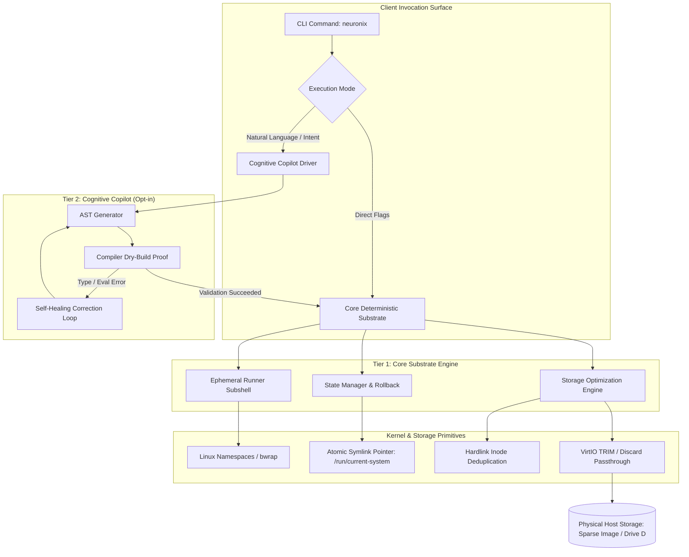

# NEURONIX

**A Deterministic, Transactional Operating System Substrate and Ephemeral Execution Harness**

[](LICENSE)
[](#architecture)
[](flake.nix)
[](#platform-support)
[](#storage-engine)

---

## Overview

Modern developer workstations and autonomous agent harnesses suffer from three fundamental structural problems:

1. **State Mutation & Dependency Entropy:** Imperative package managers (`apt`, `dnf`, `brew`, `pip`) mutate system state in-place. Successive package installations lead to shared-library drift, ABI collisions, and dependency rot.
2. **Container Runtime Overhead:** Container technologies (Docker, Podman) mitigate dependency drift by bundling entire target filesystem rootfs trees into multi-megabyte OCI tarballs. On local workstations, this incurs severe disk amplification, daemon overhead (4–8 GiB RAM), and clunky device pass-through (Wayland, PipeWire, CUDA).
3. **Hypervisor Sparse Disk Ballooning:** When virtualizing guests under KVM/QEMU or WSL2, unlinked files do not return allocated blocks to the physical host file system by default. Over time, virtual disks expand monotonically, consuming physical host storage.

**NEURONIX** is a systems substrate built on top of the pure-functional Nix engine. It decouples the deterministic OS execution layer from the cognitive agent interface, providing isolated, reproducible, content-addressed environments with zero background daemon overhead and automated hypervisor discard integration.

---

## Architectural Principles

### 1. Invariant Integrity & Mathematical Purity
The underlying store (`/nix/store`) is mounted strictly read-only at the kernel level. Packages are represented as isolated, immutable derivations keyed by their cryptographic SHA-256 closure hash:

$$\text{StorePath} = \texttt{/nix/store/} + \operatorname{Base32}(\operatorname{SHA256}(\text{Closure})) + \texttt{-} + \text{Name} + \texttt{-} + \text{Version}$$

Mutating an existing package is mathematically impossible without altering its path. System transitions are atomic symlink swaps targeting `/nix/var/nix/profiles/system`.

### 2. Ephemeral Sandboxing without OCI Image Layers
Instead of unpacking layered tarballs, `neuronix run` constructs lightweight user namespaces via `bwrap` and Nix shells. Shared libraries are referenced directly from the content-addressed store via in-memory symlink projections:
- **Startup Latency:** $< 2$ seconds.
- **Disk Overhead:** $0$ bytes of duplicated system utilities.
- **Hardware Acceleration:** Native access to the host GPU (DRI/Vulkan), Wayland socket, and PipeWire daemon without port forwarding or volume mounts.

### 3. Hypervisor-Aware Storage & Block Discard
Virtual machine guest installations under QEMU/KVM frequently inflate host storage. NEURONIX incorporates an autonomous storage lifecycle daemon:
- **Deduplication:** Hardlinks identical files across derivations using content-hash indexing.
- **Threshold Guards:** Automatically triggers garbage collection when available disk space breaches `min-free` (1.0 GiB) until reaching `max-free` (3.0 GiB).
- **VirtIO Discard:** Emits `fstrim` unmap directives over SCSI/VirtIO interfaces, releasing deallocated blocks directly to the host filesystem (e.g. host SSD / Drive D).

---

## System Architecture



---

## Technical Comparison

| Metric / Dimension | Docker Desktop | Podman | Devcontainers | NEURONIX |
| :--- | :---: | :---: | :---: | :---: |
| **Runtime Daemon Overhead** | High (4–8 GiB RAM) | Low (Daemonless) | High (Docker-based) | **Zero (Process CLI)** |
| **Storage Model** | OCI Layer Tarballs | OCI Layer Tarballs | OCI Layer Tarballs | **Content-Addressed Inodes** |
| **Package Redundancy** | Replicated per image | Replicated per image | Replicated per container | **100% Inode Deduplicated** |
| **System Rollback Duration** | Slow (Rebuild container) | Slow (Rebuild container) | N/A | **$< 2$ Seconds (Atomic)** |
| **Host Disk Sparse Shrink** | Manual / Unsupported | Manual / Unsupported | Unsupported | **Automated VirtIO TRIM** |
| **Native GUI / GPU Interop** | High configuration friction | High configuration friction | Clunky X11 forwarding | **Native Wayland / DRI** |

---

## Installation

### Prerequisites
- Nix package manager (2.24+ recommended) with Flakes enabled:
```bash
sh <(curl -L https://nixos.org/nix/install) --daemon
```

### Running Directly via Nix Flakes
No local installation required:
```bash
nix run github:adamrofc/neuronix -- status
```

### Installing into User Profile
```bash
nix profile install github:adamrofc/neuronix
```

### Building from Source
```bash
git clone https://github.com/adamrofc/neuronix.git
cd neuronix
nix build
./result/bin/neuronix version
```

---

## Command Reference

### `neuronix status`
Inspects kernel parameters, generation telemetry, active systemd timer daemons, and storage health metrics.
```bash
$ neuronix status

  SYSTEM IDENTITY & KERNEL
  ├─ OS Substrate       : NixOS (Pure-Functional)
  ├─ Linux Kernel       : 6.18.48
  ├─ Hypervisor Type    : kvm (KVM/VirtIO accelerated)
  ├─ Active Generation  : Gen #3
  └─ Total History      : 1 generation available for instant rollback

  STORAGE SUBSYSTEM TELEMETRY
  ├─ /nix Store Volume  : Used 8.6G (30%) | Free: 21G
  ├─ Boot Partition     : Used 40M (4%) | Free: 983M
  ├─ Real-time Dedupe   : ACTIVE (auto-optimise-store)
  └─ Dynamic Guard      : min-free 1.0 GiB | max-free 3.0 GiB

  AUTONOMOUS TIMERS (SYSTEMD)
  ├─ Auto Garbage Clean : ONLINE (Daily)
  ├─ Store Optimise     : ONLINE (Daily)
  └─ Host SSD TRIM      : ONLINE (Daily)
```

### `neuronix diet`
Executes garbage collection, invokes cryptographic inode deduplication across `/nix/store`, and issues `fstrim` unmap directives to shrink the host sparse disk.
```bash
$ neuronix diet

 ➔  Initiating Storage Pruning & Host TRIM Cycle...
 ➔  1/3. Purging dead store paths (Garbage Collection)...
 ➔  2/3. Deduplicating identical inodes (Hardlink Optimisation)...
 ➔  3/3. Emitting VirtIO TRIM unmap directives to Host SSD...
 ✔  Storage cycle completed cleanly.
```

### `neuronix run <packages...>`
Spawns an isolated subshell containing requested binaries. Cleans up cleanly upon exit with zero lingering rootfs artifacts.
```bash
$ neuronix run python311 ffmpeg jq
# Interactive shell initializes with python3.11, ffmpeg, and jq
# Exit leaves zero bytes of unreferenced binaries in rootfs
```

### `neuronix try [options]`
Simulates proposed system configurations or risky packages inside an ephemeral in-memory Shadow Micro-VM in RAM (`/dev/shm`) via QEMU with 9P store sharing. Features automated smoke testing and zero disk wear.
```bash
$ neuronix try --smoke-test
 ➔  Menginisialisasi Shadow Micro-VM Workspace di RAM (/dev/shm/neuronix_shadow_EBLAwC)...
 ℹ  Akselerasi KVM: TERSEDIA (/dev/kvm) - Kecepatan eksekusi native.
 ✔  Micro-VM Kernel Boot: SUCCESS
 ✔  Systemd Basic Target Reached: SUCCESS (is-system-running: clean)
 ✔  Simulasi Shadow VM lulus 100% tanpa kegagalan sistem.
```

### `neuronix verify <package>`
Formally verifies whether a derivation or package exists and evaluates cleanly in the pure nixpkgs closure before allowing any state alteration (Zero-Blast Radius Formal Proof).
```bash
$ neuronix verify ripgrep
 ➔  Menjalankan evaluasi fungsional murni (Formal Proof) untuk paket: ripgrep...
 ✔  Formal Proof PASSED: Derivasi 'ripgrep' sah dalam closure nixpkgs. Blast-radius: 0.
```

### `neuronix mcp`
Launches the Model Context Protocol (MCP) server over `stdio` adhering to JSON-RPC 2.0 (Protocol Version `2024-11-05`). Connects autonomous agents (Antigravity, Claude Code, Cursor) safely to the substrate.
```bash
$ echo '{"jsonrpc":"2.0","id":1,"method":"tools/list"}' | neuronix mcp
{"jsonrpc":"2.0","id":1,"result":{"tools":[...]}}
```

### `neuronix undo`
Instantly reverts system state to the preceding generation in $< 2$ seconds by atomically swapping profile symlinks.
```bash
$ neuronix undo
 ✔  Rollback completed: Gen #3 -> Gen #2.
```

---

## Verification & Test Suite

The codebase is hardened using a mission-critical test suite covering 336 automated test cases across 15 distinct verification suites:
- **Suite 01:** Syntax, strict POSIX compliance, static analysis.
- **Suite 02:** Argument parsing, command fuzzing, stderr/stdout separation.
- **Suite 03:** Unit testing of internal generation parser logic.
- **Suite 04:** Storage subsystem telemetry & TRIM pass-through.
- **Suite 05:** Ephemeral sandbox isolation & exit-code propagation.
- **Suite 06:** Fault injection, headless pipes, and process signals.
- **Suite 07:** Pure Flake reproducibility & metadata consistency.
- **Suite 08:** Extreme environment poisoning (`env -i`, empty `PATH`, bogus `HOME`).
- **Suite 09:** Boundary fuzzing (10,000-character buffers, control bytes, globbing).
- **Suite 10:** Filesystem invariants, circular symlink protection, inode checks.
- **Suite 11:** Concurrency stress bursts (parallel processes without race conditions).
- **Suite 12:** Resource exhaustion constraints (`ulimit -n 128`, quiet SIGPIPE handling).
- **Suite 13:** Mutation testing & repository state invariance.
- **Suite 14:** Model Context Protocol (MCP) & JSON-RPC 2.0 protocol compliance.
- **Suite 15:** Shadow Micro-VM in-memory simulation (`neuronix try`) & ephemeral RAM bounds.

Execute the verification battery locally:
```bash
bash tests/run_all_tests.sh
```

---

## Security Model

1. **Formal Gatekeeping:** Proposed configuration changes are evaluated using `nixos-rebuild dry-build` in a hermetic subshell before touching the host system.
2. **Blast-Radius Containment:** Sub-processes are executed inside unprivileged Linux namespaces (`bwrap`) without raw root privileges.
3. **Secret Encryption:** Secrets are managed via `sops-nix` using Age cryptographic keys stored under `/etc/ssh/ssh_host_ed25519_key`, ensuring zero plaintext credentials in version control.

---

## License

NEURONIX is open-source software licensed under the **Apache License, Version 2.0**. See the [LICENSE](LICENSE) file for terms and conditions.

Copyright (c) 2026 NEURONIX Contributors.
