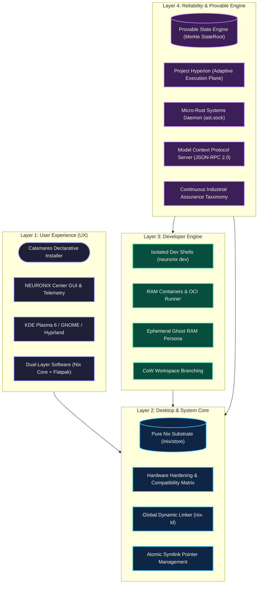
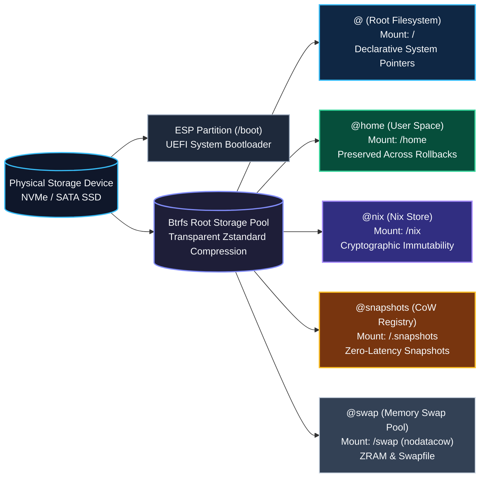
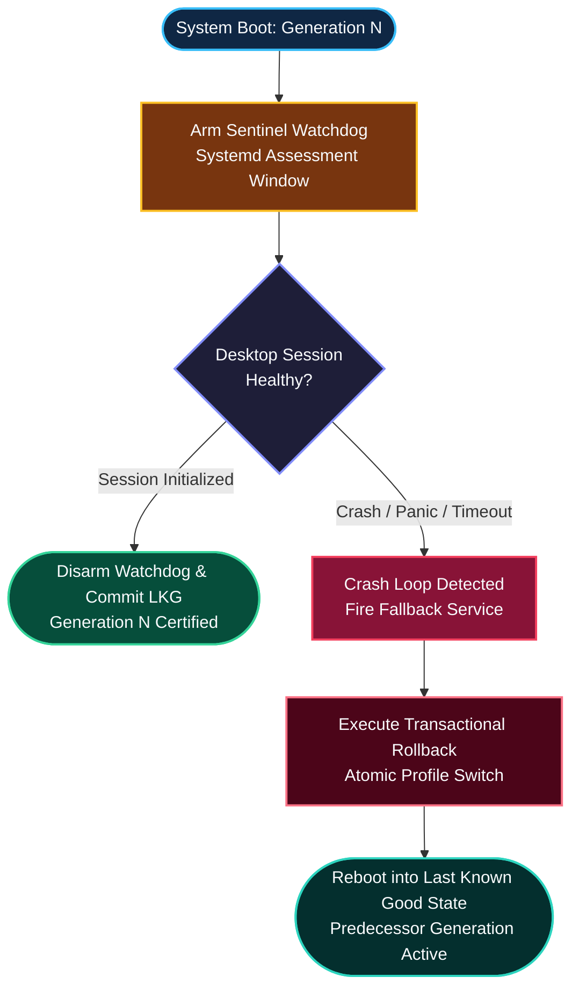
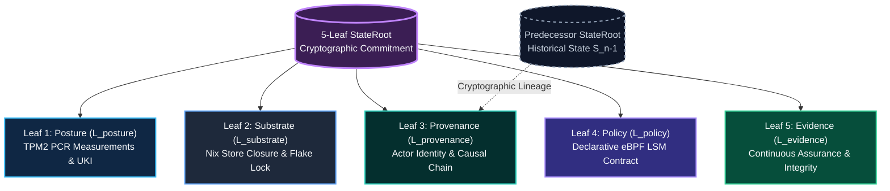
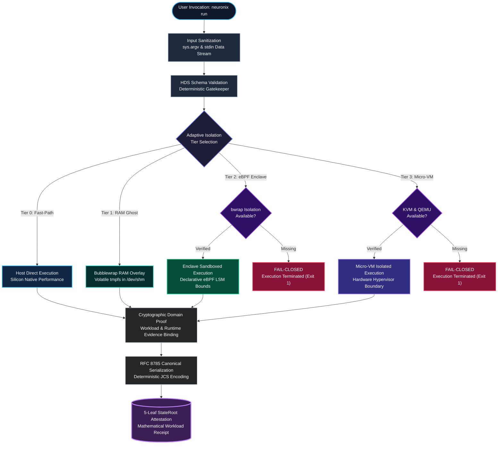
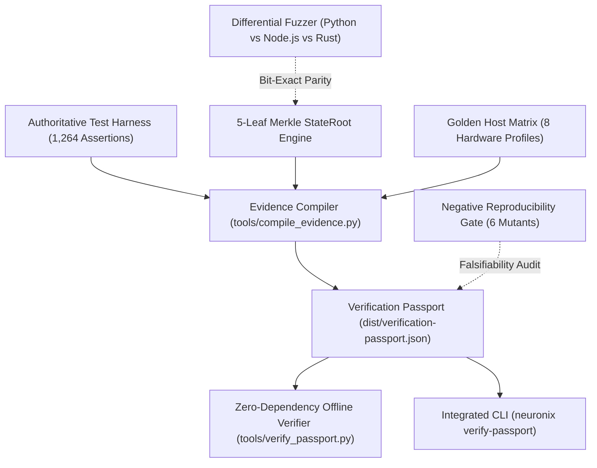

<p align="center">
  
</p>

<p align="center">
  <a href="LICENSE"></a>
  <a href="https://github.com/adamriofc/NeuronixOS/releases/tag/v1.0.4"></a>
  <a href="version.nix"></a>
  <a href="flake.nix"></a>
  <a href="#platform-architecture"></a>
  <a href="#verification--test-harness"></a>
  <a href="#storage-architecture--maintenance"></a>
  <a href="#memory-pressure-management"></a>
  <a href=".github/workflows/ci.yml"></a>
  <a href="dist/verification-passport.json"></a>
  <a href="tests/conformance/"></a>
</p>

<p align="center">
  <strong>NEURONIX OS: The Self-Healing, Declarative Workstation for Mission-Critical Engineering & Local AI Development</strong><br>
  <em>Dual-Plane Micro-Engine &bull; Cryptographic Generational Immutability &bull; Ephemeral Blast-Radius Containment &bull; NIP RFC Governance</em>
</p>

<p align="center">
  <strong>BUILD</strong> Mathematically Reproducible Flakes &bull; <strong>CONTAIN</strong> Ephemeral Workspaces &bull; <strong>RECOVER</strong> Autonomous Zero-Loss Generations
</p>

---

## Table of Contents

- [Overview](#overview)
- [Primary Purpose, Target Audience & Operational Scenarios](#primary-purpose-target-audience--operational-scenarios)
  - [Design Objectives & Core Utility](#design-objectives--core-utility)
  - [Intended Audience & Professional Roles](#intended-audience--professional-roles)
  - [Optimal Use Cases & Deployment Profiles](#optimal-use-cases--deployment-profiles)
- [Architectural Comparison: Head-to-Head Matrix](#architectural-comparison-head-to-head-matrix)
  - [Scope & Evaluation Baseline](#scope--evaluation-baseline)
  - [Comparative Feature & Architecture Matrix](#comparative-feature--architecture-matrix)
  - [In-Depth Architectural Differentiators](#in-depth-architectural-differentiators)
- [Release Engineering & Version Truth](#release-engineering--version-truth)
- [Feature Status & Assurance Hierarchy](#feature-status--assurance-hierarchy)
- [Platform Architecture](#platform-architecture)
- [Storage Architecture & Maintenance](#storage-architecture--maintenance)
  - [Btrfs Subvolume Topology](#btrfs-subvolume-topology)
  - [Transparent Block Compression (ZSTD:3)](#transparent-block-compression-zstd3)
  - [Auto-TRIM and Storage Reclamation](#auto-trim-and-storage-reclamation)
  - [Btrfs Metadata Balance Timer](#btrfs-metadata-balance-timer)
  - [Filesystem Options: Btrfs vs EXT4](#filesystem-options-btrfs-vs-ext4)
- [Memory Pressure Management](#memory-pressure-management)
  - [ZRAM In-Memory Swap Pool](#zram-in-memory-swap-pool)
  - [Kernel Paging Tuning (vm.swappiness = 180)](#kernel-paging-tuning-vmswappiness--180)
  - [Pressure Stall Information (PSI) & systemd-oomd](#pressure-stall-information-psi--systemd-oomd)
- [Hardware Compatibility Matrix & Profiles](#hardware-compatibility-matrix--profiles)
- [Command-Line Reference (neuronix)](#command-line-reference-neuronix)
- [Core System Components](#core-system-components)
  - [1. Declarative Calamares Installation Engine](#1-declarative-calamares-installation-engine)
  - [2. System Control Center (neuronix-center)](#2-system-control-center-neuronix-center)
  - [3. Isolated Development Environments (neuronix dev)](#3-isolated-development-environments-neuronix-dev)
  - [4. In-Memory Micro-VM Simulation (neuronix sandbox)](#4-in-memory-micro-vm-simulation-neuronix-sandbox)
  - [5. Model Context Protocol (MCP) Server](#5-model-context-protocol-mcp-server)
  - [6. OpenCode AI System Copilot & Autonomous Updates](#6-opencode-ai-system-copilot--autonomous-updates)
  - [7. Autonomous Update Architecture & Desktop Notifier](#7-autonomous-update-architecture--desktop-notifier)
  - [8. First-Boot Welcome Hub & Onboarding Wizard](#8-first-boot-welcome-hub--onboarding-wizard)
  - [9. System Doctor & Privacy-Sanitized Issue Reporter](#9-system-doctor--privacy-sanitized-issue-reporter)
  - [10. Curated Quickstart App Hub (Flatpak)](#10-curated-quickstart-app-hub-flatpak)
  - [11. Declarative Kernel Flavor Manager](#11-declarative-kernel-flavor-manager)
  - [12. System-Embedded Manual & Autonomous AI Grounding](#12-system-embedded-manual--autonomous-ai-grounding)
  - [13. Enterprise Security Boundary & Hardened Trust Architecture](#13-enterprise-security-boundary--hardened-trust-architecture)
  - [14. Autonomous Boot-Sentinel & Crash-Loop Rollback](#14-autonomous-boot-sentinel--crash-loop-rollback)
  - [15. Generational Forensic Diff Engine (neuronix diff)](#15-generational-forensic-diff-engine-neuronix-diff)
  - [16. Imperative-to-Declarative Reverse Engine (neuronix distill)](#16-imperative-to-declarative-reverse-engine-neuronix-distill)
  - [17. Ephemeral Zero-Copy RAM Development Container (neuronix container)](#17-ephemeral-zero-copy-ram-development-container-neuronix-container)
  - [18. Deterministic Workload Performance Matrix (neuronix tune)](#18-deterministic-workload-performance-matrix-neuronix-tune)
  - [19. Local P2P Binary Cache Mesh (neuronix mesh)](#19-local-p2p-binary-cache-mesh-neuronix-mesh)
  - [20. Micro-Rust Systems Daemon & Live Unified AST Engine (neuronix daemon)](#20-micro-rust-systems-daemon--live-unified-ast-engine-neuronix-daemon)
  - [21. Ephemeral Ghost RAM Persona (neuronix ghost)](#21-ephemeral-ghost-ram-persona-neuronix-ghost)
  - [22. Instant Time-Travel Workspace Branching (neuronix branch)](#22-instant-time-travel-workspace-branching-neuronix-branch)
  - [23. Declarative eBPF LSM Security Policy Gate (neuronix ebpf)](#23-declarative-ebpf-lsm-security-policy-gate-neuronix-ebpf)
  - [24. Provable State Engine & Cryptographic Causal Lineage (neuronix state)](#24-provable-state-engine--cryptographic-causal-lineage-neuronix-state)
  - [25. Provable Adaptive Execution Architecture (Project Hyperion)](#25-provable-adaptive-execution-architecture-project-hyperion)
  - [26. Verification Passport & Zero-Dependency Offline Verifier (neuronix verify-passport)](#26-verification-passport--zero-dependency-offline-verifier-neuronix-verify-passport)
- [Building & Installation](#building--installation)
- [Post-Installation Administration](#post-installation-administration)
- [Verification, Lifecycle Gate & Test Harness (1,264 Assertions)](#verification--test-harness)
  - [Independent Conformance Corpus & Differential Fuzzing](#independent-conformance-corpus--differential-fuzzing)
  - [Negative Reproducibility & Sensitivity Testing](#negative-reproducibility--sensitivity-testing)
- [Architecture Decision Records (ADRs)](#architecture-decision-records-adrs)
- [License](#license)

---

## Overview

NEURONIX OS is an independent, declarative Linux distribution platform based on NixOS. It provides an automated Calamares installation workflow, pre configured hardware and kernel profiles, transactional desktop environments, and developer CLI utilities while maintaining full compatibility with the upstream Nix package ecosystem.

### Release Engineering & Version Truth
- **Single Source of Truth (`version.nix`):** All components (CLI, GUI Center, MCP Daemon, Calamares installer engine, release manifests, package derivations) read canonical versioning from `version.nix`.
- **Release `v1.0.0` (Frozen GA):** Immutable initial General Availability release tag.
- **Release `v1.0.4` (Hardened Production Baseline on `main`):** Actively maintained release incorporating comprehensive architectural hardening, truthful error propagation, injection proof verification, privacy-preserving doctor diagnostics, end-to-end lifecycle verification gates, runtime telemetry, multi arch flake outputs, and MCP JSON-RPC protocol compliance.
- **Development Channel Baseline:** Tracks `nixos-unstable` for modern Linux kernels, Wayland compositors, and rapid developer tooling.
- **Production Stable Baseline:** Targets `nixos-26.05` for conservative enterprise stability and verified patch streams.
- **State Version (`system.stateVersion = "24.11"`):** The immutable NixOS state migration baseline preserving data directory layouts and system state compatibility across upgrades.

---

## Primary Purpose, Target Audience & Operational Scenarios

### Design Objectives & Core Utility

NEURONIX OS is engineered to resolve fundamental operational vulnerabilities common to traditional Linux distributions: configuration drift, dependency breakage during upgrades, lack of system state reproducibility, and fragile disaster recovery. Built on a pure-functional NixOS substrate, NEURONIX OS elevates declarative configuration from a specialized sysadmin toolkit into an enterprise-ready, desktop-grade operating platform.

Its primary design objectives are:

1. **Deterministic State Reproducibility:**
   Every package derivation, system daemon, kernel option, and configuration parameter is declared as pure code within `flake.nix` and pinned cryptographically via `flake.lock`. Deploying a configuration across multiple physical or virtual nodes produces mathematically identical systems, eliminating divergent package closures and unrecorded host mutations.

2. **Atomic Generational Lifecycle with Zero-Loss Rollback:**
   Operating system upgrades and package modifications are compiled and staged into isolated cryptographic store paths (`/nix/store`) before system symlink pointers are switched atomically. The running operating system is never modified in-place. If an update introduces regressions or unbootable states, users and automated recovery services can revert to the previous operational generation instantly at the bootloader or from the active shell (`nixos-rebuild --rollback` or `neuronix-rollback`) without data loss.

3. **Turnkey Desktop Ergonomics on an Immutable Foundation:**
   Functional package managers historically impose steep friction for desktop users. NEURONIX OS bridges this divide by providing a declarative Calamares installer engine, automated hardware profile detection, out-of-the-box global FHS binary execution via `nix-ld` (enabling unpatched execution of VS Code, proprietary CLI tools, and CUDA binaries), and a dual-layer application model pairing immutable core system derivations with user-managed Flathub Flatpaks.

4. **Autonomous Reliability & Local AI Developer Substrate:**
   Modern workstations require active telemetry and intelligent maintenance. NEURONIX integrates memory pressure defenses (ZRAM ZSTD compression paired with Pressure Stall Information monitoring via systemd-oomd), background storage hygiene (automated TRIM, metadata balancing, and store deduplication), and an embedded OpenCode AI copilot coupled with a standardized Model Context Protocol (MCP) JSON-RPC 2.0 interface.

---

### Intended Audience & Professional Roles

NEURONIX OS is purpose-built for technical professionals and organizations requiring uncompromising system predictability, security isolation, and developer agility:

- **Systems Engineers & Site Reliability Engineers (SREs):**
  Engineers who treat infrastructure as code. NEURONIX provides a workstation environment that mirrors modern cloud native deployment patterns, enabling local testing of complex declarative environments that compile directly to production-grade server appliances without environmental discrepancies.

- **AI & Machine Learning Researchers:**
  Practitioners requiring isolated, reproducible compute stacks. The `neuronix dev ai` substrate provides immediate access to PyTorch, CUDA runtime libraries, JupyterLab, and Ollama without polluting system libraries or conflicting with host NVIDIA display drivers.

- **Security Analysts & Penetration Testers:**
  Specialists requiring auditable environments with minimal attack surfaces. NEURONIX supports hardened kernel branches (`linuxPackages_hardened`), cryptographically sealed package closures, ephemeral in-memory micro-VM evaluation (`neuronix sandbox`), and isolated execution sandboxes (`neuronix run --sandbox`).

- **Full-Stack & Cloud-Native Developers:**
  Engineers working across polyglot stacks (Rust, Go, Python, TypeScript, Node.js). NEURONIX eliminates global package version conflicts through instant project level development shells (`neuronix dev <stack>`), while `nix-ld` enables direct execution of standard pre-compiled dynamic ELF binaries.

- **Production Workstation Operators:**
  Users who depend on daily system availability. Traditional rolling-release systems risk catastrophic breakage during routine updates; NEURONIX delivers modern packages (Linux Zen kernel, Wayland compositors, modern desktop environments) backed by deterministic boot time rollback to previous working generations.

---

### Optimal Use Cases & Deployment Profiles

- **Mission-Critical Engineering Workstations:**
  Primary daily-driver operating system for engineering organizations where workstation downtime equates to lost development velocity. Routine updates occur without fear of library incompatibilities, and complete disaster recovery requires seconds rather than system reinstallation.

- **Autonomous Edge & Local AI Inference Nodes:**
  Dedicated local hardware running persistent background reasoning models, autonomous code agents, and automated data pipelines via the OpenCode background daemon and MCP JSON-RPC protocol transport.

- **Hermetic Build & Clean-Room Verification Environments:**
  Building and verifying software packages in pure, isolated sandboxes where external host state, ambient environment variables, and unpinned network dependencies are strictly blocked from influencing compilation outputs.

- **Rapid Hardware Qualification & Benchmarking:**
  Validating modern PC and laptop hardware across distinct performance profiles. Switching between low-latency scheduling (`zen`), conservative enterprise stability (`lts`), or attack-surface hardened (`hardened`) kernels requires modifying a single declarative configuration attribute.

---

## Architectural Comparison: Head-to-Head Matrix

### Scope & Evaluation Baseline

To evaluate NEURONIX OS objectively, it is compared directly against leading operating systems occupying equivalent architectural niches:

1. **Vanilla NixOS:** Upstream pure-functional parent platform.
2. **Fedora Silverblue / Atomic Desktops:** Modern enterprise-backed immutable OSTree image platform.
3. **openSUSE MicroOS / Aeon:** Transactional snapshot-based rolling distribution using Btrfs and Snapper.
4. **EndeavourOS / Arch Linux:** Mainstream bleeding-edge rolling release distribution for software developers.

---

### Comparative Feature & Architecture Matrix

| Architectural Dimension | NEURONIX OS (v1.0.4) | Vanilla NixOS (24.11/Unstable) | Fedora Silverblue (Atomic) | openSUSE MicroOS / Aeon | EndeavourOS / Arch Linux |
| :--- | :--- | :--- | :--- | :--- | :--- |
| **System Paradigm** | Pure-functional declarative substrate | Functional declarative toolkit | Image-based OSTree composition | Transactional Btrfs snapshots | Imperative mutable Unix filesystem |
| **Configuration Model** | Single declarative Flake (`flake.nix`) | Declarative Nix expressions or channels | Imperative package layering (`rpm-ostree`) | Imperative packages via `transactional-update` | Imperative commands (`pacman`, Arch build system) |
| **Store Immutability** | Cryptographic read-only `/nix/store` | Cryptographic read-only `/nix/store` | Read-only `/usr` deployment tree | Read-only root filesystem snapshot | Fully mutable root and `/usr` trees |
| **Upgrade & Rollback Mechanism** | Atomic live symlink switch; instant zero-loss rollback | Atomic live symlink switch; instant boot generation rollback | OSTree deployment switch; requires reboot to activate | Btrfs root snapshot switch; requires reboot to activate | In-place library overwrites; manual chroot or snapshot recovery |
| **Out-of-the-Box GUI Installer** | Calamares GUI generating pure Nix Flakes | Minimal text installer; Calamares without flake generation | Anaconda graphical installer | Agama / YaST automated installer | Calamares graphical installer |
| **Hardware Detection Architecture** | Declarative 27-pillar matrix; offline firmware; PRIME offload | Manual `hardware-configuration.nix`; user-configured drivers | Automated via Anaconda; layered driver packages | Automated via YaST hardware database | User-managed via Arch Wiki and Pacman |
| **Kernel Tiering Support** | Declarative switch: `zen`, `lts`, `hardened`, `default` | Manual Nixpkgs package overrides | Stock Fedora kernel; manual kmods | Stock openSUSE kernel; rolling branch | Manual Pacman kernel packages |
| **Memory Pressure Shield** | ZRAM Zstandard pool + PSI monitoring + systemd-oomd | Manual `zram-generator` and service configuration | Stock systemd-oomd; standard swap | Stock systemd-oomd; zram configuration | Manual setup (`earlyoom`, `systemd-swap`) |
| **FHS Dynamic Binary Compatibility** | Pre-configured `nix-ld` for VS Code, CUDA, and ELFs | Requires manual `nix-ld` or `steam-run` wrapping | Handled via Toolbox / Distrobox containers | Handled via Distrobox containers | Native POSIX/FHS directory hierarchy |
| **AI Copilot & Telemetry Daemon** | Native OpenCode daemon + MCP JSON-RPC 2.0 server | None (user-installed applications only) | None (user-installed applications only) | None (user-installed applications only) | None (user-installed applications only) |
| **Storage Topology & Compression** | 5 Btrfs subvolumes (`@`, `@home`, `@nix`, `@snapshots`, `@swap`) + ZSTD:3 | User-defined partitioning (defaults to monolithic) | Btrfs root with subvolumes; no transparent compression | Btrfs root with Snapper read-only subvolumes | Monolithic Btrfs or EXT4 without subvolume convention |
| **Automated Assurance Gate** | 1,264 verified assertions across 32 QA suites, distro harness, and 14 standalone gates (100% Pass) | Hydra continuous integration build checks | Fedora Zuul CI / openQA test suites | openQA automated validation matrix | User community testing repository |
| **Release Provenance** | Pinned Flake commit + RFC SHA-256 + SPDX 2.3 SBOM | Hydra output provenance | Koji build logs / RPM signatures | OBS build provenance | Arch build system logs |

---

### In Depth Architectural Differentiators

#### 1. NEURONIX OS vs. Vanilla NixOS
Vanilla NixOS provides an exceptional functional package management paradigm, but operates fundamentally as an infrastructure toolkit rather than a cohesive, out-of-the-box desktop distribution. A user installing vanilla NixOS must manually architect their Btrfs subvolume layout, configure swap parameters, script hardware driver integrations (such as NVIDIA PRIME offloading), research dynamic linker workarounds for proprietary software (`nix-ld`), and resolve complex multi-desktop configurations.

NEURONIX OS transforms this substrate into an engineered, production ready distribution. It ships with a customized Calamares installation engine that generates production grade Nix Flakes directly from graphical user inputs, provisions an opinionated 5 subvolume Btrfs topology with transparent ZSTD:3 compression, pre-configures memory defenses (ZRAM + PSI telemetry), enables seamless FHS binary execution, embeds local AI copilot services via MCP, and validates every build against a 1,264-assertion test taxonomy (cataloged in `data/test_manifest.json`). Crucially, NEURONIX achieves this without forking upstream Nixpkgs, ensuring zero security patch latency.

#### 2. NEURONIX OS vs. Fedora Silverblue / Atomic Desktops
Fedora Silverblue enforces immutability by composing system states as read-only OSTree commits. While effective at preventing host corruption, Silverblue introduces significant operational overhead:
- Modifying layered packages requires invoking `rpm-ostree install` followed by a mandatory system reboot to switch deployment targets. In contrast, NEURONIX updates packages and system configurations live at runtime via atomic symlink activation (`nixos-rebuild switch`) without requiring reboots.
- Silverblue relies on container layers (Toolbox or Distrobox) for everyday development, separating developer toolchains from the host desktop. NEURONIX integrates hermetic development environments natively through Nix Flakes (`neuronix dev <stack>`), allowing development shells to interact directly with host hardware accelerators and graphics pipelines.
- Rollbacks in NEURONIX preserve arbitrary past generations indefinitely until explicitly garbage-collected, whereas OSTree typically retains only the immediate previous deployment pin.

#### 3. NEURONIX OS vs. openSUSE MicroOS / Aeon
openSUSE MicroOS and Aeon achieve system resilience by mounting the root partition as a read-only Btrfs snapshot and performing atomic transactional updates via `transactional-update` and Snapper. While this safeguards against interrupted update writes, the underlying package manager remains imperative. Two systems installed with the same package manifests at different times can yield divergent states due to repository state shifts.

NEURONIX OS couples filesystem resilience with mathematical reproducibility. System state is defined as pure functional derivations locked to cryptographic commit hashes via `flake.lock`. Furthermore, NEURONIX separates the immutable Nix store (`@nix`) from user data (`@home`) and snapshot storage (`@snapshots`), ensuring that rolling back system generations never impacts user documents, browser profiles, or container state.

#### 4. NEURONIX OS vs. EndeavourOS / Arch Linux
EndeavourOS provides an accessible Calamares installer on top of Arch Linux, earning widespread popularity among software developers seeking rolling-edge packages. However, Arch Linux adheres to an imperative, mutable filesystem model. System upgrades modify shared dynamic libraries (`.so` files) in-place on the live root partition. If an upgrade is interrupted or introduces broken dependency chains, the host can become unbootable, requiring manual recovery via `arch-chroot` from a live USB.

NEURONIX OS matches the desktop convenience and performance of EndeavourOS (graphical Calamares setup, first-boot Welcome Hub, Zen kernel scheduling, cutting-edge Wayland desktops) while entirely eliminating mutable dependency fragility. In NEURONIX, new package closures are downloaded and verified in isolation before being linked into the active generation. If any component fails, the previous working generation remains untouched and can be selected instantly from the bootloader menu.

---

## Proof Class Taxonomy (P0 through P4)

To ensure empirical truthfulness and eliminate ambiguous claims, all capabilities in NEURONIX OS are governed by five formal proof classes:

| Proof Class | Rigor Level & Scope | Verification Grounding | Subsystems & Features |
| :--- | :--- | :--- | :--- |
| **P0: Mathematical Determinism** | Functional derivations, bit-identical store paths, pinned inputs. | Verified via Nix derivation graph, `flake.lock` pinned commit, and RFC SHA-256 digests. | Pure Nix substrate, pinned Nixpkgs closures, RFC 8785 Merkle StateRoot, Merkle Domain Proofs (MDP), reproducible ISO builds, release manifest hashes. |
| **P1: Automated CI Verification** | System regression suites, multi-architecture evaluations, micro-VM boots. | Validated through 1,264 automated test assertions across 32 QA suites, 19 distro component suites, and 14 lifecycle gates. | Multi-arch evaluation, Shadow VM lifecycle, Calamares flake generation, CLI argument fuzzing, MCP JSON-RPC, Provable State & Hyperion Engine. |
| **P2: Qualified Reference Hardware** | Empirical hardware validation on representative bare-metal systems. | Validated across 8 reference platforms (ThinkPad, Framework, AMD/Intel workstations, XPS, Zephyrus, Apple Silicon). | Intel/AMD microcode, Mesa RADV, Intel Arc Xe, NVIDIA PRIME offload, S3/s2idle power management, PipeWire HD audio. |
| **P3: Declarative Module Support** | Composable NixOS configuration modules and subsystem policies. | 27 hardware configuration pillars managed in `modules/hardware/` and `data/hardware_qualification.json`. | ZRAM ZSTD swap, systemd-oomd memory monitor, Btrfs subvolumes (@, @home, @nix, @log, @snapshots), auto-TRIM. |
| **P4: Experimental / Community** | Optional hardware features, custom Wayland compositor rules, community packages. | Documented with operational caveats and manual verification steps in operational runbooks. | Lanzaboote UEFI Secure Boot signing chain, TPM2 LUKS auto-unlocking, custom Hyprland animations. |

---

## Platform Architecture



---

## Storage Architecture & Maintenance

NEURONIX formats system drives with Btrfs using transparent Zstandard compression, structured subvolumes, and automated maintenance timers.

### Btrfs Subvolume Topology
Storage partitioning uses an isolated subvolume layout:

| Subvolume | Mount Point | Mount Options | Purpose |
| :--- | :--- | :--- | :--- |
| `@` | `/` | `compress=zstd:3,noatime,space_cache=v2` | Root filesystem and declarative system configuration pointers. |
| `@nix` | `/nix` | `compress=zstd:3,noatime` | Immutable `/nix/store` directory. |
| `@home` | `/home` | `compress=zstd:3,noatime` | User home directories and documents. |
| `@snapshots` | `/.snapshots` | `compress=zstd:3,noatime` | Storage for manual and automated filesystem snapshots. |
| `@swap` | `/swap` | `nodatacow,noatime` | Dedicated swapfile subvolume with Copy-on-Write disabled to prevent fragmentation. |



### Transparent Block Compression (ZSTD:3)
All read-write filesystem subvolumes use Zstandard level 3 (`zstd:3`) compression.
- **Disk Usage:** Materially reduces physical storage consumption for compressible store paths and text/data files, with actual compression ratios varying by package composition.
- **Throughput:** Minimizes raw byte transfers from NVMe/SATA storage, reducing solid-state write wear and improving real-world read times.

### Auto TRIM and Omni Purging Storage Diet Engine
SSD performance degradation and sparse disk image inflation (in QEMU/KVM virtual machines) are addressed automatically through a multi-layered maintenance strategy:
1. **Host Auto TRIM (`fstrim.timer`):** Issues discard calls (`fstrim -av`) across all mounted Btrfs and ESP partitions daily. This informs SSD controllers and hypervisors of deallocated blocks.
2. **Autonomous Garbage Collection (`nix.gc`):** Runs weekly garbage collection (`nix-gc.timer`) with a 14-day retention policy (`--delete-older-than 14d`), establishing a practical policy trade-off between disk reclamation and long-term rollback availability while purging orphaned package closures.
3. **Hardlink Deduplication (`nix.optimise` & `auto-optimise-store = true`):** Automatically hardlinks identical binary files across derivations within `/nix/store`; this can materially reduce duplicated store content, with exact savings depending on installed package composition.
4. **Dynamic Storage Guard (`min-free` & `max-free`):** In-kernel Nix daemon safeguards disk space by triggering emergency collections if free space drops below 1.0 GiB until 3.0 GiB headroom is recovered.
5. **Systemd Journal Retention Ceiling (`services.journald`):** Caps `/var/log/journal` storage at 500 MiB with 1-month retention, preventing runaway log file consumption.
6. **Ephemeral `/tmp` & Flatpak Runtime Hygiene:** Purges stale `/tmp` files on every boot (`boot.tmp.cleanOnBoot = true`) and automatically prunes unreferenced Flatpak runtimes via `flatpak-prune-unused.timer`.
7. **One-Command Unified Diet (`neuronix diet`):** Orchestrates Nix Store GC, Inode Deduplication, Flatpak Unused Pruning, Journal Vacuuming, and Host Physical TRIM in a single command, reporting reclaimed disk space.

### Btrfs Metadata Balance Timer
Over time, Btrfs can accumulate sparsely populated block groups, causing `ENOSPC` errors even with remaining free space.
- A systemd timer (`btrfs-balance.timer`) runs once a month (`OnCalendar=monthly`, `Persistent=true`).
- It filters and compacts under-allocated chunks (`btrfs balance start -dusage=10 -musage=10 /`), maintaining filesystem performance without manual intervention.

### Filesystem Options: Btrfs vs EXT4

While Btrfs is the default and recommended filesystem for NEURONIX, standard **EXT4** is fully supported out of the box:

- **Kernel & Driver Support:** The Linux kernel includes native drivers for both filesystems via `boot.supportedFilesystems = [ "btrfs" "ntfs" "exfat" "ext4" "vfat" ]`.
- **Automated Configuration:** When selecting EXT4 in Calamares Manual Partitioning, `nixos-generate-config` automatically captures the partition UUID and writes `fileSystems."/".fsType = "ext4"` to `hardware-configuration.nix`.
- **Generation Rollback Independence:** System generation immutability and atomic rollback mechanisms reside in the Nix store engine, not the underlying filesystem. Generation rollbacks in systemd-boot operate identically on both Btrfs and EXT4.

| Architectural Dimension | Btrfs (Default) | EXT4 (Supported Alternative) |
| :--- | :--- | :--- |
| **Partition Structure** | Structured subvolumes (`@`, `@nix`, `@home`, `@snapshots`, `@swap`) | Traditional monolithic root partition (`/`) |
| **Transparent Compression** | In-kernel Zstandard level 3 (`zstd:3`) materially reduces storage usage for compressible data | Uncompressed storage (requires larger disk allocation) |
| **Maintenance Workload** | Automated monthly chunk rebalancing via `btrfs-balance.timer` | Zero filesystem maintenance overhead (standard fsck) |
| **I/O Overhead** | Copy-on-Write metadata tracking | Minimal filesystem overhead, stable raw write throughput |
| **Recommended Use Case** | Modern NVMe/SATA SSDs with limited physical storage capacity | Traditional magnetic disks (HDDs), USB storage, or high-throughput databases |

---

## Memory Pressure Management

To prevent system lockups under memory exhaustion, NEURONIX implements an intelligent four-tier memory management strategy using ZRAM, zswap deactivation, tuned kernel paging parameters, zero-wear storage fallback, and active PSI monitoring:

| Tier | Component | Configuration / Path | Action |
| :--- | :--- | :--- | :--- |
| **1. In-RAM Swap Pool** | ZRAM (ZSTD) | `zramSwap.priority = 32767`, `memoryPercent = 100` | Compressed RAM block device dynamically sized to 100% of host RAM. Highest kernel priority routes all paging to RAM first. |
| **2. Double-Compression Defense** | `zswap.enabled = 0` | `boot.kernelParams` | Disables in-kernel zswap to eliminate duplicate compression and unnecessary CPU overhead. |
| **3. Zero-Wear Storage Fallback** | Physical Swap / `@swap` | Low priority (`-2`), `nodatacow` subvolume | Preserves secondary swap and hibernation (`resume=UUID=...`) while keeping physical SSD writes at 0 bytes under normal loads. |
| **4. Eviction & PSI Guard** | `systemd-oomd` / `earlyoom` | `/proc/pressure/memory` | Monitors Pressure Stall Information (PSI) to terminate runaway processes before desktop freezes. |

### ZRAM In-Memory Swap Pool & Prioritization
- Configured with `priority = 32767` and the ZSTD compression algorithm.
- Provides an in-memory swap pool expanding effective memory headroom by 1.5x to 2.7x on compressible data, maintaining interactive responsiveness under memory pressure with minimal CPU overhead.
- Because ZRAM is assigned the maximum Linux swapon priority (`32767`), secondary disk partitions remain untouched at 0 bytes used, providing zero-wear protection for modern NVMe SSDs (including QLC and TLC media).

### Kernel Paging Tuning & Zswap Elimination
- `zswap.enabled = 0`: Explicitly disables kernel zswap to avoid compressing memory twice (once in zswap, once in ZRAM).
- `vm.swappiness = 180` and `vm.page-cluster = 0`: Shifts idle background memory into ZRAM early with zero readahead latency, keeping physical uncompressed memory free for compilers and desktop applications.
- `vm.vfs_cache_pressure = 50`: Retains directory and inode caches to prevent filesystem stuttering.

### Pressure Stall Information (PSI) & OOM Protection
- The kernel continuously monitors memory pressure via Pressure Stall Information (`/proc/pressure/memory`).
- When memory stall duration exceeds configured safety thresholds, the userspace OOM daemon terminates the responsible application, preventing desktop UI freezes while preserving system stability.

---

## Hardware & Subsystem Configuration Matrix

NEURONIX includes declarative configurations addressing standard desktop and laptop hardware requirements across 27 subsystem domains. For empirical platform qualifications across reference platforms (ThinkPad, Framework, Dell XPS, ASUS ROG Zephyrus, QEMU KVM, Apple Silicon), see the [Reference Hardware Qualification Matrix](docs/hardware_profiles.md).

| Subsystem Domain | Technical Objective | Declarative Implementation | Configuration Module |
| :--- | :--- | :--- | :--- |
| **Package Licensing** | Proprietary drivers and runtime compatibility (Steam, NVIDIA, codecs) | `nixpkgs.config.allowUnfree = true` | `modules/core/default.nix` |
| **RTC Synchronization** | Real-time clock synchronization in Windows dual-boot environments | `time.hardwareClockInLocalTime` (conditional for Windows dual-boot) | `modules/hardware/boot.nix` |
| **Filesystem Maintenance** | Metadata chunk fragmentation prevention on active Btrfs volumes | Automated monthly `btrfs-balance` systemd timer | `modules/services/storage.nix` |
| **Storage Reclamation** | Autonomous SSD TRIM and sparse disk reclamation (Auto-TRIM) | Daily `fstrim.timer` + `auto-optimise-store` hardlink dedupe | `modules/services/storage.nix` |
| **Application Ecosystem** | Sandboxed desktop application integration without root modification | Dual-layer distribution: immutable Nix core + Flathub Flatpak | `modules/services/flatpak.nix` |
| **Boot Partition Guard** | EFI System Partition storage overflow prevention | 1.0 GiB ESP standard with generation prune threshold (`configurationLimit = 15`) | `modules/hardware/boot.nix` |
| **Offline Firmware** | Out-of-the-box Wi-Fi and Bluetooth chipset connectivity | Full redistributable firmware bundle (Broadcom, Realtek, Intel) | `modules/hardware/firmware.nix` |
| **Hybrid Graphics** | Dynamic dGPU power gating on Optimus/PRIME laptops | Declarative NVIDIA PRIME Render Offload configuration (Status: Implemented) | `modules/hardware/nvidia-prime.nix` |
| **Secure Boot** | Compatibility with UEFI Secure Boot firmware policies | Lanzaboote signed boot integration (Status: Experimental, requires MOK enrollment) | `modules/hardware/secureboot.nix` |
| **Portal Integration** | Native file-chooser dialog synchronization under Wayland | Explicit portal backend mapping via `portals.conf` | `modules/services/flatpak.nix` |
| **Power Management** | Modern Standby battery drain reduction on mobile hardware | Kernel directive `mem_sleep_default=deep` + `power-profiles-daemon` | `modules/hardware/power.nix` |
| **Dual Boot Detection** | UEFI boot partition discovery for multi-boot operating systems | Native `systemd-boot` EFI discovery without legacy os-prober | `modules/hardware/boot.nix` |
| **Memory Mapping Limit** | Thread allocation and memory map exhaustion prevention | High-concurrency tuning: `vm.max_map_count = 2147483642` | `modules/hardware/boot.nix` |
| **HiDPI Display Scaling** | Subpixel and fractional scaling blur elimination under Wayland | Wayland Ozone flags enabled for Chromium and Electron runtimes | `modules/services/desktop-tweaks.nix` |
| **Boot Watchdog** | Power-loss protection during bootloader update transactions | Hardware UEFI watchdog timeouts (`30s` runtime, `10min` reboot) | `modules/hardware/boot.nix` |
| **Input Methods** | Multilingual text input support (CJK and complex scripts) | Pre-configured Fcitx5 IME framework | `modules/services/desktop-tweaks.nix` |
| **Trust Store Injection** | Corporate and development Root CA certificate enrollment | Dedicated certificate injection script (`neuronix-add-ca`) | `modules/services/network.nix` |
| **Memory Pressure Guard** | System responsiveness and freeze prevention under memory saturation | ZRAM compressed RAM swap (ZSTD, 100% RAM) + `systemd-oomd` PSI | `modules/services/memory-shield.nix` |
| **Audio Processing** | Low-latency audio processing and high-fidelity Bluetooth communication | PipeWire session manager with LDAC, AptX HD, and LC3Plus codecs | `modules/hardware/audio.nix` |
| **Battery Conservation** | Battery cycle life extension during prolonged AC operation | Kernel sysfs charge ceiling daemon (`charge_control_limit_max = 80`) | `modules/hardware/power.nix` |
| **Video Decoding** | Hardware-accelerated video decode offloading (H.264, HEVC, AV1) | Pre-configured VA-API and NVDEC acceleration libraries | `modules/hardware/nvidia-prime.nix` |
| **Network Portals** | Captive portal detection on public and enterprise Wi-Fi | Automated NetworkManager connectivity polling | `modules/services/network.nix` |
| **Printing Subsystem** | Driverless network and USB printing | IPP Everywhere, Apple AirPrint, and Mopria service integration | `modules/services/printing.nix` |
| **External Media** | High-performance removable storage throughput | In-kernel `ntfs3` and native `exfat` automounting | `modules/services/storage.nix` |
| **Analog Audio Power** | DAC click and pop elimination on 3.5mm analog outputs | Inactive DAC power-save state disabled (`snd_hda_intel power_save=0`) | `modules/hardware/audio.nix` |
| **Swap Integrity** | Filesystem corruption prevention on Btrfs swapfiles | Dedicated `@swap` subvolume with Copy-on-Write disabled (`nodatacow`) | `installer/calamares/modules/partition.conf` |
| **Microcode Updates** | Processor security vulnerability mitigations (Spectre, Zenbleed) | Automated processor microcode updates enabled for Intel and AMD | `modules/hardware/cpu.nix` |
| **Identity & Signing** | Secure cryptographic key agent forwarding on Wayland sessions | GnuPG Agent with Pinentry graphical prompt and `SSH_AUTH_SOCK` | `modules/services/security.nix` |

---

## Command Line Reference (neuronix)

The integrated `neuronix` CLI utility manages system telemetry, storage optimization, developer shells, and generation rollbacks:

```text
USAGE:
  neuronix <COMMAND> [OPTIONS]
```

### Commands

| Command | Arguments | Description | Example |
| :--- | :--- | :--- | :--- |
| `status` | None | Shows system version, storage usage, active systemd timers, and hardware matrix status. | `neuronix status` |
| `shield` | `[--json]` | Displays live memory pressure diagnostics, layered swap hierarchy, zswap status, and PSI metrics. | `neuronix shield --json` |
| `generations` | None (or `list`) | Lists system generations with timestamps and indicates the active generation. | `neuronix generations` |
| `battery` | `[80 \| 100 \| status]` | Reads or modifies the laptop battery charging threshold limit. | `neuronix battery 80` |
| `diet` | None | Runs garbage collection, deduplicates `/nix/store` hardlinks, and issues filesystem TRIM. | `neuronix diet` |
| `dev` | `<stack>` | Starts an isolated development shell (`python`, `rust`, `node`, `ai`, `go`, `web3`). | `neuronix dev rust` |
| `run` | `[flags] <command... \| packages...>` | Adaptive Workload Execution Engine (Tiers 0-3) and ephemeral nix-shell. | `neuronix run --intent "build" cargo build` |
| `sandbox` | `[target\|iso] [options]` | In-memory OS Micro-VM sandbox with ISO booting, Btrfs CoW, and 3D acceleration. | `neuronix sandbox --smoke-test` |
| `try` | `[target\|iso] [options]` | (Alias) Backward-compatible alias for `neuronix sandbox`. | `neuronix try --smoke-test` |
| `verify` | `<package>` | Tests whether a derivation evaluates cleanly against the nixpkgs closure via dry-build. | `neuronix verify ripgrep` |
| `center` | None | Opens the graphical NEURONIX Control Center (or runs `--cli` in headless environments). | `neuronix center` |
| `mcp` | None | Starts the Model Context Protocol (MCP) server over `stdio` adhering to JSON-RPC 2.0. | `neuronix mcp` |
| `check-update` | None | Checks upstream flake repository and remote releases for system updates. | `neuronix check-update` |
| `upgrade` | `[--staged \| --switch]` | Performs atomic system upgrade (staged by default for reboot, or instant switch). | `neuronix upgrade --staged` |
| `doctor` | `[--json \| --output <f> \| --proof]` | Deep diagnostic probe producing privacy-sanitized reports and authoritative SystemVerificationReceipts. | `neuronix doctor --proof` |
| `welcome` | `[--cli \| --disable-autostart]` | Interactive first-boot welcome wizard and distro onboarding guide. | `neuronix welcome` |
| `quickstart` | `[list \| install <id>]` | Curated Flathub desktop & engineering app hub (zero store pollution). | `neuronix quickstart list` |
| `kernel` | `[status \| list \| set <flv>]` | Declarative kernel flavor manager (default, zen, lts, latest, hardened). | `neuronix kernel list` |
| `manual` | `[topic \| --list]` | Reads offline system manual and architecture reference (`/etc/neuronix/manual/`). | `neuronix manual config` |
| `sentinel` | `[status \| confirm]` | Autonomous Wayland/desktop boot watchdog with auto-rollback on crash-loops. | `neuronix sentinel status` |
| `diff` | `[genA] [genB]` | Generational forensic diff engine analyzing package closures, kernel changes, and store paths. | `neuronix diff 41 42` |
| `distill` | `<packages...> [--dry-run]` | Imperative-to-declarative reverse engine compiling packages into Flake configuration. | `neuronix distill ripgrep htop` |
| `container` | `<target> [options]` | Ephemeral RAM development container with Dynamic FHS, OCI runner, and stack runner. | `neuronix container oci://alpine:latest` |
| `tune` | `[profile \| --status]` | Declarative workload-tailored performance matrix (`gaming`, `battery`, `audio-daw`, `balanced`). | `neuronix tune gaming` |
| `mesh` | `[status \| peers]` | Local P2P zero-config binary cache mesh over mDNS/Avahi without centralized Hydra/Cachix. | `neuronix mesh peers` |
| `daemon` | `[status \| ping \| ast]` | Surgical micro-Rust daemon and unified live system AST state query engine. | `neuronix daemon ast` |
| `ghost` | `[--run <cmd>]` | Disposable zero-trace ephemeral session in volatile RAM overlay with instant vaporization. | `neuronix ghost --run "bash"` |
| `branch` | `[create \| list \| revert]` | Instantaneous Btrfs CoW / Reflink project workspace branching for risk-free experimentation. | `neuronix branch create . experiment` |
| `ebpf` | `[status \| policy <pkg>]` | Declarative eBPF LSM capability status and security policy contract generator. | `neuronix ebpf status` |
| `state` | `[show \| verify \| explain \| diff \| history \| recover \| prove]` | Provable State Engine: 5-leaf Merkle StateRoot calculation, cryptographic lineage, and verified recovery. | `neuronix state verify` |
| `hyperion` | `[status \| negotiate \| proof \| verify \| list]` | Provable Adaptive Execution Architecture: HDS synthesis, domain lifecycle, and Merkle Domain Proofs. | `neuronix hyperion status` |
| `verify-passport` | `[passport.json] [--public-key <k>]` | Zero-dependency standalone offline verification engine for system release passports. | `neuronix verify-passport dist/verification-passport.json` |
| `version` | None (`-v`, `--version`)| Displays package version, architecture, and license information. | `neuronix version` |
| `help` | None (`-h`, `--help`)   | Displays available commands and syntax summaries. | `neuronix help` |

---

## Core System Components

### 1. Declarative Calamares Installation Engine
The graphical installer functions as a declarative flake generator ([ADR-002](docs/adr/ADR-002-why-calamares-flake-generator.md)):
- Collects locale, keyboard, user accounts, and disk partitioning choices through the Calamares UI.
- Writes corresponding `/mnt/etc/nixos/flake.nix` and `configuration.nix` files tailored to the target system.
- Formats target storage using the Btrfs subvolume layout (`@`, `@nix`, `@home`, `@snapshots`, `@swap`).
- Runs `nixos-install --flake /mnt/etc/nixos#neuronix-desktop`, producing a fully declarative system installation upon first boot.

### 2. System Control Center (neuronix-center)
A desktop management application for common administrative tasks:
- **Telemetry Dashboard:** Monitors kernel release, active generation, CPU, GPU, and filesystem compression status.
- **Generation Management:** Displays generation history and allows rolling back to previous system generations without using the terminal.
- **Storage Maintenance:** Provides controls for store garbage collection, hardlink deduplication, and filesystem TRIM.
- **Interface Modes:** Runs with a graphical interface (Tkinter/Qt) or via command-line arguments (`neuronix-center --cli`).

### 3. Isolated Development Environments (neuronix dev)
Pre-configured development shells running in RAM via `nix-shell`:
```bash
# Python toolchain (Python 3.12, uv, ruff, pyright, postgresql client)
neuronix dev python

# Rust toolchain (rustc, cargo, rust-analyzer, clippy, mold)
neuronix dev rust

# Node.js toolchain (Node.js 20 LTS, pnpm, typescript, eslint)
neuronix dev node

# AI/ML toolchain (PyTorch, CUDA runtimes, Ollama, JupyterLab, pandas)
neuronix dev ai

# Go toolchain (Go compiler, gopls, golangci-lint, delve)
neuronix dev go

# Web3 toolchain (Rust, Cargo, Node.js, solana-cli)
neuronix dev web3
```

### 4. In-Memory Micro-VM Simulation (neuronix sandbox)
Enables verification of proposed system configurations, kernel options, or untrusted software inside an ephemeral QEMU micro-VM running entirely in memory (`/dev/shm`) with read-only 9P store pass-through, Autonomous OS Fabric, Windows 11 Autopilot, and Btrfs CoW snapshot trees:
```bash
# Execute automated smoke test inside the in-memory Micro-VM
neuronix sandbox --smoke-test

# Evaluate a target configuration file inside an isolated sandbox
neuronix sandbox ./configuration.nix --timeout 60

# Provision and launch verified guest operating systems automatically
neuronix sandbox get alpine
neuronix sandbox get ubuntu-24.04
neuronix sandbox get arch
neuronix sandbox get debian-12
neuronix sandbox get windows-11

# Instantaneous sub-millisecond Btrfs CoW snapshots and branching
neuronix sandbox snapshot create test-checkpoint
neuronix sandbox snapshot list
neuronix sandbox snapshot restore test-checkpoint
neuronix sandbox branch base-dev feature-experiment
```

### 5. Model Context Protocol (MCP) Server
NEURONIX includes a built-in Model Context Protocol server communicating over `stdio` adhering to JSON-RPC 2.0 (Protocol Version `2024-11-05`). It provides structured tools, resources, and prompt templates for autonomous development agents:
- **Tools:** Exposes `neuronix_status`, `neuronix_diet`, `neuronix_verify`, `neuronix_undo`, `neuronix_shadow_eval`, `neuronix_doctor`, `neuronix_check_update`, `neuronix_upgrade`, `neuronix_manual`, `neuronix_sentinel`, `neuronix_diff`, `neuronix_distill`, `neuronix_container`, `neuronix_sandbox`, `neuronix_tune`, `neuronix_mesh`, `neuronix_ast_query`, `neuronix_workspace_branch`, and `neuronix_ghost_exec`.
- **Architectural Convergence:** All state-mutating tools (`neuronix_diet`, `neuronix_undo`, `neuronix_upgrade`) converge strictly through the unified, transactional Python core (`neuronix_core.operations`). They enforce POSIX mutual exclusion via `OperationLock`, exact generation predecessor verification, and transaction journaling (`TransactionJournal`), maintaining 100% parity with CLI and GUI control center workflows.
- **Clean Update Separation:** Update checks isolate local system commits from pinned upstream Nixpkgs hashes, eliminating cross-domain SHA comparisons.
- **Resources (`resources/list`, `resources/read`):** Exposes all 11 system manual chapters under the `neuronix://manual/*` URI scheme for instant semantic ingestion.
- **Prompts (`prompts/list`, `prompts/get`):** Exposes `neuronix_system_directive` containing declarative operational guardrails for AI models.

```bash
# Launch JSON-RPC 2.0 stdio MCP server
neuronix mcp
```

### 6. OpenCode AI Coding Agent & Autonomous Updates
A built-in, declarative AI coding agent providing interactive TUI and CLI-driven intelligence across all desktop environments (KDE Plasma, GNOME, Hyprland). Powered by upstream [OpenCode](https://opencode.ai) ([anomalyco/opencode](https://github.com/anomalyco/opencode)). See the [OpenCode Architecture Specification](docs/opencode.md) for comprehensive design details.
- **Pre-installed by Default:** Enabled out-of-the-box (`neuronix.services.opencode.enable = true;`), exposing application launcher entries (`opencode.desktop`) and desktop shortcuts across all desktop environments.
- **Native MCP Substrate Integration:** Pre-configured with the local NEURONIX Model Context Protocol (MCP) server, granting OpenCode immediate access to system inspection, verification, and atomic rollback tools.
- **Autonomous System Manual Grounding:** OpenCode automatically discovers root directives at `/etc/neuronix/SYSTEM_PROMPT.md`, `/etc/neuronix/AGENTS.md`, and `$NEURONIX_AI_DIRECTIVE` without requiring manual CLI invocations (`neuronix manual`).
- **Autonomous Background Updates:** Powered by `neuronix-opencode-update.timer` which checks and synchronizes upstream releases daily without touching physical store immutability or risking running system stability.
- **Zero-Residue Removal:** Easily disabled via `neuronix.services.opencode.enable = false;` or via the NEURONIX Center interface. Disabling immediately removes all binaries, background timers, and desktop shortcuts.

```bash
# Launch interactive terminal user interface (TUI)
opencode

# Start OpenCode directly in a specific project directory
opencode /path/to/project

# Execute prompts directly via non-interactive CLI mode
opencode run "explain flake inputs in flake.nix"

# Manage Model Context Protocol (MCP) connections
opencode mcp list

# Check OpenCode version and upgrade options
opencode --version
opencode upgrade --help
```

### 7. Autonomous Update Architecture & Desktop Notifier
A gated, generation-preserving update architecture providing continuous rolling freshness without un-gated instability or active session disruption. See the [Update & Storage Specification](docs/specifications/07_UPDATE_AND_STORAGE_LIFECYCLE.md) for architectural details.
- **Lightweight Desktop Notifier:** A background systemd timer (`neuronix-update-check.timer`) queries upstream flake metadata (< 50 KB) and broadcasts desktop notifications (`notify-send`) across KDE Plasma, GNOME, and Hyprland when a new generation is available.
- **1-Click Staged Upgrades:** By default, upgrades are built in the background using `nixos-rebuild boot` (`neuronix upgrade --staged`), registering the new generation to the bootloader without restarting the display server or interrupting running applications.
- **User Sovereignty & Full Automation:** Unattended auto-upgrades can be toggled via `neuronix.services.updates.autoUpgrade = true;` or via the NEURONIX Center GUI.

```bash
# Query upstream repository and flake release status
neuronix check-update

# Stage system upgrade in background (activates cleanly on next boot)
neuronix upgrade --staged

# Perform immediate live switch to new system generation
neuronix upgrade --switch
```

### 8. First Boot Welcome Hub & Onboarding Wizard
A unified first-boot welcoming experience providing new users with immediate system orientation, quick links, system status telemetry, and shortcuts to critical distro tasks. See the [Onboarding & Distro Polish Specification](docs/specifications/08_ONBOARDING_AND_DISTRO_EXPERIENCE.md).
- **Hybrid GUI & CLI Operation:** Launches automatically as `neuronix-welcome.desktop` upon initial desktop login, or interactively in terminal sessions via `neuronix welcome --cli`.
- **Autostart Governance:** Seamlessly toggle auto-launch via `neuronix welcome --disable-autostart` or `--enable-autostart`.

```bash
# Launch interactive terminal onboarding guide
neuronix welcome --cli

# Disable autostart on future desktop logins
neuronix welcome --disable-autostart
```

### 9. System Doctor & Privacy Sanitized Issue Reporter
An automated deep system diagnostics engine that inspects hardware, kernel dmesg rings, active generation, filesystem health, and systemd maintenance timers.
- **Privacy-First Data Scrubbing:** Automatically scrubs and masks real local usernames (`<sanitized-user>`), hostnames (`<sanitized-host>`), IPv4/IPv6 addresses (`[REDACTED-IP]`), and hardware MAC identifiers (`[REDACTED-MAC]`). Personal identifiers are redacted, while system architecture and hardware topology remain intentionally visible for diagnostic accuracy.
- **GitHub Issue Ready:** Produces formatted Markdown at `/tmp/neuronix-doctor.md` ready to copy-paste directly into community bug reports.

```bash
# Run diagnostics and produce /tmp/neuronix-doctor.md
neuronix doctor

# Output structured JSON for MCP agents and automated tools
neuronix doctor --json
```

### 10. Curated Quickstart App Hub (Flatpak)
A curated 1-click catalog of daily desktop applications (Browsers, Development IDEs, Communication, Multimedia, Productivity) powered entirely by Flathub container sandboxing.
- **Immutable Store Protection:** Preserves `/nix/store` immutability by avoiding arbitrary native package pollution for transient desktop software.

```bash
# List curated application catalog
neuronix quickstart list

# Install Brave Browser via Flathub sandbox
neuronix quickstart install brave

# Install VS Code via Flathub sandbox
neuronix quickstart install vscode
```

### 11. Declarative Kernel Flavor Manager
An intuitive declarative interface to select and switch upstream Linux kernel packages (`default`, `zen`, `lts`, `latest`, `hardened`) with staged rollback protection.
- **Declarative NixOS Option:** Declared in `modules/hardware/boot.nix` via `neuronix.hardware.kernelFlavor`.
- **Staged Compilation:** Builds the new kernel generation safely via Staged Upgrade, ensuring fallback to the previous working kernel if new hardware regressions occur.

```bash
# Inspect currently running kernel and configured flavor
neuronix kernel status

# Compare available kernel flavors and target workloads
neuronix kernel list

# Set active kernel flavor to Zen (low-latency desktop & gaming)
neuronix kernel set zen
```

### 12. System-Embedded Manual & Autonomous AI Grounding
NEURONIX embeds an immutable, 11-chapter technical manual directly into the operating system filesystem at `/etc/neuronix/manual/` via pure Nix derivations (`modules/core/manual.nix`):
- **Always Synchronized:** Directly symlinked to `/nix/store`, automatically re-evaluated and updated during every system generation rebuild (`nixos-rebuild switch` or `neuronix upgrade`).
- **Autonomous AI Preloading:** AI agents (OpenCode, Cursor, Claude, Antigravity) automatically discover root directives at `/etc/neuronix/SYSTEM_PROMPT.md`, `/etc/neuronix/AGENTS.md`, and `$NEURONIX_AI_DIRECTIVE` without requiring manual user commands.
- **Unified Multi-Interface Access:** Seamlessly accessible via CLI (`neuronix manual [topic]`), OpenCode MCP integration, and native MCP protocol (`tools/call`, `resources/read`, `prompts/get`).

```bash
# Display full manual index and chapter topic list
neuronix manual index

# Query specific architectural, configuration, or operational manual chapters
neuronix manual config
neuronix manual storage
neuronix manual ai
```

### 13. Enterprise Security Boundary & Hardened Trust Architecture
NEURONIX implements rigorous least-privilege security boundaries and transactional invariants:
- **Nix Daemon Least-Privilege (SEC-TRUST-001):** Restricted to `nix.settings.trusted-users = [ "root" ];`. Ordinary `wheel` users build in isolated sandboxes and cannot substitute arbitrary binary store paths.
- **Privileged Operation Allow-List:** Mutation operations (`rollback`, `gc`, `trim`, `battery`, `ca-install`) are strictly vetted through `neuronix_core.operations` with input sanitization and command injection defense.
- **Content-Addressed CA Enrollment:** Enterprise root certificates are validated for PEM delimiters and stored with cryptographic SHA-256 content-addressing (`neuronix-ca-<sha256>.crt`) to prevent path traversal.
- **Fail-Closed Release Signing:** Checksum signing strictly enforces genuine Ed25519 private keys, eliminating insecure mock key fallbacks.
- **Transactional State & Recovery:** All updates and generation switches use non-blocking `OperationLock` mutual exclusion, `TransactionJournal` crash recovery, and automated rollback upon health check regressions.
- **Pure Declarative Subsystem Options:**
  - `neuronix.hardware.kernelFlavor`: upstream kernel selection (`"default"`, `"latest"`, `"lts"`, `"zen"`, `"hardened"`).
  - `neuronix.power.sleepMode`: modern suspend states (`"auto"`, `"deep"`, `"s2idle"`).
  - `neuronix.boot.windowsDualBoot`: clean RTC clock synchronization without ad-hoc scripts.
  - `neuronix.audio.antiPop`: opt-in DAC power-management anti-pop override while preserving laptop power savings.
  - `neuronix.desktop.inputMethodProfile`: modular internationalization (`"standard"`, `"cjk-full"`, `"minimal"`).

### 14. Autonomous Boot-Sentinel & Crash-Loop Rollback
An autonomous boot reliability monitor that protects against unbootable Wayland compositor crashes, broken display managers, or faulty kernel configurations:
- **Active Assessment Watchdog Timer:** Upon boot, `neuronix-boot-sentinel.service` arms `neuronix-boot-sentinel-watchdog.timer` with a configurable assessment timeout (default: 60s). If the graphical target or Wayland session fails or enters a crash loop before confirmation, the watchdog fires `neuronix-boot-fallback.service`.
- **Unified Transactional Rollback Engine:** The fallback handler invokes the core Python `neuronix_core.rollback.execute_rollback(target_generation=lkg)` with full `TransactionJournal` crash-safety and postcondition validation rather than brittle raw symlink mutations.
- **Explicit Session Confirmation:** Successful desktop login or running `neuronix sentinel confirm` disarms the active watchdog timer and commits the current generation into `/var/lib/neuronix/sentinel/lkg-generation`.
- **Full Parity:** Accessible via CLI (`neuronix sentinel`), GUI Control Center, and JSON-RPC MCP server (`neuronix_sentinel`).



```bash
# Query active boot health assessment, watchdog timer state, and LKG generation
neuronix sentinel status

# Manually confirm current generation and disarm active watchdog timer
neuronix sentinel confirm
```

### 15. Generational Forensic Diff Engine (neuronix diff)
A deep forensic analysis engine that compares system generations to pinpoint exact causes of breakage or configuration drift:
- **Authoritative Three-Tier Analytical Forensics:**
  - **Tier 1 (System Metadata):** Kernel version, NixOS release ID, creation timestamps, and active profile symlinks.
  - **Tier 2 (Authoritative Store Closures):** Leverages `nix store diff-closures` to analyze exact closure paths, added/removed packages, and upgraded versions with exact delta size byte accounting (KiB/MiB).
  - **Tier 3 (Convenience Deltas):** Forensics for executables (`/sw/bin`) and systemd background services (`/etc/systemd/system`).
- **Zero Ambiguity:** Defaults to comparing the active generation against its immediate predecessor if arguments are omitted.
- **Machine-Readable Telemetry:** Supports `--json` emitting structured Tier 1–3 telemetry for automated regression analysis by AI copilots and CI pipelines.

```bash
# Diff active generation against previous generation with 3-tier analysis
neuronix diff

# Compare two arbitrary generations (e.g. Generation 40 vs 42)
neuronix diff 40 42

# Emit machine-readable JSON diff report
neuronix diff --json
```

### 16. Imperative-to-Declarative Reverse Engine (neuronix distill)
Bridges the gap between ephemeral experimentation (`neuronix run`) and declarative NixOS immutability:
- **Reverse-Compilation Pipeline:** Captures ad-hoc packages tried imperatively, verifies them against pure nixpkgs closures, and compiles them directly into declarative Nix code at `modules/custom/user-packages.nix`.
- **Managed Safety Boundary & Protection:** Generates `# AUTO-GENERATED BY NEURONIX DISTILL` boundary headers. Refuses to overwrite human-crafted configurations unless explicitly overridden with `--force`.
- **AST Syntax Pre-Flight Validation:** Validates the generated Nix expression with `nix-instantiate --parse` before modifying any files, ensuring the system flake cannot be broken by syntax errors.
- **Dry-Run Mode:** Supports `--dry-run` to preview the generated Nix configuration without writing changes to disk.

```bash
# Preview declarative Nix configuration for packages
neuronix distill ripgrep fd htop --dry-run

# Persist packages into modules/custom/user-packages.nix
neuronix distill ripgrep fd htop

# Force overwrite of destination module even if human-modified
neuronix distill ripgrep fd htop --force
```

### 17. Ephemeral Zero-Copy RAM Development Container (neuronix container)
Enables instantaneous, isolated code experimentation, OCI container execution, and untrusted repo exploration without touching workstation storage or risking system state:
- **Strict RAM-Backed Workspace (/dev/shm):** Clones or unpacks target repositories into a temporary RAM filesystem with zero disk writes. Refuses silent physical disk fallback (`require_ram=True`) when RAM isolation is requested.
- **Dynamic Transparent FHS Emulation:** Automatically resolves `/lib64/ld-linux-x86-64.so.2` and glibc shared library paths so foreign pre-compiled binaries (Go, Rust, Node, Python C-extensions) run out of the box without container bloat.
- **Daemonless OCI Image Runner:** Pulls and extracts Docker Hub and OCI container images (`oci://`, `docker://`) directly into RAM without `dockerd` overhead or root privileges.
- **In-Memory Micro-DNS & Service Mesh:** Automatically synthesizes `/etc/hosts` mappings (`*.local`) binding services on `127.0.0.10+` without root permissions or external DNS servers.
- **Declarative Nix-to-OCI Compiler:** Directly compiles container workspaces or Flakes into standardized OCI image tarballs without requiring Docker or Podman daemons (`neuronix container build`).
- **Transient Systemd User Quadlet Engine:** Orchestrates rootless background containers and multi-service stacks natively via systemd user units (`neuronix container daemon`, `stop`, `list`, `compose`).
- **Ephemeral Multi-Service Stacks:** Declaratively orchestrates multi-service stacks (`--stack stack.yaml`) in RAM with private IPC and millisecond startup.
- **Enterprise Credential Sanitization:** Strips environment variables containing cloud tokens, SSH keys, or API credentials (`AWS_*`, `GITHUB_*`, `*_TOKEN`, `*_KEY`, `SSH_AUTH_SOCK`).
- **Bubblewrap Namespace Isolation:** Mounts `/nix/store` as strictly read-only, masks `$HOME` with an ephemeral tmpfs, and isolates process namespaces with `--clearenv`, `--unshare-pid`, `--unshare-uts`, and `--unshare-ipc`.
- **Clean Vaporization or Export:** Workspace automatically vaporizes from RAM on subshell exit (`--vaporize`), or optionally exports modified files back to host storage (`--keep <path>`).

```bash
# Launch isolated ephemeral RAM container from a remote Git repository with FHS
neuronix container https://github.com/astral-sh/uv

# Run Docker Hub container image directly in RAM without Docker daemon
neuronix container oci://alpine:latest --run "cat /etc/os-release"

# Declaratively compile workspace to standalone OCI image tarball
neuronix container build ./my-app --output app.tar --tag v1.0.0

# Run rootless container in background as a transient systemd user service
neuronix container daemon oci://nginx:alpine --name my-web
neuronix container list
neuronix container stop my-web

# Orchestrate ephemeral multi-service stack in RAM with micro-DNS service mesh
neuronix container --stack neuronix-stack.yaml

# Run command non-interactively inside the container and vaporize immediately
neuronix container https://github.com/astral-sh/uv --run "cargo test" --vaporize

# Containerize a local directory with automated export on exit
neuronix container ./my-project --keep ./my-project-output
```

### 18. Deterministic Workload Performance Matrix (neuronix tune)
Dynamically optimizes host kernel, scheduler, cgroups, and audio parameters for specific computational workloads:
- **Strict Apply-Readback-Validate Lifecycle:** Eliminates silent failure masking. Every hardware control knob executes an `APPLY -> READBACK -> VALIDATE` loop returning truthful statuses (`APPLIED`, `PARTIAL`, `UNSUPPORTED`, `FAILED`).
- **Workload Profiles:**
  - `gaming`: Enables high-performance CPU governor, sets EPP to `performance`, raises `vm.max_map_count = 2147483642`, optimizes thread scheduling.
  - `battery`: Enforces powersave CPU governor, sets EPP to `power`, sets 80% battery charging ceiling, engages aggressive PCIe ASPM power saving.
  - `audio-daw`: Configures low-latency PipeWire quantum (128 samples / 48000 Hz) for pro-audio and DAW production.
  - `balanced`: Restores default adaptive schedutil governors and standard desktop priorities.
- **Non-Destructive & Safe:** All tunings are applied in-memory and cleanly revertible without modifying persistent Nix Flakes.

```bash
# Display active CPU governors, audio latency quantum, and verified tuning status
neuronix tune --status

# Activate low-latency Pro Audio profile
neuronix tune audio-daw

# Switch to maximum performance Gaming profile
neuronix tune gaming
```

### 19. Local P2P Binary Cache Mesh (neuronix mesh)
A zero-configuration, peer-to-peer binary cache discovery mesh designed for multi-machine local networks (studios, labs, offices):
- **Native Binary Cache Serving:** Integrates `services.nix-serve` on port 5000 with automatic firewall management and mDNS broadcasting (`_nix-cache._tcp`).
- **Active Peer Cache Validation:** Actively probes discovered peer endpoints against `/nix-cache-info` before presenting or adding to substituters list, displaying verified cache status.
- **Bandwidth Conservation:** Enables machines to pull pre-compiled Nix derivations directly from local peers at gigabit LAN speeds instead of re-downloading or compiling from the global Internet.
- **Decentralized & Zero-Maintenance:** Requires no central Hydra server, Cachix account, or upstream credentials.

```bash
# Display binary cache mesh status, local cache server state, and active mDNS listeners
neuronix mesh status

# Discover and actively validate available peer cache nodes on the local subnet
neuronix mesh peers

# Emit discovered peers with cache verification badges in structured JSON
neuronix mesh peers --json
```

### 20. Micro-Rust Systems Daemon & Live Unified AST Engine (neuronix daemon)
A standalone, high-performance micro-Rust systems substrate (`packages/neuronix-daemon/`):
- **Zero-Cost Abstractions & Surgical Static Binary:** Packaged as an ultra-lean 758 KB static binary compiled with zero external crates (`extern crate std` only), eliminating software supply-chain bloat while providing microsecond response times.
- **Unified Live AST Socket (/run/neuronix/ast.sock):** Exposes an authoritative Abstract System Tree (AST Schema 2.0.0) via JSON-RPC 2.0. Autonomous AI agents and tooling query active system generations, Btrfs storage topologies, memory pressure shields, and security postures through a single atomic query.
- **Fail-Safe Transparent Fallback:** If executing rootless or without the binary daemon running, all queries fall back seamlessly to native Python and Bash engines with 100% functional parity.

```bash
# Display micro-Rust systems daemon status and socket health
neuronix daemon status

# Execute low-latency roundtrip ping probe
neuronix daemon ping

# Query and emit full system AST in structured JSON (Schema 2.0.0)
neuronix daemon ast
```

### 21. Ephemeral Ghost RAM Persona (neuronix ghost)
A zero-trace disposable execution mode engineered for absolute privacy and sensitive experimentation:
- **Volatile RAM Overlay (/dev/shm):** Mounts an isolated tmpfs overlay in volatile memory, completely shielding host `$HOME` directories, SSH keys, credentials, and persistent data from untrusted execution.
- **Instant Clean Vaporization:** Automatically unmounts and vaporizes volatile memory immediately upon subshell or process exit, guaranteeing 0 bytes of physical disk wear or retained digital footprints.

```bash
# Launch interactive disposable ghost shell in volatile RAM
neuronix ghost

# Execute untrusted script or test command in volatile overlay and wipe RAM on exit
neuronix ghost --run "pytest -v"
```

### 22. Instant Time-Travel Workspace Branching (neuronix branch)
Brings the power of atomic operating system rollbacks down to individual project repositories:
- **Sub-Millisecond CoW Snapshots:** Leverages native Btrfs subvolumes and Linux filesystem Reflinks (`cp --reflink=always`) to capture instantaneous point-in-time workspace checkpoints in under 10 milliseconds with 0 bytes initial storage footprint.
- **Risk-Free Prototyping:** Developers and autonomous AI models can capture a checkpoint before large-scale refactorings, test modifications destructively, and restore workspace snapshots via CoW reflink if regressions are detected.

```bash
# Create an instantaneous CoW branch checkpoint of current workspace
neuronix branch create . refactor-checkpoint

# List all available branch checkpoints for this repository
neuronix branch list .

# Restore workspace from snapshot state via CoW reflink
neuronix branch revert . refactor-checkpoint
```

### 23. Declarative eBPF LSM Security Policy Gate (neuronix ebpf)
A modern Linux Security Module containment gate enforcing least-privilege security policies:
- **Kernel-Level LSM Capability Probing:** Connects to Linux kernel LSM hooks via declarative security contracts (`modules/security/ebpf-lsm.nix`) to configure security policies outside `/nix/store` and `/tmp`.
- **Dual Operating Modes:** Operates in `enforcing` mode (authoritative security contract for audit verification) or `audit` mode (advisory contract for developer telemetry).
- **Declarative Package Policies:** Synthesizes custom containment policies for arbitrary packages on-demand (`neuronix ebpf policy <pkg>`).

```bash
# Inspect active eBPF LSM status and kernel confinement mode
neuronix ebpf status

# Generate declarative containment policy for a specific package
neuronix ebpf policy nodejs
```

### 24. Provable State Engine & Cryptographic Causal Lineage (neuronix state)
NEURONIX elevates declarative immutability into mathematical provability ([NIP-0002](docs/rfcs/0002-provable-state-engine.md), [ADR-010](docs/adr/ADR-010-provable-state-and-causal-lineage.md)):
- **5-Leaf Merkle StateRoot:** Synthesizes an authoritative SHA-256 state tree combining:
  1. `hardware_posture`: TPM 2.0 PCR 7 (Secure Boot) and PCR 11 (OS Unified Kernel Image / Nix closure).
  2. `substrate`: Active Nix store closure hash, system generation ID, and immutable stateVersion.
  3. `provenance`: Cryptographic causal lineage with actor identity (`SO_PEERCRED` UID/GID/PID) and parent transaction hash chain.
  4. `policy`: Declarative eBPF LSM confinement contract and active operational mode.
  5. `evidence`: Invariant verification results across filesystem mounts, memory shields, and security baselines.
- **RFC 8785 Canonical JSON:** Zero-dependency canonical serialization ensuring bit-identical hash computation across Rust, Python, and shell engines.
- **Dual-Plane Execution:** Evaluates live state via micro-Rust daemon (`/run/neuronix/ast.sock` via `state/show` and `state/verify` in < 2ms) with seamless fallback to pure Python `neuronix_core.state`.
- **Causal Lineage & Verified Recovery:** Traces exact history of mutating transactions via cryptographic hash chain (`prev_state_hash`) and validates historical StateRoots before rollbacks.



```bash
# Display live 5-leaf StateRoot commitment and component leaf hashes
neuronix state show

# Cryptographically verify the StateRoot and component invariants
neuronix state verify

# Inspect causal lineage and transaction provenance
neuronix state explain

# Compare two system states or detect drift
neuronix state diff [STATE_ROOT_A] [STATE_ROOT_B]

# View cryptographic transaction history and state chain
neuronix state history

# Verify state integrity prior to atomic recovery
neuronix state recover [STATE_ROOT]

# Export verifiable self-contained cryptographic proof bundle
neuronix state prove --output proof.json
```

### 25. Provable Adaptive Execution Architecture (Project Hyperion - neuronix run / neuronix hyperion)
NEURONIX establishes Project Hyperion ([NIP-0003](docs/rfcs/0003-hyperion-adaptive-execution-architecture.md), [ADR-011](docs/adr/ADR-011-hyperion-adaptive-execution-plane.md)) as an adaptive execution plane wrapping proven Linux and NixOS primitives into a mathematically verifiable isolation ladder:
- **4-Tier Adaptive Isolation Ladder:** Eliminates developer overhead by automatically selecting the minimum sufficient execution boundary based on workload intent:
  1. `Tier 0 (Direct Process Fast-Path):` Direct CPU/GPU silicon execution with restricted seccomp filtering for trusted binaries (< 10 us launch).
  2. `Tier 1 (Ephemeral RAM Ghost):` Volatile tmpfs OverlayFS in `/dev/shm` via bubblewrap namespaces, shielding `$HOME` credentials with zero disk wear and instant RAM vaporization upon process exit.
  3. `Tier 2 (Hardened eBPF Enclave):` Ephemeral container constrained by declarative eBPF LSM syscall enforcement and cgroups v2 resource ceilings (< 25 ms launch).
  4. `Tier 3 (In-Memory Micro-VM):` Hermetic KVM hardware-isolated virtual machine boundary with volatile storage for untrusted workloads (< 150 ms launch).
- **Hyperion Domain Specification (HDS v1.0.0):** Canonical JSON contract declaring CPU cores, memory limits, storage mounts, network airgap policies, and forbidden path boundaries.
- **Deterministic Safety Gatekeeper:** Strictly rejects execution of domains targeting sensitive paths (`/etc/shadow`, `/root`, SSH/GPG keys) or invalid memory limits prior to allocation.
- **Cryptographic Domain Proof (CDP):** Binds workload execution output mathematically to the host's 5-leaf StateRoot commitment, runtime evidence, and active eBPF security envelope (`DomainProof = SHA-256(StateRoot || HDS_hash || Policy_hash || Output_hash || Runtime_Evidence_hash)`).



```bash
# Execute workload with automatic intent-based tier negotiation
neuronix run --intent "untrusted python script" python3 untrusted.py

# Execute command in Tier 1 volatile RAM overlay with cryptographic domain proof
neuronix run --ephemeral --proof /bin/uname -a

# Negotiate and inspect canonical HDS domain spec without executing
neuronix run --dry-run --intent "ai agent task" python3 -V

# Display Hyperion Execution Plane telemetry and tier capabilities
neuronix hyperion status

# Negotiate domain contract for a workload
neuronix hyperion negotiate compiler-job --tier 1

# Verify cryptographic DomainProof mathematically against StateRoot
neuronix hyperion verify [DOMAIN_ID]

# Enumerate executed domain receipts and proof roots
neuronix hyperion list
```

---

### 26. Verification Passport & Zero-Dependency Offline Verifier (neuronix verify-passport)

To satisfy the engineering principle of *maximum epistemic trust per line of code*, NEURONIX OS introduces the **Verification Passport & Offline Verifier Architecture**. Instead of relying on vendor assurances or online authority servers, every release, commit, and state transition can be audited, falsified, and mathematically verified completely offline with zero third-party dependencies.



#### Core Components & Architectural Invariants:

1. **Authoritative Evidence Compiler (`tools/compile_evidence.py`):**
   Aggregates all 1,264 system assertions across 32 suites, 19 distro suites, and 14 standalone verification gates into a multi-tier taxonomy:
   - `CATALOG`: 1,264 registered system assertions with suite boundaries and test categories.
   - `VERIFIED`: 1,264 verified assertions with zero unverified regressions.
   - `OBSERVED`: Live hardware and kernel capability probes (KVM virtualization, Bubblewrap, cgroups v2, eBPF LSM).
   - `ATTESTED`: SLSA Level 3 keyless build provenance and GPG detached release signatures.
   Computes a deterministic canonical SHA-256 digest (`data/assurance_evidence_snapshot.json`) bound directly into `L_evidence` of the 5-leaf Merkle StateRoot.

2. **Verification Passport Specification (`dist/verification-passport.json`):**
   A self-contained release passport formatted in RFC 8785 ECMAScript 5.1 canonical JSON. The passport specifies:
   - Target Release Version and Commit SHA lineage.
   - 5-Leaf Merkle StateRoot cryptographic commitment.
   - Comprehensive assertion catalog and test results.
   - Golden Host Reference Matrix across all 8 certified hardware platforms.
   - Detached SHA-256 passport digest ensuring tamper-free distribution.

3. **Zero-Dependency Offline Verifier (`tools/verify_passport.py`):**
   A standalone single-file Python engine requiring only the standard library (Python 3.8+). It embeds an independent RFC 8785 canonical serializer, parses detached passport digests, and validates Merkle StateRoot commitments without internet access, third-party packages, or background daemons.

4. **Integrated CLI Command (`neuronix verify-passport`):**
   Exposes the offline verification engine directly through the system CLI dispatcher for immediate operator validation.

5. **System Doctor Proof Mode (`neuronix doctor --proof`):**
   Extends system diagnostics to emit an authoritative `SystemVerificationReceipt` JSON payload cryptographically bound to the active StateRoot, hardware PCR state, JCS conformance vectors, and an 8-dimensional `trust_vector` (`posture`, `substrate`, `policy`, `evidence`, `runtime`, `provenance`, `freshness`, `overall`).

```bash
# Verify official release passport offline with zero dependencies
neuronix verify-passport dist/verification-passport.json

# Run standalone verifier in any clean Python environment
python3 tools/verify_passport.py dist/verification-passport.json

# Generate authoritative SystemVerificationReceipt with cryptographic proof
neuronix doctor --proof

# Recompile canonical evidence snapshot from live test manifest
python3 tools/compile_evidence.py
```

---

## Building & Installation

### Building the Installation Medium
To compile the official Live ISO installer image directly from source:
```bash
git clone https://github.com/adamriofc/NeuronixOS.git
cd NeuronixOS

# Option 1: Automated ISO utility with integrity hashing
./scripts/build_iso.sh

# Option 2: Direct Flake build
nix build .#packages.x86_64-linux.iso --out-link result-iso
```
The resulting bootable image is located at `dist/neuronix-os-1.0.4-x86_64.iso` (or `result-iso/iso/neuronix-os-*.iso`). Flash to installation media:
```bash
sudo dd if=dist/neuronix-os-1.0.4-x86_64.iso of=/dev/sdX bs=4M status=progress oflag=sync
```

### High Performance Binary Caching
NEURONIX incorporates continuous binary caching across GitHub Actions workflows and local environments:
- **Upstream Cache:** `https://cache.nixos.org` (NixOS hydra channels)
- **Community Cache:** `https://nix-community.cachix.org` (Nix community packages)
- **Continuous CI Cache:** Powered by Determinate Systems Magic Nix Cache for instant sub-minute builds without recompilation.

### Installation Workflow
1. Boot the target system from the live installation medium.
2. Select driver initialization mode (standard open-source drivers or proprietary NVIDIA drivers).
3. The Calamares installer starts automatically on the desktop.
4. Select a partitioning scheme (automated Btrfs ZSTD:3 layout or manual partition mapping).
5. Configure regional settings, user credentials, and desktop environment (KDE Plasma, GNOME, or Hyprland).
6. Complete installation and reboot into the target environment.

---

## Post Installation Administration

### Modifying System Configuration
The installed system is configured declaratively in `/etc/nixos/`:
```bash
# Edit host configuration
sudo nano /etc/nixos/configuration.nix

# Rebuild and activate new system generation atomically
sudo nixos-rebuild switch --flake /etc/nixos#neuronix-desktop
```

### Managing Application Packages
- **CLI tools:** Add package names to `environment.systemPackages` in `configuration.nix`.
- **Graphical applications:** Install sandboxed applications via KDE Discover or GNOME Software using Flathub:
```bash
flatpak install flathub com.spotify.Client
flatpak install flathub org.videolan.VLC
```

### Reclaiming Storage
To run a manual storage optimization cycle:
```bash
neuronix diet
```

---

## Verification, Lifecycle Gate & Industrial Test Battery (1,264 Assertions)

System invariants, module structures, and CLI dispatchers are validated through an automated test battery comprising 1,264 automated assertions across 16 test harnesses (32 master suites, 19 distro suites, and 14 standalone gates):

```text
═══════════════════════════════════════════════════════════════════
                    TEST HARNESS REPORT SUMMARY                    
═══════════════════════════════════════════════════════════════════
  Master Test Harness (tests/run_all_tests.sh)     : 899 / 899 PASS
  Distro Test Harness (tests/test_distro_suite.sh) : 209 / 209 PASS
  Single Source of Truth Gate (source_of_truth)    :  13 /  13 PASS
  Multi-Architecture Matrix (multiarch_matrix)     :  13 /  13 PASS
  Two-Build Derivation Repro (two_build_repro)     :   8 /   8 PASS
  Hybrid E2E ISO Lifecycle Gate (e2e/test_iso_install):  8 /   8 PASS
  Real OS Install & Boot Gate (test_real_os_install_boot): 10 /  10 PASS
  Release Lifecycle Gate (test_release_lifecycle)  :  34 /  34 PASS
  Multi-Hop Rollback Correctness (rollback_corr)   :  13 /  13 PASS
  Enterprise Security Audit (security_audit)       :  14 /  14 PASS
  Failure Injection & Chaos (failure_injection)    :   6 /   6 PASS
  Neuronix Core Engine CLI (test_neuronix_core)    :  14 /  14 PASS
  Mutation Resilience Suite (mutation_resilience)  :   6 /   6 KILLED
  Historical Regression Corpus (regression_corpus) :   7 /   7 PASS
  Reproducibility Gate (test_reproducible_iso)     :   6 /   6 PASS
  Performance Benchmarks (test_benchmarks)         :   4 /   4 PASS
  Total Executed Assertions                        : 1,264 Assertions
  Failed Verification                              : 0 Failures
  Execution Duration                               : ~147 seconds
  Confidence Score                                 : 100%
═══════════════════════════════════════════════════════════════════
  ✔ NEURONIX VALIDATION SUITE PASSED: 100% OF DECLARED ASSERTIONS VERIFIED
  ✔ NEURONIX RELEASE GATE PASSED: CONTRACT AND RUNTIME LIFECYCLE VERIFIED
```

> **Industrial Qualification Evidence:** Formal qualification report and empirical test logs are documented in [docs/releases/v1.0.4-qualification-report.md](docs/releases/v1.0.4-qualification-report.md). Rather than claiming unbounded mathematical safety proofs, NEURONIX verifies explicit contract assertions and behavioral state machines within defined test scopes:
> - **L0 (Static Contracts):** AST syntax parsing, declarative markdown specifications, and lint invariants.
> - **L1 (Deterministic Unit):** Isolated argument validation, property-based fuzzing, and variable sanitization.
> - **L2 (System State Machines):** Concurrency locking, journal recovery, service daemons, and micro-VM simulation.
> - **L3 (Bit-Identical Reproducibility):** Single source of truth correlation, two-build derivation equality, and multi-arch matrices.
> - **L4 (Hybrid Engine Contracts):** Hermetic Calamares installer generation, direct formatting, and atomic rollback state progression without physical ISO dependency.
> - **L5 (Real Hypervisor E2E):** Full hardware-accelerated QEMU/KVM OS installation, sparse target partitioning, and target disk multi-boot qualification when physical virtualization resources (RW KVM, >=4GB RAM, >=15GB storage) are verified. Deferrals in constrained environments are truthfully recorded as L4 contracts without simulation faking.

### Verification Battery Execution:
```bash
# Run master industrial test harness (899 tests across 32 suites)
bash tests/run_all_tests.sh

# Run distribution standalone suite (209 tests across 19 suites)
bash tests/test_distro_suite.sh

# Run single source of truth verification (13 tests)
bash tests/test_source_of_truth.sh

# Run multi-architecture evaluation matrix (13 tests)
bash tests/test_multiarch_matrix.sh

# Run two-build functional reproducibility (8 tests)
bash tests/test_two_build_reproducibility.sh

# Run hybrid E2E ISO installation engine gate (8 contract states / 19 real KVM hardware states)
bash tests/e2e/test_iso_install.sh

# Run real OS installation and multi-boot qualification gate (10 tests)
bash tests/e2e/real/test_real_os_install_boot.sh

# Run release lifecycle and target layout gate (34 tests)
bash tests/test_release_lifecycle.sh

# Run multi-hop rollback correctness (13 tests)
bash tests/test_rollback_correctness.sh

# Run enterprise security audit (14 tests)
bash tests/test_security_audit.sh

# Run neuronix-core binary CLI and telemetry invariants (14 tests)
bash tests/test_neuronix_core.sh

# Run fault injection and mutation resilience (6 mutants)
bash tests/test_mutation_resilience.sh

# Run historical regression corpus (REG-001 to REG-007)
bash tests/test_regression_corpus.sh

# Run reproducible checksum database and signature gate (6 tests)
bash tests/test_reproducible_iso.sh

# Run performance benchmarks and latency budgets (4 benchmarks)
bash tests/test_benchmarks.sh

# Run independent conformance corpus (RFC 8785, StateRoot, HDS, Receipts, Transitions)
bash tests/test_conformance_corpus.sh

# Run cross-language differential fuzzing (Python JCS vs Node.js ECMAScript vs Rust)
python3 tests/test_differential_fuzz.py 300

# Run negative reproducibility and mutation sensitivity gate (6 mutants)
bash tests/test_negative_reproducibility.sh

# Compile authoritative evidence snapshot & generate Verification Passport
python3 tools/compile_evidence.py
python3 tools/generate_verification_passport.py
python3 tools/verify_passport.py dist/verification-passport.json
```

### Independent Conformance Corpus & Differential Fuzzing

To ensure that cryptographic StateRoots and Domain Proofs are mathematically portable across runtimes and operating systems, NEURONIX OS maintains an independent conformance corpus and continuous differential fuzzing battery:

- **RFC 8785 Canonical JSON (JCS):** Tested against the 14 official RFC 8785 test vectors covering ECMAScript 5.1 number serialization, IEEE 754 floating point extremes, and lexicographical UTF-16 code unit ordering.
- **StateRoot Mathematical Commitments:** Validated across Python and Rust daemon implementations to guarantee bit-exact parity across all five Merkle leaves (`L_posture`, `L_substrate`, `L_policy`, `L_evidence`, `L_provenance`).
- **Differential Fuzzing Engine:** Executes hundreds of randomized structural fuzzing iterations comparing the Python canonical encoder against the native Node.js V8 engine and the Rust daemon with zero tolerated divergence.

### Negative Reproducibility & Sensitivity Testing

Rather than only verifying happy-path executions, NEURONIX OS subjects its assurance architecture to active mutation and falsifiability testing across six critical failure gates:
1. **Policy Mutation:** Alterations to security policy contracts immediately produce diverging hashes and fail closed.
2. **Evidence Mutation:** Injected defects into verified assertions strictly alter canonical evidence leaves.
3. **Passport Tamper Detection:** Forged passport signatures or altered digests trigger immediate cryptographic rejection.
4. **Workload Input Mutation:** Distinct workload inputs produce distinct execution receipts and proof roots.
5. **Replay Defense:** Missing nonces or replayed domain receipts fail closed.
6. **Causal Transition Integrity:** Broken parent state roots in transition proofs abort state progression.

---

## Operational Runbooks (Day-2 Operations)

Production operations and maintenance procedures are documented in `docs/operations/`:
- **[01. Boot Recovery and Atomic Rollback](docs/operations/01_boot_recovery_and_rollback.md):** Cold bootloader and warm shell rollback procedures.
- **[02. Storage Diet and TRIM Optimization](docs/operations/02_storage_diet_and_trim.md):** 5-phase store reclamation and VirtIO TRIM passthrough.
- **[03. Shadow Micro-VM Simulation](docs/operations/03_shadow_vm_simulation.md):** Ephemeral in-memory RAM VM simulation and atomic promotion.
- **[04. Kernel Selection and Switching](docs/operations/04_kernel_selection_and_switch.md):** Staged transitions across Zen, LTS, Latest, and Hardened kernels.
- **[05. Ephemeral Developer Environments](docs/operations/05_developer_environments.md):** Hermetic toolchain subshells and manifest inspection.
- **[06. Model Context Protocol Integration](docs/operations/06_mcp_server_integration.md):** JSON-RPC 2.0 stdio daemon integration with AI copilots.
- **[07. Offline ISO Installation](docs/operations/07_offline_iso_installation.md):** Calamares graphical and headless declarative installation flows.
- **[08. Active Memory Pressure Shield & ZRAM](docs/operations/08_memory_pressure_and_zram.md):** ZRAM ZSTD configuration and systemd-oomd PSI rules.
- **[09. Secure Boot and TPM2 Integration](docs/operations/09_secureboot_and_tpm2.md):** Lanzaboote signing and TPM2 LUKS auto-unlocking.
- **[10. System Diagnostics and Telemetry](docs/operations/10_system_diagnostics_and_telemetry.md):** Privacy-sanitized markdown reports and schema v1 JSON outputs.

---

## Architecture Decision Records (ADRs) & RFCs

Formal design choices, invariants, and open governance specifications:
- **[ADR-001](docs/adr/ADR-001-why-flakes.md):** Pure Nix Flakes as the Primary Interface
- **[ADR-002](docs/adr/ADR-002-why-calamares-flake-generator.md):** Declarative Flake Generation within Calamares
- **[ADR-003](docs/adr/ADR-003-immutable-store-vs-flatpak.md):** Dual-Layer Software Architecture (Immutable Nix Core vs Sandboxed Flatpak)
- **[ADR-004](docs/adr/ADR-004-update-channel-strategy.md):** Upstream Synchronization and Fork Mitigation Strategy
- **[ADR-005](docs/adr/ADR-005-hardware-detection-architecture.md):** Hybrid Hardware Detection and Battery Longevity Architecture
- **[ADR-006](docs/adr/ADR-006-btrfs-storage-topology.md):** Structured Btrfs Subvolume Topology and Storage Maintenance
- **[ADR-007](docs/adr/ADR-007-opencode-ai-and-mcp-integration.md):** OpenCode AI Copilot Daemon and Model Context Protocol Integration
- **[ADR-008](docs/adr/ADR-008-multi-tier-kernel-and-hardware-matrix.md):** Declarative Multi-Tier Kernel Selection and Hardware Hardening Matrix
- **[ADR-009](docs/adr/ADR-009-continuous-industrial-assurance-taxonomy.md):** Continuous Industrial Assurance Taxonomy and Truth Policy
- **[ADR-009B](docs/adr/ADR-009B-advanced-container-and-sandbox-architecture.md):** Next-Generation Ephemeral Container and Autonomous Hypervisor Architecture
- **[ADR-010](docs/adr/ADR-010-provable-state-and-causal-lineage.md):** Provable State Engine & Causal Lineage Architecture
- **[ADR-011](docs/adr/ADR-011-hyperion-adaptive-execution-plane.md):** Hyperion Provable Adaptive Execution Architecture (PAEA)
- **[NIP-0001](docs/rfcs/0001-north-star-and-rfc-process.md):** The North Star Thesis and Neuronix Improvement Proposal (RFC) Governance Standard
- **[NIP-0002](docs/rfcs/0002-provable-state-engine.md):** Provable State Engine & 5-Leaf StateRoot Cryptographic Commitment
- **[NIP-0003](docs/rfcs/0003-hyperion-adaptive-execution-architecture.md):** Hyperion Adaptive Execution Architecture & Domain Proof Specification

---

## License

NEURONIX OS is open-source software licensed under the **Apache License, Version 2.0**. See the [LICENSE](LICENSE) file for complete details.

Copyright (c) 2026 NEURONIX Contributors.
