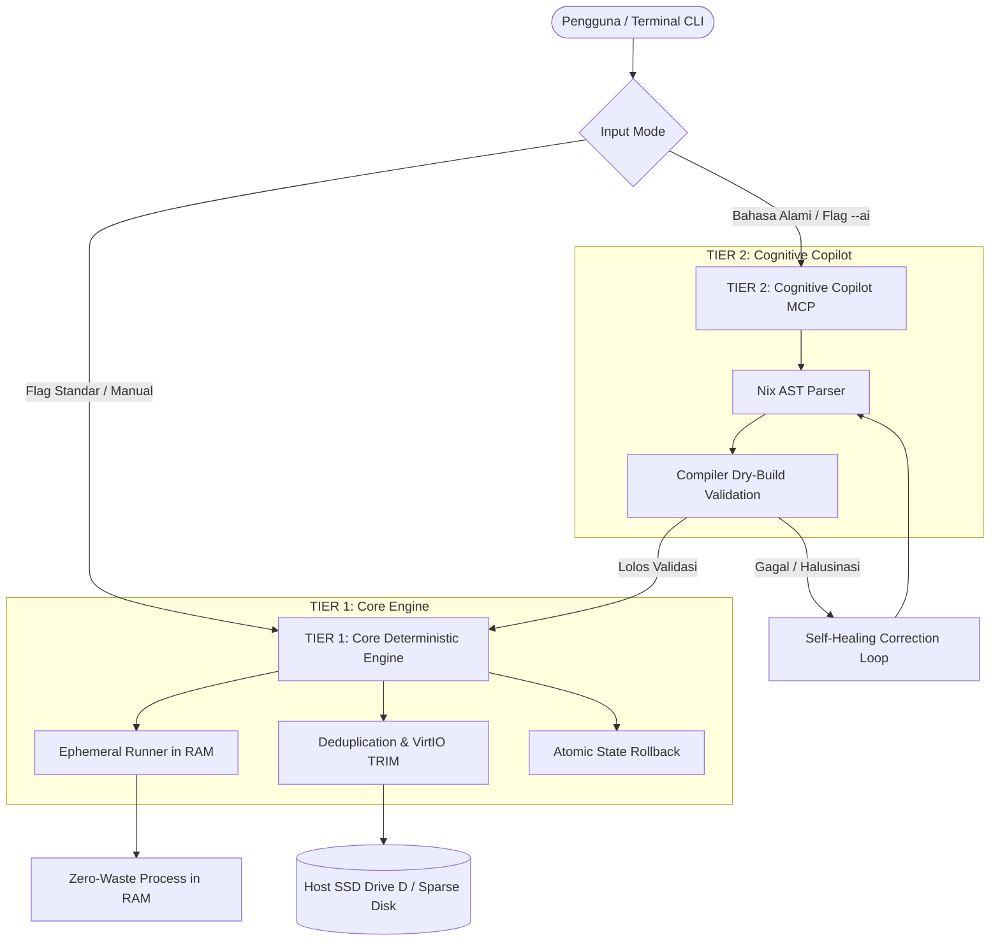

# NEURONIX

<p align="center">
  
</p>

<p align="center">
  <strong>The Deterministic, Self-Healing Workstation & Ephemeral Sandbox Substrate</strong><br>
  <em>(AI-Augmented, Hypervisor-Aware, Zero-Waste)</em>
</p>

<p align="center">
  <a href="LICENSE"></a>
  <a href="flake.nix"></a>
  
  
  
</p>

---

## 🌊 The Philosophy: "The Water and the Concrete Trench"

> *"AI adalah aliran air yang deras dan tidak dapat ditebak arah lajunya; sistem operasi tradisional yang mutable ibarat desa tanah liat yang hanyut saat air meluap. NEURONIX adalah parit beton bertulang (*deterministic pure-functional substrate*) yang mengarahkan energi air tersebut secara aman dan presisi tanpa merusak desa."*

Di era agen kecerdasan buatan otonom, memberi AI akses ke sistem operasi konvensional (seperti Ubuntu atau Windows biasa) adalah bencana laten: halusinasi AI dapat menghapus file penting sistem atau memicu konflik dependensi yang fatal.

**NEURONIX** memecahkan masalah ini secara fundamental:
1. **Zero-Blast Radius:** Menggunakan compiler fungsional murni sebagai gerbang formal (*formal gatekeeper*).
2. **2-Second Atomic Rollback:** Jika ada sesuatu yang salah, seluruh kondisi komputer dapat diputar balik ke detik sebelum kesalahan terjadi.
3. **Hypervisor-Aware Auto-Diet:** Menjaga kapasitas harddisk host (misal: Drive D) agar tidak bocor atau membengkak saat menjalankan mesin virtual/container.

---

## ⚡ Mengapa NEURONIX Berbeda?

| Fitur / Karakteristik | Docker Desktop | Podman | OpenSandbox | **NEURONIX** |
| :--- | :---: | :---: | :---: | :---: |
| **Beban Memory (Daemon Overhead)** | Boros (4–8 GB RAM) | Rendah (Daemonless) | Berat (Docker-based) | **NOL (CLI Murni Instan)** |
| **Efisiensi Disk Storage** | Layer Bloat (Menduplikasi OS) | Layer Bloat | Layer Bloat | **Content-Addressed Inodes (Hardlink 100%)** |
| **Integrasi Hardware (GUI, Audio, GPU)** | Kaku (Perlu mapping flag) | Kaku | Sulit | **Alami & Instan (Wayland / PipeWire / GPU)** |
| **Sadar Penyusutan Virtual Disk Host** | Tidak | Tidak | Tidak | **YA (Otomatis TRIM ke SSD Host)** |
| **Waktu Rollback Kerusakan Sistem** | Lambat (Rebuild image) | Lambat | N/A | **$< 2$ Detik (Atomic Symlink Flip)** |
| **Arsitektur AI** | Pasif | Pasif | Integrasi Cloud Kaku | **Decoupled Modular (Offline-First / Opt-In)** |

---

## 🏗️ Arsitektur Dua Lapis (*Decoupled Two-Tier*)

NEURONIX memisahkan mesin fisik deterministik dengan korteks AI kognitif:



---

## 🚀 Quickstart & Panduan Penggunaan

### 1. Menjalankan Langsung via Nix Flakes (Tanpa Instalasi)
```bash
nix run github:adamrofc/neuronix -- status
```

### 2. Menginstal ke Profile Pengguna
```bash
nix profile install github:adamrofc/neuronix
```

---

## 🛠️ Perintah Utama (*Core Commands*)

### 1. `neuronix status` (Dashboard Telemetri)
Memeriksa kesehatan sistem operasi, generasi aktif, pemakaian storage `/nix`, dan status timer otomatis.
```bash
neuronix status
```

### 2. `neuronix diet` (Dokter Storage & Host TRIM)
Membersihkan paket usang, menyatukan file kembar via *hardlink*, dan menembakkan sinyal *VirtIO discard* agar file virtual disk di Drive D host menyusut otomatis.
```bash
neuronix diet
```

### 3. `neuronix run <packages...>` (Ruang Kerja Gaib di RAM)
Mencoba software apa pun dari repositori tanpa menginstalnya secara permanen di komputer.
```bash
# Menjalankan Python 3, PyTorch, atau tools multimedia
neuronix run ffmpeg yt-dlp
# Begitu terminal ditutup, 0 byte sampah tersisa di sistem!
```

### 4. `neuronix undo` (Tombol Darurat Rollback 2 Detik)
Mengembalikan seluruh konfigurasi komputer ke generasi sebelumnya secara atomik jika ada software atau eksperimen yang gagal.
```bash
neuronix undo
```

---

## 🗺️ Roadmap Pengembangan

- [x] **Fase 0:** Inisialisasi Repositori, Dokumen PRD, Arsitektur & Lisensi Apache 2.0.
- [x] **Fase 1:** Core CLI Engine v0.1 (`status`, `diet`, `run`, `undo`, `flake.nix`).
- [ ] **Fase 2:** Decoupled Cognitive Driver via Model Context Protocol (MCP) & Local Ollama.
- [ ] **Fase 3:** Shadow Micro-VM Simulation (`neuronix try`) berbasis QEMU RAM canary testing.
- [ ] **Fase 4:** Standalone OS ISO Distribution dengan installer grafis Calamares (`nixos-generators`).
- [ ] **Fase 5:** Paket distribusi lintas platform untuk Windows WSL2 dan macOS Darwin.

---

## 📄 Lisensi

Didistribusikan di bawah lisensi resmi **Apache License 2.0**. Lihat file [`LICENSE`](LICENSE) untuk informasi lebih lanjut.

Copyright (c) 2026 NEURONIX Contributors.
