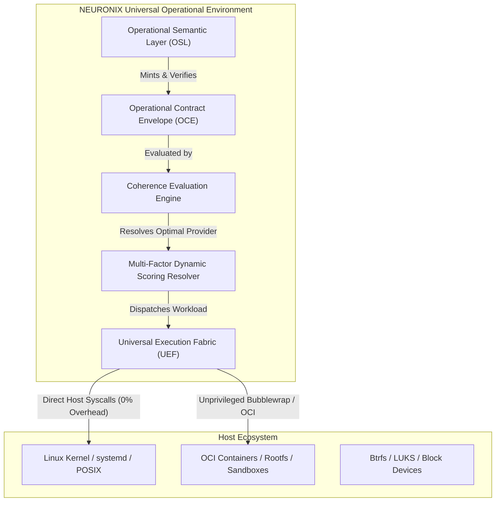

# NEURONIX OS: Universal Operational Environment (UOE)

## 1. Architectural Paradigm & Intent

NEURONIX OS introduces the **Universal Operational Environment (UOE)**: an architecture unifying the **Universal Execution Fabric (UEF)** and the **Operational Semantic Layer (OSL)**.

Rather than attempting to reinvent the Linux kernel or rewrite established distribution package ecosystems, NEURONIX operates as a **Universal Operational Semantic Overlay**. Linux and NixOS serve as the first and most deeply integrated native substrate, but they do not bound the operational identity of NEURONIX.

### Foundational Distinction: Execution vs Semantics
- **Linux Substrate:** Executes processes, manages syscalls, handles hardware drivers, drives memory paging, and isolates threads.
- **NEURONIX Overlay:** Comprehends the **meaning of operational change**: intent, actor identity, authority tier, target environment, declared preconditions, expected blast radius, enforced security invariants, empirical evidence, and verifiable outcomes.

---

## 2. Core Primitive: Operational Contract Envelope (OCE)

Every operational transition in NEURONIX is encapsulated in a canonical, typed contract. The formula for the Operational Contract Envelope is:

$$\text{Contract} = \text{Intent} + \text{Actor} + \text{Authority} + \mathbf{Environment} + \text{Preconditions} + \text{Expected Effects} + \text{Invariants} + \text{Evidence} + \mathbf{Outcome}$$

### Formal Schema Anchors
The envelope adheres strictly to Draft 2020-12 JSON Schema (`data/schemas/operational_contract_envelope.schema.json`) and RFC 8785 JSON Canonicalization Scheme (JCS):
1. **Intent:** Dot-delimited action name (`category`: `READ`, `PROPOSE`, `MUTATE`), human-readable rationale, and target resource URI.
2. **Actor:** Requesting principal (`HUMAN_OWNER`, `HUMAN_OPERATOR`, `AI_AGENT`, `SYSTEM_DAEMON`) and session nonce.
3. **Authority:** Cryptographic delegation tier (`OBSERVE_ONLY`, `PROPOSE_ONLY`, `DELEGATED_SCOPED`, `FULL_OPERATOR`), delegation token (`DEL-...`), and optional signature.
4. **Environment:** Target substrate, isolation tier (`TIER_0_HOST`, `TIER_1_SANDBOX`, `TIER_2_MICROVM`), and provider preferences.
5. **Preconditions:** Required StateRoot digest and security invariant prerequisites.
6. **Expected Effects:** Declared structured diff, destructiveness flag, and deterministic rollback recipe.
7. **Invariants:** Formal security invariants (`INV-SEC-001` through `INV-SEC-020`).
8. **Evidence:** SHA-256 digest of inputs and parent receipt lineage hashes.
9. **Outcome:** Lifecycle status, execution receipt ID, and diagnostic reports.

---

## 3. The 8 Non-Negotiable Resource & Lean Architecture Rules

To guarantee minimal resource consumption, low idle footprint, and uncompromised performance, NEURONIX enforces eight strict operational invariants:

1. **Rule 1: Zero Forced Providers:** Never run daemons or background execution runtimes for providers that are not actively executing workloads.
2. **Rule 2: No Unnecessary Virtual Machines:** Micro-isolation, unprivileged namespaces, and Landlock take precedence. Hardware virtualization (KVM) is reserved exclusively for foreign or untrusted kernels.
3. **Rule 3: Proportional Semantics (Selective Semanticization):**
   - **Tier 0 (Passthrough):** Read-only operations and local inquiries bypass heavy cryptographic enveloping, achieving sub-millisecond execution.
   - **Tier 1 (Lightweight):** Non-destructive configuration queries and safe proposals record lightweight receipts without complex preflight locking.
   - **Tier 2 (Full Contract):** Destructive mutations, disk formatting, and privilege changes require full StateRoot preflight, invariant verification, and interactive Conductor approval.
4. **Rule 4: Ephemeral Execution State:** All execution mounts, temporary directories, and volatile namespaces must be immediately reclaimed upon process termination with verifiable release proofs.
5. **Rule 5: No Monolithic Bundling into ISO:** The base distribution image remains lean, reproducible, and immutable. Execution providers and rootfs layers are retrieved or mounted on demand.
6. **Rule 6: No Internal Engine Reinvention:** Standard production-proven Linux primitives (`bubblewrap`, `crun`, Nix store, eBPF) are leveraged directly rather than reinvented.
7. **Rule 7: Independent Layer Garbage Collection:** Cached container images and foreign rootfs layers carry explicit TTLs and LRU eviction policies, operating independently from the immutable Nix store.
8. **Rule 8: Native Path Preservation:** Workloads targeting host NixOS/Linux binaries execute with 0% proxy overhead and direct host syscall performance.

---

## 4. Universal Execution Fabric: 3-Provider MVP

The Universal Execution Fabric resolves workloads across three canonical providers:

| Provider ID | Implementation Mechanism | Supported Formats | Isolation Score | Startup Latency | Resource Footprint |
| :--- | :--- | :--- | :--- | :--- | :--- |
| `native.linux` | Host Linux POSIX execution | `elf-binary`, `nix-closure`, `posix-script` | 0.00 (Host) | Sub-millisecond (<1ms) | Zero overhead |
| `rootfs.bwrap` | Unprivileged Bubblewrap sandbox | `rootfs-dir`, `elf-binary`, `posix-script` | 0.70 (Namespace) | Low millisecond (3-5ms) | Minimal namespaces |
| `oci.crun` | OCI standard container runtime | `oci-image`, `rootfs-dir` | 0.85 (Container) | Moderate (15-25ms) | Moderate container |

---

## 5. Dynamic Multi-Factor Scoring Formula

The `ProviderResolver` evaluates each registered provider using a multi-factor scoring function:

$$\text{ProviderScore} = C_{\text{compat}} \times \left( w_1 P_{\text{policy}} + w_2 I_{\text{isolation}} + w_3 R_{\text{resource}} + w_4 L_{\text{latency}} + w_5 Q_{\text{provenance}} \right)$$

Where:
- $C_{\text{compat}} \in \{0.0, 1.0\}$: Hard binary compatibility gate. If the provider cannot inspect or run the workload format, the score drops to 0.0 immediately.
- $w_1 = 0.25$: Policy compliance weight ($P_{\text{policy}}$).
- $w_2 = 0.25$: Security isolation alignment ($I_{\text{isolation}}$).
- $w_3 = 0.20$: Inverse resource overhead score ($R_{\text{resource}}$).
- $w_4 = 0.20$: Latency and cold-start efficiency score ($L_{\text{latency}}$).
- $w_5 = 0.10$: Provenance and cryptographic signature verification ($Q_{\text{provenance}}$).

---

## 6. Subsystem Integration & Human Sovereignty

1. **User Sovereignty Gate:** AI agents calling UOE cannot commit mutations directly. Any `MUTATE` action initiated by an `AI_AGENT` principal without a valid, unexpired cryptographic delegation token (`DEL-...`) triggers `CoherenceApprovalRequired`, emitting a structured proposal for human operator resolution.
2. **Conductor Native Surface:** Proposals and operational contracts render directly in the Conductor terminal slide-over overlay with diff inspection, blast radius metrics, and provider score breakdowns.
3. **Vital Observatory:** Resource metrics, per-provider memory footprints, and execution latencies are sampled truthfully without synthetic fallbacks.
4. **StateRoot & Evidence Graph:** Execution receipts bind directly to `StateCommitment` and `EvidenceCommitment`, providing end-to-end cryptographic lineage verified offline via `verify_passport.py`.
