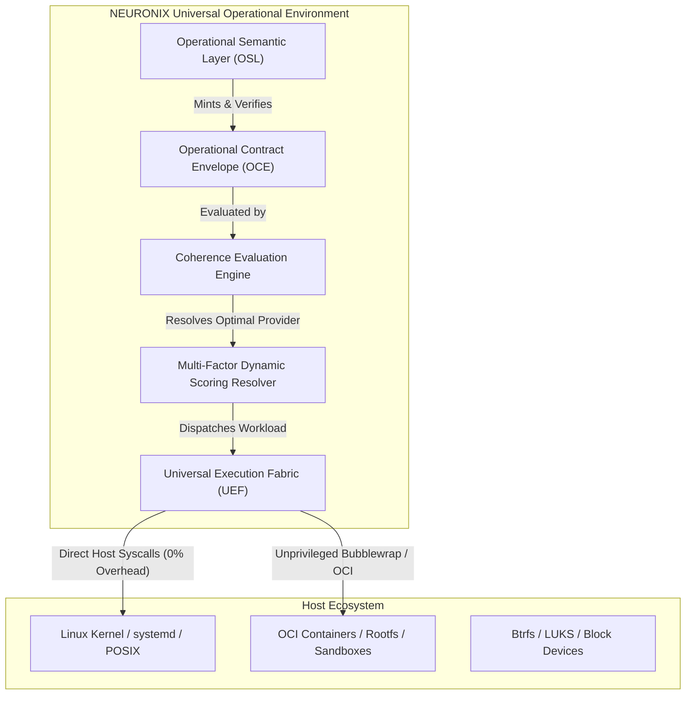

# NEURONIX OS: Universal Operational Environment (UOE)

## 1. Architectural Paradigm & Intent

NEURONIX OS introduces the **Universal Operational Environment (UOE)**: an architecture unifying the **Universal Execution Fabric (UEF)** and the **Operational Semantic Layer (OSL)**.

Rather than attempting to reinvent the Linux kernel or rewrite established distribution package ecosystems, NEURONIX operates as a **Universal Operational Semantic Overlay**. Linux and NixOS serve as the first and most deeply integrated native substrate, but they do not bound the operational identity of NEURONIX.

### Foundational Distinction: Execution vs Semantics
- **Linux Substrate:** Executes processes, manages syscalls, handles hardware drivers, drives memory paging, and isolates threads.
- **NEURONIX Overlay:** Comprehends the **meaning of operational change**: intent, actor identity, authority tier, target environment, declared preconditions, expected blast radius, enforced security invariants, empirical evidence, and verifiable outcomes.

---

## 2. Core Primitive: Operational Contract Envelope (OCE)

Every operational transition in NEURONIX is encapsulated in a canonical, typed contract. The formula for the Operational Contract Envelope is:

$$\text{Contract} = \text{Intent} + \text{Actor} + \text{Authority} + \mathbf{Environment} + \text{Preconditions} + \text{Expected Effects} + \text{Invariants} + \text{Evidence} + \mathbf{Outcome}$$

### Formal Schema Anchors
The envelope adheres strictly to Draft 2020-12 JSON Schema (`data/schemas/operational_contract_envelope.schema.json`) and RFC 8785 JSON Canonicalization Scheme (JCS):
1. **Intent:** Dot-delimited action name (`category`: `READ`, `PROPOSE`, `MUTATE`), human-readable rationale, and target resource URI.
2. **Actor:** Requesting principal (`HUMAN_OWNER`, `HUMAN_OPERATOR`, `AI_AGENT`, `SYSTEM_DAEMON`) and session nonce.
3. **Authority:** Cryptographic delegation tier (`OBSERVE_ONLY`, `PROPOSE_ONLY`, `DELEGATED_SCOPED`, `FULL_OPERATOR`), delegation token (`DEL-...`), and optional signature.
4. **Environment:** Target substrate, isolation tier (`TIER_0_HOST`, `TIER_1_SANDBOX`, `TIER_2_MICROVM`), and provider preferences.
5. **Preconditions:** Required StateRoot digest and security invariant prerequisites.
6. **Expected Effects:** Declared structured diff, destructiveness flag, and deterministic rollback recipe.
7. **Invariants:** Formal security invariants (`INV-SEC-001` through `INV-SEC-020`).
8. **Evidence:** SHA-256 digest of inputs and parent receipt lineage hashes.
9. **Outcome:** Lifecycle status, execution receipt ID, and diagnostic reports.

---

## 3. The 8 Non-Negotiable Resource & Lean Architecture Rules

To guarantee minimal resource consumption, low idle footprint, and uncompromised performance, NEURONIX enforces eight strict operational invariants:

1. **Rule 1: Zero Forced Providers:** Never run daemons or background execution runtimes for providers that are not actively executing workloads.
2. **Rule 2: No Unnecessary Virtual Machines:** Micro-isolation, unprivileged namespaces, and Landlock take precedence. Hardware virtualization (KVM) is reserved exclusively for foreign or untrusted kernels.
3. **Rule 3: Proportional Semantics (Selective Semanticization):**
   - **Tier 0 (Passthrough):** Read-only operations and local inquiries bypass heavy cryptographic enveloping, achieving sub-millisecond execution.
   - **Tier 1 (Lightweight):** Non-destructive configuration queries and safe proposals record lightweight receipts without complex preflight locking.
   - **Tier 2 (Full Contract):** Destructive mutations, disk formatting, and privilege changes require full StateRoot preflight, invariant verification, and interactive Conductor approval.
4. **Rule 4: Ephemeral Execution State:** All execution mounts, temporary directories, and volatile namespaces must be immediately reclaimed upon process termination with verifiable release proofs.
5. **Rule 5: No Monolithic Bundling into ISO:** The base distribution image remains lean, reproducible, and immutable. Execution providers and rootfs layers are retrieved or mounted on demand.
6. **Rule 6: No Internal Engine Reinvention:** Standard production-proven Linux primitives (`bubblewrap`, `crun`, Nix store, eBPF) are leveraged directly rather than reinvented.
7. **Rule 7: Independent Layer Garbage Collection:** Cached container images and foreign rootfs layers carry explicit TTLs and LRU eviction policies, operating independently from the immutable Nix store.
8. **Rule 8: Native Path Preservation:** Workloads targeting host NixOS/Linux binaries execute with 0% proxy overhead and direct host syscall performance.

---

## 4. Universal Execution Fabric: 3-Provider MVP & Fail-Closed Mechanics

The Universal Execution Fabric resolves workloads across three canonical providers:

| Provider ID | Implementation Mechanism | Supported Formats | Isolation Score | Startup Latency | Resource Footprint |
| :--- | :--- | :--- | :--- | :--- | :--- |
| `native.linux` | Host Linux POSIX execution | `elf-binary`, `nix-closure`, `posix-script` | 0.00 (Host) | Sub-millisecond (<1ms) | Zero overhead |
| `rootfs.bwrap` | Unprivileged Bubblewrap sandbox | `rootfs-dir`, `elf-binary`, `posix-script` | 0.70 (Namespace) | Low millisecond (3-5ms) | Minimal namespaces |
| `oci.crun` | OCI standard container runtime | `oci-image`, `rootfs-dir` | 0.85 (Container) | Moderate (15-25ms) | Moderate container |

### Fail-Closed Execution Hardening
1. **Missing Runtime Rejection:**
   - `RootfsBwrapProvider`: When the `bwrap` binary is absent, `inspect()` marks `compatible = False`, immediately preventing invalid dispatch.
   - `OciContainerProvider`: When no OCI runtime (`crun`, `runc`, `podman`, `docker`) is installed on the host, `inspect()` marks `compatible = False`.
2. **Authentic Subprocess Execution:**
   - Providers execute authentic host binaries or sandboxed processes via real subprocess pipelines.
   - Exit codes, real `stdout`, and real `stderr` are preserved verifiably. Synthetic success strings (e.g. `ROOTFS_EXEC_SUCCESS`, `OCI_CONTAINER_OUTPUT`) are strictly prohibited.
   - When a process exits with a non-zero code or fails, `invariants_verified` is emptied (`[]`), guaranteeing that failed executions never emit affirmative invariant claims.
3. **Deterministic Cleanup & Release Proofs:**
   - Every provider registers explicit cleanup handlers (`cleanup_workspace`, `cleanup_dir`) in `PreparedEnvironment`.
   - `cleanup()` guarantees complete removal of temporary bundle specs and scratch spaces, returning a typed `ResourceReleaseProof`.

---

## 5. Dynamic Multi-Factor Scoring Formula

The `ProviderResolver` decouples provider capability facts from scoring policies. Providers declare truthful facts via `evaluate_capabilities()` returning a `CapabilityVector`:
- `policy_fit`: Alignment with workload requirements.
- `isolation_fit`: Degree of protection provided for the requested isolation tier.
- `resource_cost`: Normalized inverse memory/CPU overhead (1.0 = near-zero).
- `startup_latency`: Normalized cold-start efficiency (1.0 = sub-millisecond).
- `provenance`: Cryptographic and build reproducibility assurance.

The `ProviderResolver` evaluates each registered provider using the formal multi-factor formula:

$$\text{ProviderScore} = C_{\text{compat}} \times \left( w_1 P_{\text{policy}} + w_2 I_{\text{isolation}} + w_3 R_{\text{resource}} + w_4 L_{\text{latency}} + w_5 Q_{\text{provenance}} \right)$$

Where:
- $C_{\text{compat}} \in \{0.0, 1.0\}$: Hard binary compatibility gate. If the provider cannot inspect or run the workload format, the score drops to 0.0 immediately.
- $w_1 = 0.25$: Policy compliance weight ($P_{\text{policy}}$).
- $w_2 = 0.25$: Security isolation alignment ($I_{\text{isolation}}$).
- $w_3 = 0.20$: Inverse resource overhead score ($R_{\text{resource}}$).
- $w_4 = 0.20$: Latency and cold-start efficiency score ($L_{\text{latency}}$).
- $w_5 = 0.10$: Provenance and cryptographic signature verification ($Q_{\text{provenance}}$).

---

## 6. Coherence Engine Enforcement & Human Sovereignty

1. **Authoritative Delegation Registry Verification:**
   - Naive token prefix matching (e.g. `DEL-`) is strictly forbidden.
   - Delegation tokens presented by `AI_AGENT` principals are verified authoritatively against `DelegationRegistry.validate_token()`:
     - Principal identity match (`agent_id == token.principal_id`).
     - Scope conformance (`action` matching declared `scope` pattern).
     - Delegation tier sufficiency (`DELEGATED_SCOPED` or `FULL_OPERATOR`).
     - Cryptographic expiration timestamp (`valid_until_utc > now`).
     - Anti-replay input digest binding (`evidence.input_digest == token.input_digest`).
   - Tokens failing any check trigger `CoherenceApprovalRequired`, forcing interactive human operator review in Conductor.
2. **Security Invariant Validation Gates:**
   - Formal invariants (`INV-SEC-001` through `INV-SEC-020`) are checked against strict regex syntax (`^INV-SEC-[0-9]{3}$`).
   - `INV-SEC-002`: Enforces verified host KVM hardware virtualization availability.
   - `INV-SEC-014`: Enforces secret leakage prevention by inspecting envelope diffs for raw private keys or plain secrets.
3. **Zero-Simulation Execution Rejection:**
   - The Coherence Engine rejects synthetic execution fallbacks (e.g. `/bin/echo "Executed: ..."`).
   - If an operational action is not mapped to an active executable skill, execution raises `CoherenceUnexecutableError`, ensuring unexecutable actions fail closed.

---

## 7. RFC 8785 JCS Receipt Integrity & Cryptographic Commitments

1. **Bit-Level Canonical Envelope Hashing:**
   - Envelope digests are calculated strictly via `canonical_json_bytes(envelope)` adhering to RFC 8785 JSON Canonicalization Scheme (JCS).
   - Naive `str(dict)` approximations and unescaped serializations are eliminated.
2. **Truthful StateRoot Lineage:**
   - All execution receipts query the live Git commit and NixOS generational state root via `compute_state_root()`.
   - Receipts record the verified `state_root_after`, enabling offline falsifiable lineage traversal via `verify_passport.py`.
3. **Truthful Invariant Accounting:**
   - Receipts only report security invariants that were genuinely verified during that specific execution cycle.

---

## 8. Empirical Benchmark Qualification & Zero-Leak Verification

The UOE architecture has been qualified through empirical latency and resource endurance benchmarks:

### A. Latency & Overhead Profile (`benchmark_uef_latency.py`)
- **Resolver Scoring Latency:** Median 269 us (p99 477 us, mean 283 us), confirming sub-millisecond dynamic routing.
- **Coherence Evaluation Latency:** Median 3.04 us (p99 3.45 us, mean 3.21 us), confirming microsecond-level policy evaluation.

### B. Resource Qualification & 1,000-Cycle Endurance (`benchmark_uef_resources.py`)
- **Idle Core Baseline:** Memory footprint of 26.7 MB RSS, background CPU idle consumption of 0.05 ms / 50 ms window, initial StateRoot computation in 11.8 ms.
- **Single Lifecycle Latencies:**
  - `native.linux`: Prepare 0.12 ms, Execute 8.97 ms, Cleanup 0.01 ms (Total 9.09 ms).
  - `rootfs.bwrap`: Prepare 0.21 ms, Execute 15.56 ms, Cleanup 0.09 ms (Total 15.85 ms).
  - `oci.bundle`: Prepare 0.22 ms, Cleanup 0.12 ms (Total 0.34 ms).
- **1,000-Cycle Continuous Stress Qualification:**
  - Total Duration: 13.7 s (mean 13.7 ms/cycle across 1,000 interleaved native and container sandboxes).
  - `INV-RES-001_ZERO_FD_LEAK`: 0 file descriptor leaks (`fd_delta == 0`, initial 57 -> final 57).
  - `INV-RES-002_ZERO_MOUNT_LEAK`: 0 mount leaks (`mount_delta == 0`, initial 31 -> final 31).
  - `INV-RES-003_ZERO_TEMP_DIR_LEAK`: 0 leftover temporary directories (`temp_dir_delta == 0`, initial 6 -> final 6).
  - `INV-RES-004_BOUNDED_RSS_GROWTH`: 0.33 MB RSS growth over 1,000 cycles (< 20.0 MB threshold).
