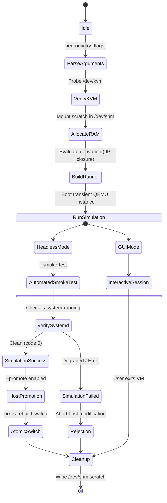

# NEURONIX Shadow Micro-VM Architecture Specification

**Component ID:** `NRX-SPEC-003`  
**Subsystem:** Transient In-Memory QEMU Micro-Hypervisor Harness  
**Substrate Version:** 0.4.0-beta  

---

## 1. Abstract

Mutating configuration files on bare-metal systems creates unquantified availability risks. While NixOS provides generation-based rollback, a faulty kernel driver, display server regression, or broken systemd service can render the machine unbootable, forcing manual GRUB recovery.

The **NEURONIX Shadow Micro-VM (`neuronix try`)** isolates evaluation by constructing a transient clone of the proposed system state entirely inside volatile memory (`/dev/shm`). The host store (`/nix/store`) is mapped into the virtual guest via a 9P transport mount, achieving instantaneous boot latency (under 3 seconds) with zero duplicate disk allocation.

---

## 2. Memory Topology & Ephemeral Scratch Space

Traditional `nixos-rebuild build-vm` invocations write a persistent `.qcow2` overlay file directly to the invoking working directory. On developer workstations, this introduces filesystem clutter, disk I/O bottlenecks, and host storage inflation.

`neuronix try` enforces an in-memory disk topology:

Scratch Path: `/dev/shm/neuronix_shadow_<pid>`

```text
Host Memory (RAM)
┌──────────────────────────────────────────────────────────────┐
│ /dev/shm (tmpfs)                                             │
│  └─ neuronix_shadow_XXXXXX/                                  │
│      ├─ nixos.qcow2        <-- Ephemeral copy-on-write delta │
│      └─ qemu.pid           <-- Tracked process supervisor    │
└──────────────────────────────┬───────────────────────────────┘
                               │ 9P File System (Read-Only)
┌──────────────────────────────▼───────────────────────────────┐
│ Host Physical Storage                                        │
│  └─ /nix/store/ (Immutable Closure Store)                    │
└──────────────────────────────────────────────────────────────┘
```

Upon VM termination, a POSIX exit trap (`EXIT INT TERM HUP`) unconditionally issues `rm -rf` on the scratch path, guaranteeing **zero disk leakage**.

---

## 3. Execution Lifecycle & State Machine



---

## 4. Execution Modes & CLI Reference

### 4.1 Automated Smoke Test (`--smoke-test`)
Boots the Micro-VM non-interactively in headless mode, verifies that the systemd target reaches operational equilibrium, and halts the guest:

```bash
neuronix try --smoke-test
```

### 4.2 One-Click Host Promotion (`--promote`)
Guarantees that a configuration is applied to the host operating system only after passing verification inside the Shadow Micro-VM:

```bash
neuronix try --smoke-test --promote /etc/nixos/configuration.nix
```

If the smoke test encounters a kernel panic, failing unit, or dependency cycle, promotion is blocked immediately.

### 4.3 Interactive GUI Session (`--gui`)
Spawns the Micro-VM with a virtual Spice/GTK display for interactive testing of desktop environments (Wayland/Hyprland/GNOME):

```bash
neuronix try --gui
```

---

## 5. Security & Isolation Guarantees

1. **Host Store Immutability:** The 9P mount exports `/nix/store` as read-only. Any attempt by a compromised or buggy daemon inside the guest to modify store paths is denied at the VFS layer (`EROFS: Read-only file system`).
2. **Crash Containment:** Kernel panics, OOM conditions, and fork-bombs triggered inside the Micro-VM cannot escape the QEMU process boundary.
3. **Hardware Acceleration:** Uses `/dev/kvm` hardware virtualization extensions (VT-x / AMD-V) when available for near-native execution performance.
