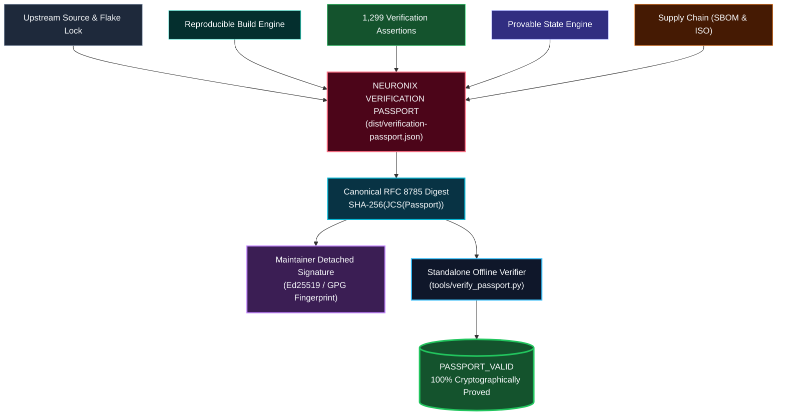

# NEURONIX Specification 013: Verification Passport & Unified Epistemic Proof Fabric

> **Document ID:** `NRX-SPEC-013`  
> **Status:** RATIFIED STANDARD  
> **Version:** `1.0.0`  
> **Target Release:** `v1.0.4+`  
> **Standard:** `NEURONIX-VERIFICATION-PASSPORT-V1`

---

## 1. Scope & Architectural Rationale

Prior to this specification, verification evidence across NEURONIX OS was distributed across disparate files:
- Release manifests (`dist/release.json`, `dist/release-manifest.json`)
- Cryptographic checksums and GPG signatures (`dist/SHA256SUMS`, `dist/SHA256SUMS.sig`)
- Two-build bit-identical reproducibility evidence (`dist/reproducibility_evidence.json`)
- Software Bill of Materials (`dist/neuronix-os-v1.0.4-sbom.spdx.json`)
- JCS RFC 8785 number formatting evidence (`dist/jcs_conformance_evidence.json`)
- Performance benchmark reports (`dist/benchmark_results.json`)
- Provable State Engine StateRoot (`L_posture`, `L_substrate`, `L_provenance`, `L_policy`, `L_evidence`)

The **NEURONIX VERIFICATION PASSPORT** (`dist/verification-passport.json`) consolidates all release claims, build closures, test assertions, hardware profiles, and supply chain attestations into a single immutable cryptographic object.

By binding the entire document under a canonical RFC 8785 SHA-256 digest:
$$\text{PassportDigest} = \text{SHA-256}(\operatorname{JCS}(\text{VerificationPassport} \setminus \{\text{passport\_digest}\}))$$
an external auditor, automated pipeline, or air-gapped verifier can falsify or certify the complete operating system release through a single cryptographic verification step.

---

## 2. Passport Architecture & Verification Flow



---

## 3. Authoritative Passport Schema

A conforming NEURONIX VERIFICATION PASSPORT adheres strictly to schema version `1.0.0`:

```json
{
  "schema_version": "1.0.0",
  "passport_type": "NEURONIX_VERIFICATION_PASSPORT_V1",
  "release_metadata": {
    "distribution": "NEURONIX OS",
    "release_version": "1.0.4",
    "release_tag": "v1.0.4",
    "commit_sha": "ef8e07bc5f1428552ebf2399921313df1da8b6f3",
    "nixpkgs_commit": "3ed67ec0a4d3c7ab4ae1f04f8ee8df07bfa506a2",
    "proof_engine_version": "1.1.0"
  },
  "cryptographic_commitments": {
    "state_root": "dad96456f439cfb5c6f157c051d5599cec239159a3c7f2ad12f773788981e8f2",
    "policy_hash": "eaaea8a0352a4c4c393ae0b81007f6152213b412e87106dae93b108c9b89af30",
    "flake_lock_hash": "06135d460eb72c7dcb846ac22cab8cee65f9acea9f3b285a9adb9d27de876981",
    "trust_status": "TRUSTED",
    "trust_vector": {
      "posture": "VERIFIED",
      "substrate": "VERIFIED",
      "policy": "VERIFIED",
      "evidence": "VERIFIED",
      "runtime": "VERIFIED",
      "provenance": "VERIFIED",
      "freshness": "FRESH",
      "overall": "TRUSTED"
    }
  },
  "verification_evidence": {
    "test_manifest_hash": "5d2b7b51...",
    "catalog_assertion_count": 1299,
    "verified_assertion_count": 1299,
    "verified_failure_count": 0,
    "verified_pass_rate_percentage": 100,
    "verification_status": "PASSING_ALL",
    "evidence_snapshot_digest": "28774085..."
  },
  "ci_attestation": {
    "ci_workflow_id": "ci.yml",
    "ci_run_id": "34442429942",
    "ci_run_status": "success",
    "ci_commit_sha": "ef8e07bc5f1428552ebf2399921313df1da8b6f3"
  },
  "supply_chain_digests": {
    "reproducibility_evidence_sha256": "4b91...",
    "iso_checksums_sha256": "7a82...",
    "sbom_spdx_sha256": "de88...",
    "jcs_conformance_sha256": "14f0..."
  },
  "hardware_profiles": [
    "thinkpad_t14_gen3",
    "framework_laptop_13",
    "amd_workstation_zen4",
    "intel_nuc_13_pro",
    "dell_xps_15_prime",
    "asus_zephyrus_g14",
    "apple_silicon_m_series",
    "generic_uefi_hardware"
  ],
  "verification_timestamp": "2026-09-09T01:57:20Z",
  "passport_digest": "c933f0c4b732434b57ba1c912baaff898878931923ece136752611cd853c8a80"
}
```

---

## 4. Multi-Tier Assurance Taxonomy

The passport formalizes an epistemically rigorous taxonomy:

1. **`CATALOG`**: Total test assertions registered in canonical manifest (`data/test_manifest.json`), fixed at 1,299 across 32 QA suites, 19 distro suites, and 15 standalone verification gates.
2. **`VERIFIED`**: Assertions that were executed and observed green in CI/local runs.
3. **`OBSERVED`**: Dynamic confirmation that execution occurred on a physical or hypervisor substrate.
4. **`ATTESTED`**: Cryptographically bound into `assurance_evidence_snapshot.json` and signed.

---

## 5. Evidence Freshness Semantics

To prevent stale verification claims from presenting as active truth, the passport evaluates evidence age:

- **`FRESH`**: Verified within the last 24 hours ($\Delta t \le 86,400\,\text{s}$). System trust resolves to `"TRUSTED"`.
- **`STALE`**: Verified between 24 hours and 7 days ago ($86,400 < \Delta t \le 604,800\,\text{s}$). System trust resolves to `"CONDITIONAL_TRUST"`.
- **`EXPIRED`**: Verified more than 7 days ago ($\Delta t > 604,800\,\text{s}$). System trust degrades to `"DEGRADED"`.

---

## 6. Standalone Offline Verification Protocol

Verification requires zero external dependencies, network access, or running daemons:

```bash
# Verify official release passport
neuronix verify-passport dist/verification-passport.json

# Or using standalone Python 3 script on any machine (air-gapped):
python3 tools/verify_passport.py /path/to/verification-passport.json
```

### Protocol Invariants:
1. Recomputed RFC 8785 digest **must match** `passport_digest` exactly.
2. `verified_assertion_count` **must equal or exceed** `catalog_assertion_count`.
3. `verified_pass_rate_percentage` **must equal** 100.
4. `verification_status` **must equal** `"PASSING_ALL"`.
5. Any byte alteration produces a digest mismatch and causes immediate failure with exit code 1.
