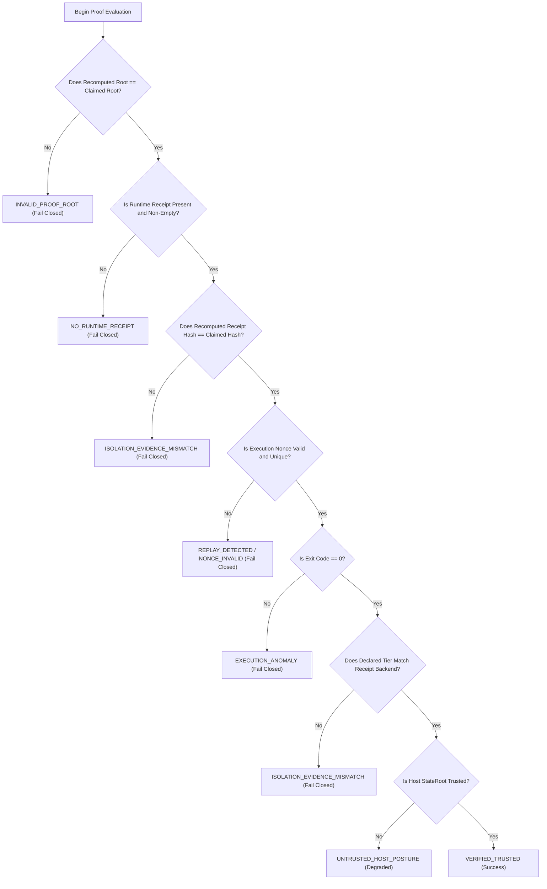

# Specification: Canonical Domain Proof Architecture (DomainProofV1)

## 1. Specification Metadata
- **Specification ID:** SPEC-NRX-DP-014
- **Title:** Canonical Domain Proof Standard and Cryptographic Semantics
- **Version:** 1.0.0
- **Status:** AUTHORITATIVE_STANDARD
- **Scope:** Hyperion Execution Broker (`packages/neuronix-core/neuronix_core/hyperion.py`, `packages/neuronix-daemon/src/hyperion.rs`), CLI, and Offline Verifiers.
- **Reference RFC:** RFC 8785 (JSON Canonicalization Scheme - JCS), FIPS 180-4 (SHA-256).

---

## 2. Motivation and Invariants

To eliminate implementation divergence and achieve deterministic verification across diverse runtimes (Python, Rust, Shell, and air-gapped verifiers), all Domain Proof calculations MUST adhere to a single mathematical formulation.

### Core Invariants:
1. **Identical Cryptographic Root:** Any conforming implementation given identical inputs MUST emit an identical 64-character hexadecimal SHA-256 string for `domain_proof_root`.
2. **Mandatory Runtime Receipt:** A Domain Proof CANNOT be trusted without a valid, authentic `RuntimeReceipt`. If a receipt is absent, the engine MUST fail closed with verdict `NO_RUNTIME_RECEIPT`.
3. **No Silent Downgrade:** If a requested isolation tier is unavailable on the host silicon, execution MUST terminate with `ISOLATION_EVIDENCE_MISMATCH` or `FAIL_CLOSED` unless explicitly authorized by policy.
4. **Replay Resistance:** Every proof binds a unique 128-bit `execution_nonce` and monotonic timestamp. Reused or missing nonces are rejected.
5. **Deterministic Verdict Derivation:** Trust verdicts are derived strictly from evidence assertions; hardcoded trust verdicts are prohibited.

---

## 3. Mathematical Formulation

A Canonical Domain Proof $P$ is formulated as the SHA-256 cryptographic hash of the concatenated canonical digests of six distinct subsystem inputs:

$$P_{\text{root}} = \operatorname{SHA-256}(L_{\text{state}} \parallel H_{\text{hds}} \parallel H_{\text{policy}} \parallel H_{\text{input}} \parallel H_{\text{output}} \parallel H_{\text{receipt}})$$

Where:
- $L_{\text{state}}$: 64-character hex digest of the host 5-leaf Merkle StateRoot.
- $H_{\text{hds}}$: 64-character hex digest of the canonical RFC 8785 serialized Hyperion Domain Specification (HDS).
- $H_{\text{policy}}$: 64-character hex digest of the active eBPF LSM security policy file.
- $H_{\text{input}}$: 64-character hex digest of the workload command or input payload.
- $H_{\text{output}}$: 64-character hex digest of the execution stdout/stderr artifact.
- $H_{\text{receipt}}$: 64-character hex digest of the canonical RFC 8785 serialized `RuntimeReceipt`.

---

## 4. Canonical Proof Document Schema

```json
{
  "$schema": "https://json-schema.org/draft/2020-12/schema",
  "title": "DomainProofV1",
  "type": "object",
  "required": [
    "schema_version",
    "proof_type",
    "domain_id",
    "domain_proof_root",
    "host_state_root",
    "hds_spec_hash",
    "policy_hash",
    "workload_input_hash",
    "output_digest",
    "runtime_evidence_hash",
    "runtime_evidence",
    "execution_nonce",
    "exit_code",
    "timestamp",
    "isolation_tier",
    "mathematical_validity",
    "trust_verdict"
  ],
  "properties": {
    "schema_version": { "type": "string", "const": "1.0.0" },
    "proof_type": { "type": "string", "const": "HYPERION_DOMAIN_PROOF_V1" },
    "domain_id": { "type": "string", "pattern": "^DOM-[0-9]{4}-[0-9]{2}-[0-9]{2}-[A-F0-9]{8}$" },
    "domain_proof_root": { "type": "string", "pattern": "^[a-f0-9]{64}$" },
    "host_state_root": { "type": "string", "pattern": "^[a-f0-9]{64}$" },
    "hds_spec_hash": { "type": "string", "pattern": "^[a-f0-9]{64}$" },
    "policy_hash": { "type": "string", "pattern": "^[a-f0-9]{64}$" },
    "workload_input_hash": { "type": "string", "pattern": "^[a-f0-9]{64}$" },
    "output_digest": { "type": "string", "pattern": "^[a-f0-9]{64}$" },
    "runtime_evidence_hash": { "type": "string", "pattern": "^[a-f0-9]{64}$" },
    "runtime_evidence": { "type": "object" },
    "execution_nonce": { "type": "string", "minLength": 16 },
    "exit_code": { "type": "integer" },
    "timestamp": { "type": "integer" },
    "isolation_tier": { 
      "type": "string", 
      "enum": ["TIER_0_FAST_PATH", "TIER_1_RAM_GHOST", "TIER_2_EBPF_ENCLAVE", "TIER_3_MICRO_VM"] 
    },
    "mathematical_validity": { "type": "boolean" },
    "trust_verdict": {
      "type": "string",
      "enum": [
        "VERIFIED_TRUSTED",
        "NO_RUNTIME_RECEIPT",
        "ISOLATION_EVIDENCE_MISMATCH",
        "EXECUTION_ANOMALY",
        "UNTRUSTED_HOST_POSTURE",
        "INVALID_PROOF_ROOT"
      ]
    }
  }
}
```

---

## 5. Verdict Derivation Decision Tree



---

## 6. Authoritative Runtime Receipt Standard

A `RuntimeReceipt` emitted by an executor backend MUST contain:
```json
{
  "receipt_version": "1.0.0",
  "execution_nonce": "nrx_nonce_1788921849102837_14920",
  "domain_id": "DOM-2026-09-09-8F9A683E",
  "hds_hash": "a1b2c3d4...",
  "requested_tier": "TIER_3_MICRO_VM",
  "actual_tier": "TIER_3_MICRO_VM",
  "backend": "qemu_kvm_micro_vm",
  "runtime_mode": "real_isolated",
  "boundary_id": "boundary-t3-14920",
  "executor_pid": 14920,
  "guest_id": "vm-DOM-2026-09-09-8F9A683E",
  "host_state_root": "e0a3089b...",
  "policy_hash": "eaaea8a0...",
  "start_time": 1788921849,
  "end_time": 1788921852,
  "exit_code": 0,
  "workload_input_hash": "3f82d1c7...",
  "output_digest": "4e91b2c8..."
}
```
