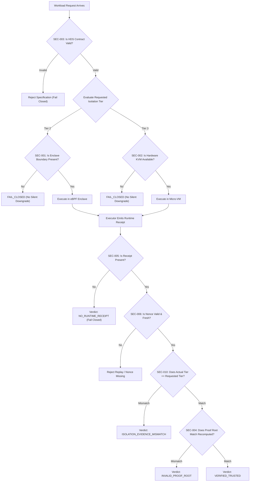

# Specification: Security Invariant Registry & Fail-Closed Semantics

## 1. Specification Metadata
- **Specification ID:** SPEC-NRX-SEC-015
- **Title:** Security Invariant Registry and Verification Matrix
- **Version:** 1.0.0
- **Status:** AUTHORITATIVE_STANDARD
- **Scope:** Complete NEURONIX OS kernel boundary, Hyperion Execution Broker, State Engine, and Verification Gates.
- **Reference Document:** RFC 8785 (JCS), FIPS 180-4, NIST SP 800-207 (Zero Trust Architecture).

---

## 2. Executive Purpose

The Security Invariant Registry establishes a deterministic mapping between architectural security requirements, implementation modules, failure injection gates, and automated regression corpora. Every invariant MUST be fail-closed: if an integrity assertion fails or evidence is absent, the system MUST NOT proceed under an assumption of trust.

---

## 3. Invariant Registry Matrix (SEC-001 to SEC-010)

| Invariant ID | Security Invariant Title | Target Component | Failure Semantics | Automated Gate |
| :--- | :--- | :--- | :--- | :--- |
| **SEC-001** | Missing Tier 2 Isolation Boundary | `packages/neuronix-core/hyperion.py` | Fail closed if Bubblewrap or eBPF LSM unavailable | `tests/test_security_invariants.sh` |
| **SEC-002** | Missing Tier 3 Virtual Boundary | `packages/neuronix-core/hyperion.py` | Fail closed if KVM acceleration unavailable | `tests/test_security_invariants.sh` |
| **SEC-003** | Malformed HDS Contract Specification | `packages/neuronix-core/hyperion.py` | Reject before execution with structural error | `tests/test_conformance_corpus.sh` |
| **SEC-004** | Domain Proof Root Mismatch | `packages/neuronix-daemon/src/hyperion.rs` | Immediate verification rejection | `tests/test_conformance_corpus.sh` |
| **SEC-005** | Missing Runtime Execution Receipt | Python & Rust Hyperion Engines | Fail closed with `NO_RUNTIME_RECEIPT` | `tests/test_conformance_corpus.sh` |
| **SEC-006** | Receipt Replay & Nonce Omission | `packages/neuronix-core/hyperion.py` | Reject proof if nonce is missing or replayed | `tests/test_negative_reproducibility.sh`|
| **SEC-007** | StateRoot Leaf Tamper Sensitivity | `packages/neuronix-core/state.py` | Any leaf modification strictly alters StateRoot | `tests/test_negative_reproducibility.sh`|
| **SEC-008** | Age-Bounded Evidence Staleness | `packages/neuronix-core/state.py` | Degrade trust to `EXPIRED` if evidence > 7 days | `tests/test_security_invariants.sh` |
| **SEC-009** | Missing Security Policy Handling | `packages/neuronix-daemon/src/state.rs` | Degrade trust posture to `DEGRADED` | `tests/test_security_invariants.sh` |
| **SEC-010** | Zero Silent Downgrade Enforcement | Python & Rust Hyperion Engines | Reject with `ISOLATION_EVIDENCE_MISMATCH` | `tests/test_conformance_corpus.sh` |

---

## 4. Invariant Verification Lifecycle

