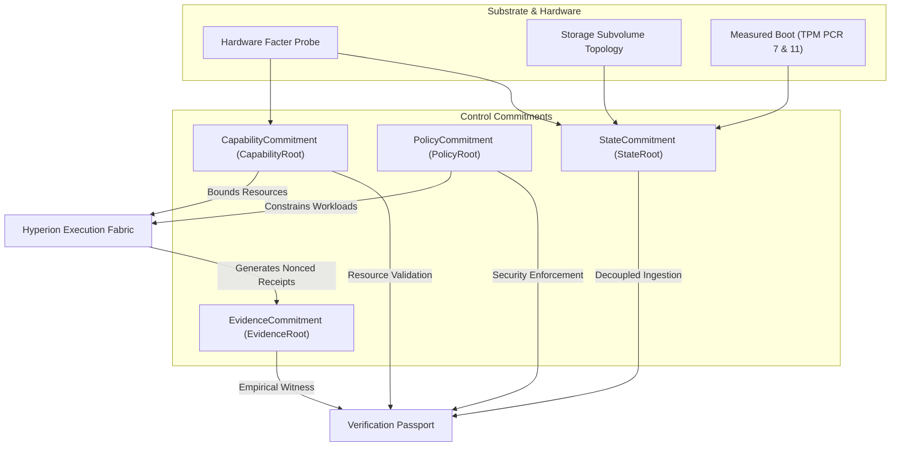

# Specification: Universal Control Plane Schemas & Commitments

## 1. Specification Metadata
- **Specification ID:** SPEC-NRX-UCP-016
- **Title:** Universal Control Plane Schema and Canonical Commitment Architecture
- **Version:** 1.0.0
- **Status:** AUTHORITATIVE_STANDARD
- **Scope:** NEURONIX OS Universal Control Plane, Decoupled Trust Commitments, RFC 8785 JCS Encoding, and Epistemic Verification Engine.
- **Reference Standards:** RFC 8785 (JSON Canonicalization Scheme - JCS), FIPS 180-4 (SHA-256), NIST SP 800-207.

---

## 2. Executive Architectural Purpose

The Universal Control Plane replaces fragmented configuration semantics with a typed, unified commitment model. Rather than treating evidence as a tautological assertion of state, NEURONIX OS formally decouples:
1. **Declared State:** What is declared in the immutable NixOS derivation and configuration.
2. **Observed State (`StateCommitment`):** What is empirically mounted, active, and measured at kernel runtime.
3. **Execution Evidence (`EvidenceCommitment`):** The nonced execution receipts, test assertions, and exit codes produced by the system.
4. **Policy Boundary (`PolicyCommitment`):** The active LSM profiles, seccomp filters, and AI visibility restrictions.
5. **Capability Boundary (`CapabilityCommitment`):** The hardware virtualization, storage bounds, and identity permissions.

All commitments are canonicalized using RFC 8785 (ECMAScript 5.1 / JCS) to guarantee bit-exact cross-language cryptographic determinism between Python, Rust, and shell runtimes.

---

## 3. Commitment Topology & Epistemic Verification

---

## 4. Commitment Schemas & Canonical Definitions

### 4.1 StateCommitment (`StateRoot`)
The `StateCommitment` binds the active runtime state across 5 canonical domains:
- `substrate_hash`: Nix store derivation closure and immutable filesystem anchors.
- `storage_hash`: Btrfs subvolumes, LUKS containers, and mountpoint configuration.
- `hardware_hash`: Machine hardware facts (CPU, RAM, GPU, NVMe, TPM).
- `boot_hash`: UKI digest, Secure Boot status, and TPM2 PCR measurement vector.
- `lifecycle_hash`: 5-tier mount classification (`IMMUTABLE`, `DURABLE`, `EPHEMERAL`, `DISPOSABLE_GHOST`, `FORENSIC`).

$$\text{StateRoot} = \text{SHA-256}(\text{JCS}(\{\text{substrate\_hash}, \text{storage\_hash}, \text{hardware\_hash}, \text{boot\_hash}, \text{lifecycle\_hash}\}))$$

### 4.2 EvidenceCommitment (`EvidenceRoot`)
The `EvidenceCommitment` provides empirical proof of operational correctness:
- Total assertion count and pass/fail tallies.
- Array of SHA-256 digests of runtime execution receipts from Hyperion domains.
- Monotonic execution nonces preventing receipt replay.
- Offline falsifiability flag guaranteeing third-party auditability without network access.

### 4.3 PolicyCommitment (`PolicyRoot`)
The `PolicyCommitment` declares active security rules:
- eBPF Landlock and LSM profile digest.
- Seccomp BPF syscall filter digest.
- AI Boundary Policy:
  - `secret_visibility`: `METADATA_ONLY` (plaintexts never accessible to AI models).
  - `mutation_privilege`: `PROPOSER_ONLY` (AI can only propose transitions, cannot commit).
  - `interactive_confirmation`: Mandatory operator confirmation for high-blast-radius actions.

### 4.4 CapabilityCommitment (`CapabilityRoot`)
The `CapabilityCommitment` formalizes available and granted resources:
- Physical hardware virtualization (`/dev/kvm`, VMX/SVM flags, IOMMU groups).
- Storage authorization boundaries (`target_disk_id`, `destructive_allowed`).
- Workload identity and granted isolation tiers (Tier 0 to Tier 3).

---

## 5. Canonical Serialization Standard (RFC 8785)

All cryptographic commitments MUST adhere to the following canonical serialization rules:
1. Object keys are sorted lexicographically by UTF-16 code units.
2. Numbers are formatted in ECMAScript specification standard:
   - Integers are rendered without decimal points or exponent notation.
   - Non-integers are rendered with minimal decimal precision required for exact round-tripping.
   - Floating point -0 is serialized as 0.
3. Whitespace is stripped outside string literals: no leading/trailing whitespace, no linebreaks, no indentation.
4. String literals escape control characters (`\u0000` to `\u001F`), double quotes (`\"`), and backslashes (`\\`).
