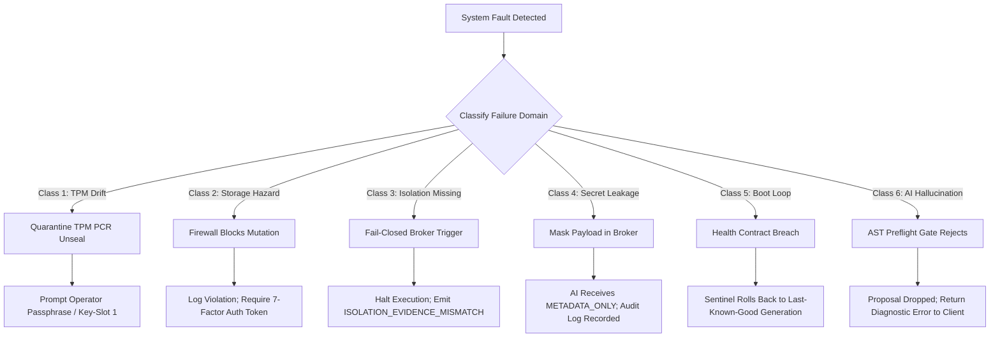

# Specification: Failure Containment Taxonomy & Risk Boundaries

## 1. Specification Metadata
- **Specification ID:** SPEC-NRX-RES-017
- **Title:** Failure Containment Taxonomy and Risk-Bounded Recovery Architecture
- **Version:** 1.0.0
- **Status:** AUTHORITATIVE_STANDARD
- **Scope:** Complete NEURONIX OS error domains, isolation tiers, storage transactions, and boot lifecycle.
- **Reference Standards:** NIST SP 800-160 (Systems Security Engineering), IEEE 1044 (Classification for Software Anomalies).

---

## 2. Risk-Bounded Engineering Philosophy

In alignment with rigorous engineering practices, NEURONIX OS rejects absolute assertions of "zero-risk" or "zero-defect" operation. Real-world systems operate under hardware wear, physical faults, race conditions, and adversarial pressure.

Instead, NEURONIX OS implements a **Risk-Bounded Architecture**:
1. **Fault Isolation:** Failures in any single subsystem are bounded to that domain and cannot cascade to root integrity.
2. **Fail-Closed Default:** Any ambiguous, unverified, or tampered condition immediately halts execution or falls back to an unprivileged posture rather than assuming validity.
3. **Atomic Reversibility:** State mutations must be transactional, self-verifying, and instantly reversible via generation rollback.
4. **Independent Falsifiability:** System claims must be verifiable by external tooling without trusting running daemon memory.

---

## 3. Failure Classification Matrix

| Class ID | Failure Class Name | Blast Radius Boundary | Containment Mechanism | Fallback / Remediation |
| :--- | :--- | :--- | :--- | :--- |
| **CLASS-1** | Hardware & TPM Measurement Drift | Bootloader & Secret Decryption | Decoupled BootTrustRoot from StateRoot | Fallback to passphrase key-slot; operator alert |
| **CLASS-2** | Storage Mutation Hazard | Disk Partitioning & Filesystems | 7-Factor Destructive Operation Firewall | Execution abort; loopback dry-run required |
| **CLASS-3** | Isolation Breach / Missing Backend | Workload Execution Space | Fail-closed Tier negotiation (`NO_FALLBACK`) | Halt domain execution; emit `ISOLATION_EVIDENCE_MISMATCH` |
| **CLASS-4** | Secret Exposure Hazard | RAM & IPC Communication | Secrets materialized in `/run/neuronix/secrets` ramfs | Zero disk footprint; AI visibility masked to metadata |
| **CLASS-5** | Boot Loop / Userspace Display Failure | Host Boot Lifecycle | Multi-Stage Boot Health Contract | Auto-rollback to Last-Known-Good generation |
| **CLASS-6** | AI Mutation Hallucination | Declarative NixOS Configuration | Proposer-Only Architecture & AST dry-run | Reject unvalidated proposal; zero filesystem mutation |

---

## 4. Failure Containment & Escalation Flow

---

## 5. Containment Invariants & Operational Rules

1. **Storage Invariant:** No storage planner command can format or repartition a block device containing active mounts (`/`, `/nix/store`) or existing filesystem headers without an explicit typed token:
   `--confirm-destructive-action="DESTROY <SERIAL> PLAN <PLAN_HASH>"`
2. **Isolation Invariant:** If a workload requests Micro-VM (Tier 3) isolation and `/dev/kvm` or hardware virtualization is unavailable, the broker MUST NOT silently downgrade to container or host execution. It MUST exit code 1 with `UNAVAILABLE_ON_HOST`.
3. **Secret Invariant:** Secrets are NEVER written to `/nix/store`, Git commits, or persistent storage. They are decrypted in volatile memory tmpfs (`/run/neuronix/secrets`) with permissions `0700` owned by root.
4. **Boot Invariant:** A boot generation is not marked as Last-Known-Good (LKG) until all 5 stages of the Boot Health Contract are satisfied:
   - Stage 1: Kernel Reach
   - Stage 2: Userspace Mounts Healthy
   - Stage 3: `neuronix-daemon.service` socket READY
   - Stage 4: `StateRoot` verification PASS
   - Stage 5: Desktop target reached
   If the contract fails before timeout (default: 120s), the hardware watchdog forces an immediate reboot into the prior generation.
