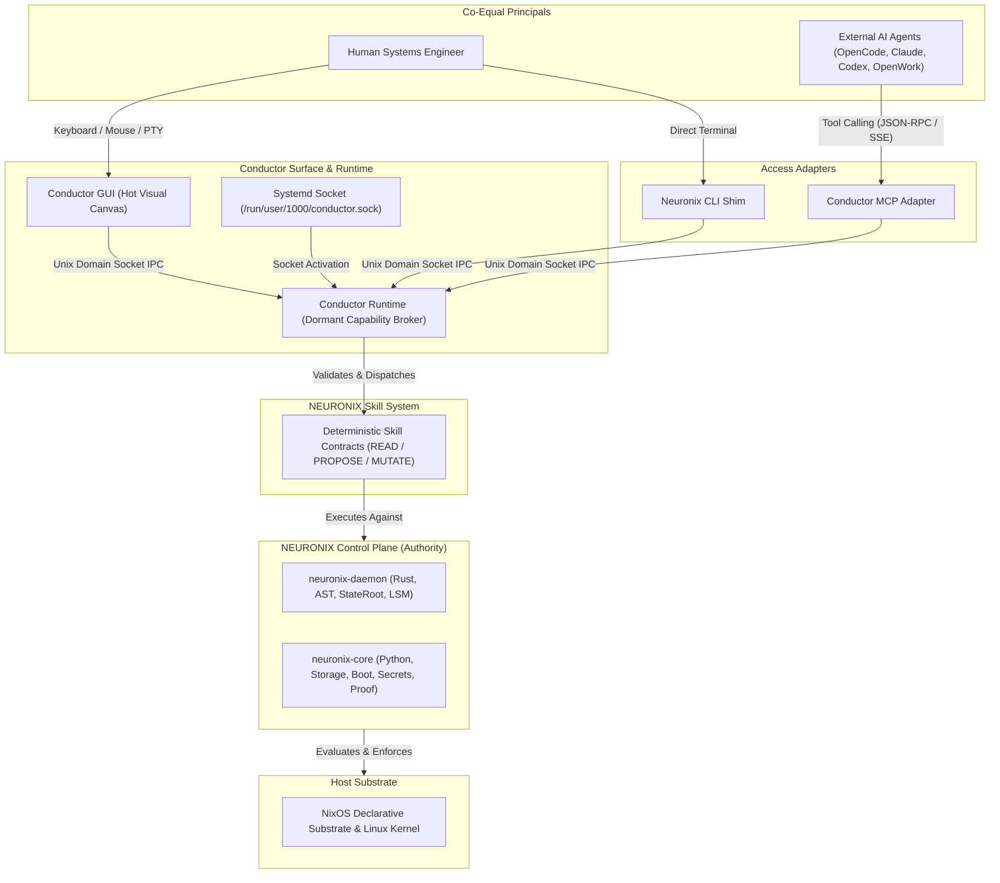
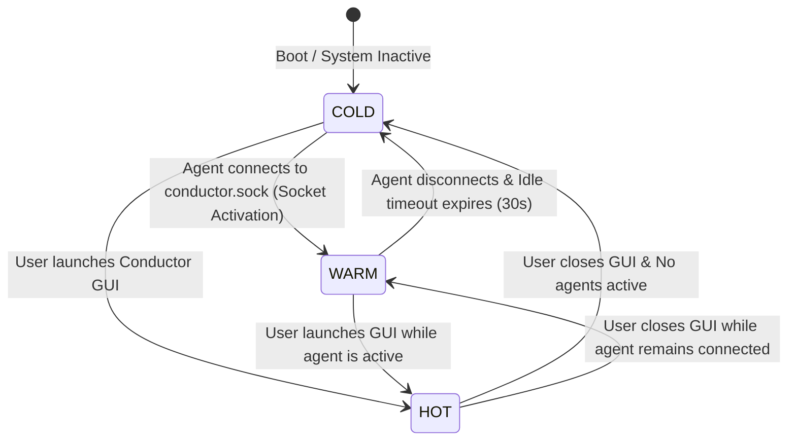

# Specification: Conductor Runtime and Surface Architecture

## 1. Specification Metadata
- **Specification ID:** SPEC-NRX-CND-018
- **Title:** Conductor Runtime, Unified Surface Architecture, and Zero-Idle Lifecycle
- **Version:** 1.0.0
- **Status:** RATIFIED_SPECIFICATION
- **Scope:** Native Operator Surface, Dormant Capability Runtime, Systemd Socket Activation, Terminal Canvas, and Multi-Principal Interaction Model.
- **Reference Standards:** RFC 8785 (JCS), JSON-RPC 2.0, POSIX.1-2017 (PTY/TTY), Linux systemd Socket Activation Protocol.

---

## 2. Executive Architectural Purpose

**Conductor** is the universal native operating surface and capability broker for NEURONIX OS. It formally replaces the legacy graphical control center (`neuronix-center`) with an integrated, radical-minimalist operating environment designed equally for human systems engineers and autonomous AI agents.

### The Core Architectural Tenet:
> **"Capability != Visual Clutter."**  
> Conductor does not display all system capabilities simultaneously. It provides an uncluttered, distraction-free terminal canvas where 100+ native system capabilities, telemetry feeds, and verification primitives are dormant until explicitly demanded by human intent or agent automation.

---

## 3. Structural Hierarchy & Authority Boundaries

Conductor is **not** the kernel, **not** the security boundary, and **not** the supervisor of external AI agents. It serves as the native operational harness.



---

## 4. The Three Architectural Pillars

### Pillar 1: Terminal-First Interactive Canvas
- **95% Viewport Allocation:** The default view is a high-performance terminal canvas backed by a hardware-accelerated VT/ANSI emulator engine.
- **Modern VT Semantics:** Complete support for TrueColor (24-bit RGB), Kitty graphics protocol, SGR mouse tracking, and alternate screen buffers.
- **Shell Integration (OSC 133):** Native detection of command start (`OSC 133 ; A ST`), command executed (`OSC 133 ; C ST`), and command finished with exit status (`OSC 133 ; D ; <exit-code> ST`).
- **Zero Semantic Hijacking:** Terminal keystrokes flow directly to the active PTY without latency or synthetic interception.

### Pillar 2: Native Contextual Surface
- **Minimalist Topbar:** A single ultra-thin status line displaying:
  ```text
  CONDUCTOR   [ NEURONIX v ]                             VITAL o
  ```
- **Ephemeral Proposal Cards:** When an AI agent or background task produces an actionable mutation proposal (e.g., NixOS generation rollback, storage repartitioning plan), a contextual card slides into view above the terminal prompt.
- **Deterministic Action Triggers:** Human engineers review proposals with three explicit actions:
  - `[A]` Approve & Execute
  - `[D]` Diff & Inspect
  - `[X]` Reject & Dismiss
- **Zero Modal Blocking:** Proposal cards never block terminal typing; they can be ignored or dismissed with `Escape`.

### Pillar 3: Dormant Capability Bridge
- **Decoupled GUI and Runtime:** Conductor GUI is purely a presentation client. The underlying capability runtime provides headless IPC endpoints.
- **Universal Skill Dispatch:** Translates human button clicks, CLI arguments, and AI tool calls into identical, deterministic skill contracts.

---

## 5. Zero-Idle Lifecycle (COLD, WARM, HOT)

Conductor rejects the pattern of heavy, always-running desktop daemons that poll background sensors continuously. Instead, it enforces a three-tier demand-driven lifecycle:



### 1. `COLD` State (Dormant Host)
- **Condition:** Conductor GUI is closed. No external agents connected.
- **Resource Footprint:** 0% CPU, 0 MB active heap (managed strictly by `systemd.socket`).
- **Active Components:** Linux kernel socket buffer for `/run/user/1000/conductor.sock`.

### 2. `WARM` State (Headless Capability Broker)
- **Condition:** External agent (e.g., OpenCode, Claude Desktop) connects via MCP or IPC. Conductor GUI remains closed.
- **Resource Footprint:** Minimal memory (<15 MB RSS), event-driven execution, 0% CPU between requests.
- **Active Components:** Lightweight async IPC loop, skill registry loader, pull-based telemetry provider.
- **Behavior:** Executes requested skills, validates JSON schemas, interfaces with `neuronix-daemon`. Closes back to `COLD` after idle timeout if all clients disconnect.

### 3. `HOT` State (Full Interactive Canvas)
- **Condition:** User launches the Conductor application window.
- **Resource Footprint:** GPU-accelerated rendering engine active, PTY worker threads running.
- **Active Components:** Complete terminal UI canvas, adaptive Vital topbar stream, proposal notification surface.
- **Window Close Guarantee:** Closing the GUI window immediately kills the graphical process (`Conductor GUI = 0`). If an external agent is actively executing tasks, the runtime transparently transitions to `WARM` without dropping the agent connection or failing inflight jobs.

---

## 6. Linux Systemd Socket Activation Architecture

Conductor integrates with Linux systemd user sessions via standard socket activation protocol (`LISTEN_FDS` / `sd_listen_fds`).

### Unit: `~/.config/systemd/user/conductor.socket`
```ini
[Unit]
Description=Conductor Universal Capability Runtime Socket
PartOf=conductor-runtime.service

[Socket]
ListenStream=%t/conductor.sock
SocketMode=0600
DirectoryMode=0700

[Install]
WantedBy=sockets.target
```

### Unit: `~/.config/systemd/user/conductor-runtime.service`
```ini
[Unit]
Description=Conductor Universal Capability Runtime
After=network.target

[Service]
Type=notify
ExecStart=/usr/lib/neuronix/conductor-runtime --socket-fd
StandardInput=socket
Restart=on-failure
TimeoutStopSec=15
Slice=app.slice

# Hardened sandbox isolation
ProtectSystem=strict
ProtectHome=read-only
PrivateTmp=true
ProtectKernelTunables=true
ProtectControlGroups=true
```

---

## 7. Wire Protocol Specification (JSON-RPC 2.0)

Communication across `/run/user/1000/conductor.sock` adheres to canonical JSON-RPC 2.0 with streaming notifications.

### 7.1 Skill Invocation Frame
```json
{
  "jsonrpc": "2.0",
  "id": "cnd-req-9104",
  "method": "skill.execute",
  "params": {
    "skill_id": "system.rollback",
    "inputs": {
      "target_generation": 42,
      "dry_run": true
    },
    "client_id": "opencode-agent-01"
  }
}
```

### 7.2 Skill Execution Response Frame
```json
{
  "jsonrpc": "2.0",
  "id": "cnd-req-9104",
  "result": {
    "execution_id": "exec-4902-8a1f",
    "status": "PROPOSED",
    "category": "PROPOSE",
    "requires_human_approval": true,
    "proposal": {
      "summary": "Rollback from generation 45 to generation 42",
      "generation_delta": -3,
      "kernel_version_change": "6.12.8 -> 6.12.6",
      "preflight_passed": true
    }
  }
}
```

### 7.3 Ephemeral UI Event Notification Frame
When a mutating skill is proposed by an agent, the runtime emits an asynchronous push notification to any active GUI listeners (`HOT` state):
```json
{
  "jsonrpc": "2.0",
  "method": "ui.proposal.emit",
  "params": {
    "proposal_id": "prop-8812-bb20",
    "skill_id": "system.rollback",
    "source_principal": "opencode-agent-01",
    "title": "System Generation Rollback Request",
    "description": "Agent requests atomic rollback to generation 42.",
    "severity": "WARNING",
    "timeout_seconds": 300
  }
}
```

---

## 8. Verification & Acceptance Criteria

1. **Zero-Idle Invariant:** When in `COLD` state, no Conductor process shall appear in `ps -ef` or consume CPU cycles.
2. **Graceful Degradation:** Terminating the Conductor GUI process (`SIGTERM` or window close) must not disrupt background agent MCP connections or terminate the socket listener.
3. **Typography Invariant:** Strictly 0 Unicode em-dashes (`\xe2\x80\x94`) or en-dashes (`\xe2\x80\x93`) in any specification, source code, or configuration file.
4. **Latency Budget:** Socket activation wake-up latency to first JSON-RPC reply shall be strictly < 40 ms.
