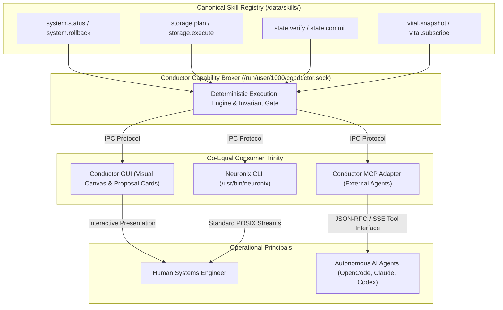
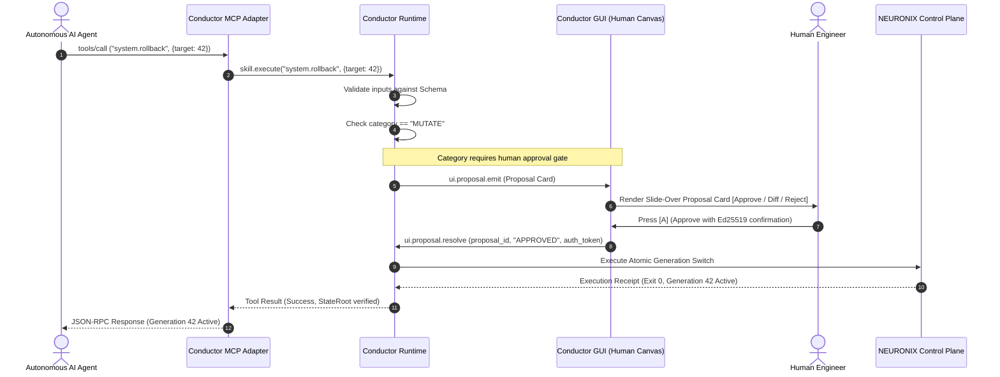

# Specification: NEURONIX Skill System and Machine Contracts

## 1. Specification Metadata
- **Specification ID:** SPEC-NRX-SKL-019
- **Title:** NEURONIX Skill System, Deterministic Machine Contracts, and Consumer Adapters
- **Version:** 1.0.0
- **Status:** RATIFIED_SPECIFICATION
- **Scope:** Machine-Contract Capabilities, Security Invariant Enforcement, Skill Graph Execution (DAG), and Co-Equal Consumer Adapters (CLI, Conductor, MCP).
- **Reference Standards:** RFC 8785 (JCS), JSON Schema Draft 2020-12, Model Context Protocol (MCP) 2024-11-05.

---

## 2. Executive Architectural Purpose

The **NEURONIX Skill System** decouples operational capabilities from visual presentation and command-line parsing. Rather than implementing distinct business logic inside the CLI, the GUI, and the MCP server, all NEURONIX capabilities are defined as **typed, deterministic machine contracts** called **Skills**.

### The Core Architectural Tenet:
> **"Do Not Turn Commands into MCP. Define Canonical Skills, Then Expose Them Everywhere."**  
> CLI utilities, visual UI cards, and MCP tools are thin consumer adapters to the exact same underlying skill registry. Every skill possesses deterministic input/output validation, explicit security invariant bindings, and strict side-effect classification.

---

## 3. Co-Equal Consumer Trinity

The Skill System is consumed identically by three distinct operational surfaces:



---

## 4. Skill Taxonomy & Execution Categories

Every skill must declare exactly one execution category governing its side-effects and authorization requirements:

| Category | Side-Effects | Approval Gate | Execution Behavior | Examples |
| :--- | :--- | :--- | :--- | :--- |
| **`READ`** | Strictly zero side-effects. | None (Automated). | Queries system state, reads telemetry, evaluates invariant health. | `system.status`, `vital.snapshot`, `state.verify` |
| **`PROPOSE`** | Read-only simulation. | None (Automated). | Computes dry-run diffs, compiles storage partition layouts, simulates NixOS build closure. Yields deterministic plan hash. | `storage.plan`, `semantic.propose`, `update.check` |
| **`MUTATE`** | State-altering or destructive. | **Mandatory Human Gate** (when invoked by AI). | Mutates block devices, applies NixOS generations, writes persistent configuration, or rotates secrets. Enforces 7-factor safety. | `system.rollback`, `storage.execute`, `secret.rotate` |

---

## 5. Machine Contract Schema Specification

Every skill definition resides as a validated JSON file in `data/skills/<namespace>.<name>.json` complying with the following schema:

```json
{
  "$schema": "https://json-schema.org/draft/2020-12/schema",
  "skill_id": "system.rollback",
  "version": "1.0.0",
  "category": "MUTATE",
  "title": "System Generation Rollback",
  "description": "Atomically roll back the active NixOS operating system generation to a verified prior generation.",
  "invariants_required": [
    "INV-SEC-002",
    "INV-SEC-007"
  ],
  "approval_gate_required": true,
  "inputs_schema": {
    "type": "object",
    "properties": {
      "target_generation": {
        "type": "integer",
        "minimum": 1,
        "description": "The exact generation number to activate."
      },
      "dry_run": {
        "type": "boolean",
        "default": false,
        "description": "If true, validates target generation bootability without switching profile."
      }
    },
    "required": ["target_generation"],
    "additionalProperties": false
  },
  "outputs_schema": {
    "type": "object",
    "properties": {
      "status": {
        "type": "string",
        "enum": ["SUCCESS", "FAILED", "DRY_RUN_PASSED"]
      },
      "previous_generation": {"type": "integer"},
      "active_generation": {"type": "integer"},
      "kernel_version": {"type": "string"},
      "switched_at": {"type": "string", "format": "date-time"}
    },
    "required": ["status", "active_generation"],
    "additionalProperties": false
  }
}
```

---

## 6. Deterministic Human-In-The-Loop Approval Sequence

When an autonomous AI agent invokes a `MUTATE` skill, Conductor enforces an unbypassable human approval sequence:



---

## 7. Adapter Specifications

### 7.1 CLI Adapter (`/usr/bin/neuronix`)
- Command line invocations are translated directly into skill frames:
  ```bash
  neuronix system rollback --target-generation 42
  ```
- Reads user terminal permissions and supplies local operator identity tokens directly to the runtime broker.

### 7.2 MCP Adapter (`conductor-mcp`)
- Automatically registers all skills in `data/skills/` as available MCP tools on `tools/list`.
- Maps JSON Schema definitions directly to MCP tool parameters.
- Converts skill execution outputs into standardized MCP `content` text/image blocks.
- Emits structured progress updates during multi-stage DAG executions.

---

## 8. Verification & Quality Gates

1. **Schema Strictness:** All skill definition files must pass strict JSON Schema draft 2020-12 validation.
2. **Deterministic Canonicalization:** All skill inputs, outputs, and proposal plans must be canonicalized via RFC 8785 (JCS) before generating hashes.
3. **No Hidden Mutations:** A skill categorized as `READ` or `PROPOSE` is mathematically forbidden from modifying disk state or configuration files.
4. **Typography Guarantee:** Strictly 0 Unicode em-dashes (`\xe2\x80\x94`) or en-dashes (`\xe2\x80\x93`) in any documentation or code.
