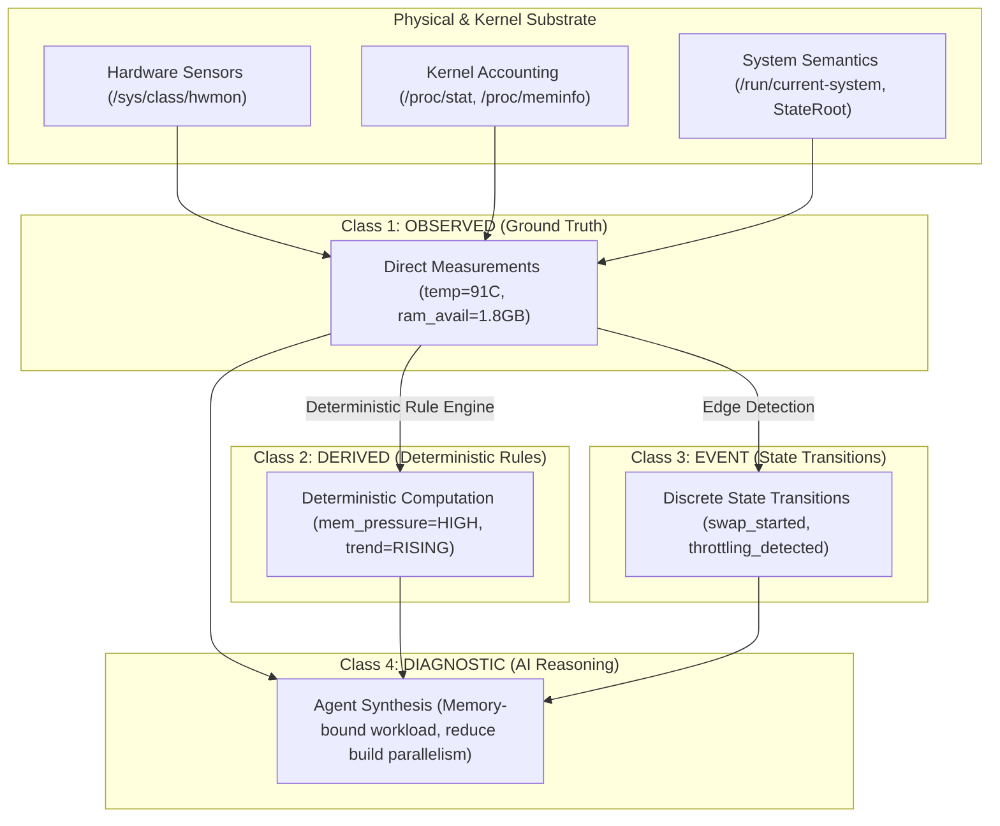
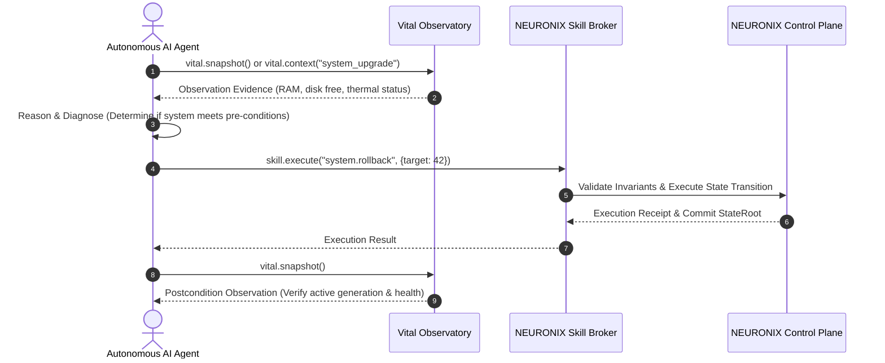

# Specification: Vital Machine Telemetry and Zero-Idle Observer

## 1. Specification Metadata
- **Specification ID:** SPEC-NRX-VTL-020
- **Title:** Vital Observability Substrate, Laboratory Instrumentation, and Zero-Idle Telemetry Engine
- **Version:** 1.1.0
- **Status:** RATIFIED_SPECIFICATION
- **Scope:** Host Telemetry Collection, Sensor Probing, Laboratory Evidence Schema, Zero-Idle Sampling, Anti-Hallucination Primitives, and Telemetry Privacy Boundaries.
- **Reference Standards:** Linux sysfs/procfs APIs, Linux hwmon subsystem, RFC 8785 (JCS).

---

## 2. Executive Architectural Purpose

**Vital** is not a cosmetic system monitor or GUI dashboard. It is the **authoritative machine observability and laboratory sensing substrate** of NEURONIX OS and Conductor.

### The Core Architectural Tenet:
> **"Vital sees and measures. NEURONIX decides and controls. AI understands and reasons. Conductor presents and connects."**

Vital operates as precision laboratory instrumentation for the host. It provides grounded, high-fidelity empirical facts about the operating system and physical machine so that human engineers and autonomous AI agents can diagnose bottlenecks, plan actions, and verify execution without guessing or hallucinating system state.

### The Zero-Idle Doctrine:
> **"No Consumer, No Work."**  
> Vital runs zero background polling loops and samples zero hardware sensors when no observer is active. Continuous sampling occurs only when an active visual consumer (Conductor GUI) or explicit agent subscription exists. When the last subscriber disconnects or the Conductor window closes, all sampling threads immediately terminate.

---

## 3. Four Telemetry Data Classes

To prevent AI agents from confusing raw sensor facts with computed trends or speculative interpretations, Vital strictly partitions all telemetry into four orthogonal data classes:



1. **`OBSERVED` (Ground Truth):** Direct physical and kernel sensor measurements. Completely objective, unmodified facts.
2. **`DERIVED` (Deterministic Rules):** Rates of change, load pressures, and health states calculated by deterministic math and deterministic rule engines. Strictly never evaluated by an LLM.
3. **`EVENT` (State Transitions):** Discrete transitions detected across sampling intervals (e.g., thermal throttling engaged, battery discharging).
4. **`DIAGNOSTIC` (AI Reasoning):** High-level root cause analysis and recommendations formulated by external AI models based on the first three classes. AI models are strictly forbidden from treating their own diagnostics as system evidence.

---

## 4. Laboratory Evidence Metadata & Anti-Hallucination Invariants

Every single measurement emitted by Vital is encapsulated within an **Observation Record** containing rigorous provenance and freshness metadata:

```json
{
  "metric": "thermal.cpu_package_celsius",
  "value": 74.2,
  "unit": "celsius",
  "timestamp": 1789028400.124,
  "source": "/sys/class/hwmon/hwmon1/temp1_input",
  "age_ms": 12,
  "quality": "fresh",
  "confidence": "measured",
  "reason": null
}
```

### The Absence of Data Invariant
> **"Absence of data must be explicitly represented as absence of data."**  
> If a sensor is unreadable, unexposed by the kernel driver, or restricted by LSM policy, Vital records `value: null` with `quality: "unavailable"` and an explicit `reason: "sensor_not_exposed"`. Vital never invents fallback defaults (such as reporting `0` for an unreadable temperature or fan speed), preventing AI models from hallucinating false normalcies.

### Quality & Freshness Classification
- **`fresh`:** Sampled within the current active request (< 1000 ms).
- **`recent`:** Sampled within the last 5000 ms.
- **`stale`:** Older than 5000 ms; must not be used for safety-critical mutation decisions.
- **`unavailable`:** Sensor cannot be probed on this host hardware.

---

## 5. Dual Presentation Strategy: Minimalist UI vs Rich Machine API

Vital maintains an intentional duality between visual presentation and machine consumption:

| Operational Surface | Presentation Format | Purpose |
| :--- | :--- | :--- |
| **Conductor GUI (Human)** | `CONDUCTOR [ NEURONIX v ] VITAL o` | Radical minimalism. Single indicator dot (green/yellow/red) with tooltip hover for essential summary. |
| **Agent API (`vital.snapshot`)** | Full structured JSON with metadata | High-fidelity machine context. Complete factual basis for automated diagnosis and verification. |
| **Context API (`vital.context`)** | Purpose-tailored factual slice | Low-overhead context packaging for specific workflows (`system_upgrade`, `diagnostic`). |

---

## 6. Closed-Loop System Intelligence

Vital enables a closed-loop operational cycle for autonomous AI agents:



---

## 7. Tailored AI Context Packaging (`vital.context`)

To prevent context window bloat while maintaining strict grounding, Vital provides purpose-filtered context packages:

```json
{
  "purpose": "system_upgrade",
  "timestamp": "2026-09-10T09:34:09Z",
  "overall_health": "NOMINAL",
  "facts": {
    "active_generation": 148,
    "memory_available_bytes": 13316911104,
    "root_available_bytes": 195427147776,
    "root_used_percent": 24.8,
    "cpu_load_1m": 0.42,
    "thermal_status": "NORMAL"
  }
}
```

---

## 8. Security, Privacy, and Redaction Boundary

1. **Process and Path Redaction:** Vital never emits command-line arguments of running processes, container mount paths, or user home directory names.
2. **Network Masking:** Interface MAC addresses and internal private IP address ranges are masked by default.
3. **Zero Secret Leakage:** In accordance with Security Invariant `INV-SEC-014`, private cryptographic keys, Age identities, and decrypted environment buffers are permanently excluded from telemetry payloads.
4. **LSM Compliance:** All sensor probing respects active AppArmor and seccomp filters.

---

## 9. Verification & Quality Gates

1. **Zero-Idle Invariant:** When no clients are subscribed, Vital sampling CPU usage must be strictly 0.0%.
2. **Absence of Data Verification:** Unreadable sensors must emit `value: null` with `quality: "unavailable"`.
3. **Response Latency:** Synchronous `vital.snapshot` execution latency must be strictly < 20 ms.
4. **Typography Guarantee:** Strictly 0 Unicode em-dashes (`\xe2\x80\x94`) or en-dashes (`\xe2\x80\x93`) in any documentation or code.
