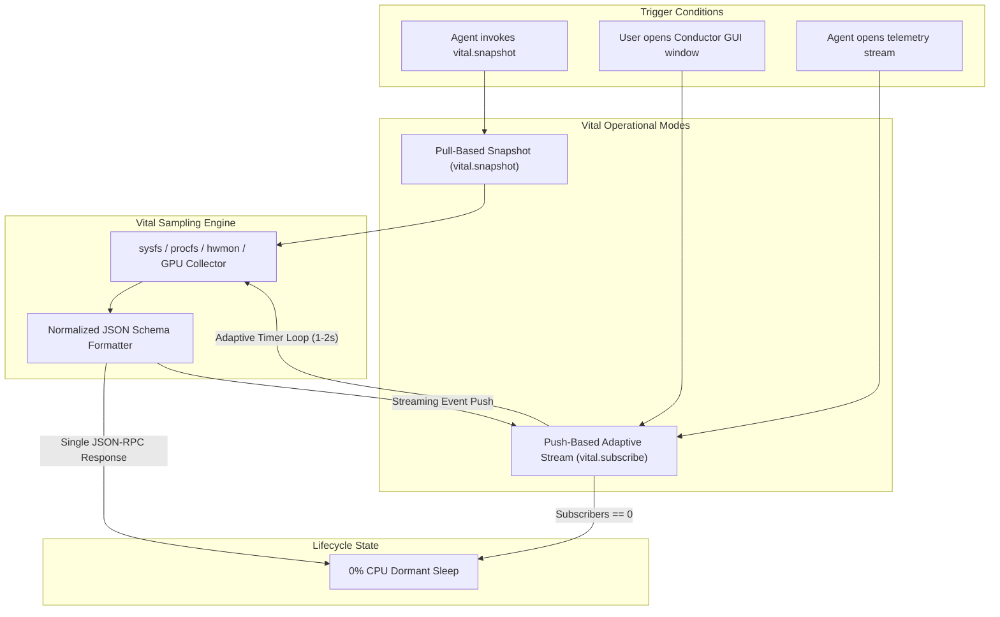

# Specification: Vital Machine Telemetry and Zero-Idle Observer

## 1. Specification Metadata
- **Specification ID:** SPEC-NRX-VTL-020
- **Title:** Vital Machine Telemetry, Zero-Idle Observer, and Adaptive Streaming Engine
- **Version:** 1.0.0
- **Status:** RATIFIED_SPECIFICATION
- **Scope:** Host Telemetry Collection, Sensor Probing, Normalized Hardware Telemetry, Zero-Idle Sampling, and Telemetry Privacy Boundaries.
- **Reference Standards:** Linux sysfs/procfs APIs, Linux hwmon subsystem, RFC 8785 (JCS).

---

## 2. Executive Architectural Purpose

**Vital** is the native host observability subsystem of NEURONIX OS. It provides real-time system health metrics, hardware performance telemetry, and thermal conditions to both human operators (via the Conductor topbar) and autonomous AI agents (via the `vital.snapshot` and `vital.subscribe` skills).

### The Core Architectural Tenet:
> **"No Consumer, No Work."**  
> Vital does not run background polling loops or sample hardware sensors when no observer is active. Telemetry collection is pull-based by default. Continuous sampling occurs only when an active visual consumer (Conductor GUI) or explicit agent subscription exists. When the last subscriber disconnects or the Conductor window closes, all sampling threads immediately terminate.

---

## 3. Dual Operating Modes

Vital operates in two distinct operational paradigms:



### 3.1 Pull-Based Snapshot Mode (`vital.snapshot`)
- **Execution Lifecycle:** On-demand synchronous query.
- **Sampling Behavior:** The collector samples kernel accounting data (`/proc/stat`, `/proc/meminfo`), hardware monitors (`/sys/class/hwmon`), and storage health.
- **Duration:** < 15 ms total execution time.
- **Postcondition:** Immediate return to zero-work dormant state.

### 3.2 Push-Based Adaptive Stream Mode (`vital.subscribe`)
- **Execution Lifecycle:** Activated strictly while `subscriber_count > 0`.
- **Adaptive Sampling Frequencies:**
  - CPU utilization and load average: 1000 ms
  - Memory and ZRAM compression status: 1000 ms
  - Storage I/O throughput: 1000 ms
  - Thermal sensors and fan speeds: 2000 ms
  - Battery / Power draw (mobile): 5000 ms
- **Immediate Termination Invariant:** When the Conductor GUI window closes or an agent drops its subscription session, the reference count drops to 0 and all timer loops are cancelled.

---

## 4. Normalized System Telemetry Schema

Vital normalizes diverse kernel interfaces into a canonical JSON telemetry schema:

```json
{
  "$schema": "https://json-schema.org/draft/2020-12/schema",
  "type": "object",
  "properties": {
    "timestamp": {
      "type": "string",
      "format": "date-time"
    },
    "host_id": {
      "type": "string"
    },
    "cpu": {
      "type": "object",
      "properties": {
        "overall_usage_percent": {"type": "number", "minimum": 0.0, "maximum": 100.0},
        "core_count": {"type": "integer", "minimum": 1},
        "frequency_mhz": {"type": "number"},
        "load_average": {
          "type": "array",
          "items": {"type": "number"},
          "minItems": 3,
          "maxItems": 3
        }
      },
      "required": ["overall_usage_percent", "core_count", "load_average"]
    },
    "memory": {
      "type": "object",
      "properties": {
        "total_bytes": {"type": "integer"},
        "used_bytes": {"type": "integer"},
        "available_bytes": {"type": "integer"},
        "swap_used_bytes": {"type": "integer"},
        "zram_ratio": {"type": "number"}
      },
      "required": ["total_bytes", "used_bytes", "available_bytes"]
    },
    "storage": {
      "type": "object",
      "properties": {
        "root_used_percent": {"type": "number"},
        "nix_store_bytes": {"type": "integer"},
        "read_bytes_sec": {"type": "number"},
        "write_bytes_sec": {"type": "number"}
      },
      "required": ["root_used_percent", "nix_store_bytes"]
    },
    "thermals": {
      "type": "object",
      "properties": {
        "cpu_package_celsius": {"type": "number"},
        "gpu_celsius": {"type": ["number", "null"]},
        "nvme_celsius": {"type": ["number", "null"]}
      },
      "required": ["cpu_package_celsius"]
    },
    "status": {
      "type": "string",
      "enum": ["NOMINAL", "DEGRADED", "CRITICAL"]
    }
  },
  "required": ["timestamp", "cpu", "memory", "storage", "thermals", "status"],
  "additionalProperties": false
}
```

---

## 5. Security, Privacy, and Redaction Boundary

To protect developer confidentiality and system security, Vital enforces an unbypassable telemetry redaction filter:

1. **Process and Path Redaction:** Vital never emits command-line arguments of running processes, container mount paths, or user home directory names.
2. **Network Masking:** Interface MAC addresses and internal private IP address ranges are masked by default unless invoked with elevated operator credentials.
3. **Zero Secret Leakage:** In accordance with Security Invariant `INV-SEC-014`, private cryptographic keys, Age identities, and decrypted environment buffers are permanently excluded from telemetry payloads.
4. **LSM Compliance:** All sensor probing respects active AppArmor and seccomp filters. If a sensor node cannot be read due to kernel permissions, Vital records `null` rather than elevating privileges.

---

## 6. Verification & Quality Gates

1. **Zero-Idle Invariant:** When no clients are subscribed to `vital.subscribe`, the Vital thread pool must be completely idle (0.0% CPU usage measured over 60 seconds).
2. **Schema Conformance:** Every payload emitted by `vital.snapshot` must validate against the normalized JSON Schema.
3. **Response Latency:** `vital.snapshot` synchronous execution latency must be strictly < 25 ms on standard hardware.
4. **Typography Invariant:** Strictly 0 Unicode em-dashes (`\xe2\x80\x94`) or en-dashes (`\xe2\x80\x93`) in any documentation or code.
