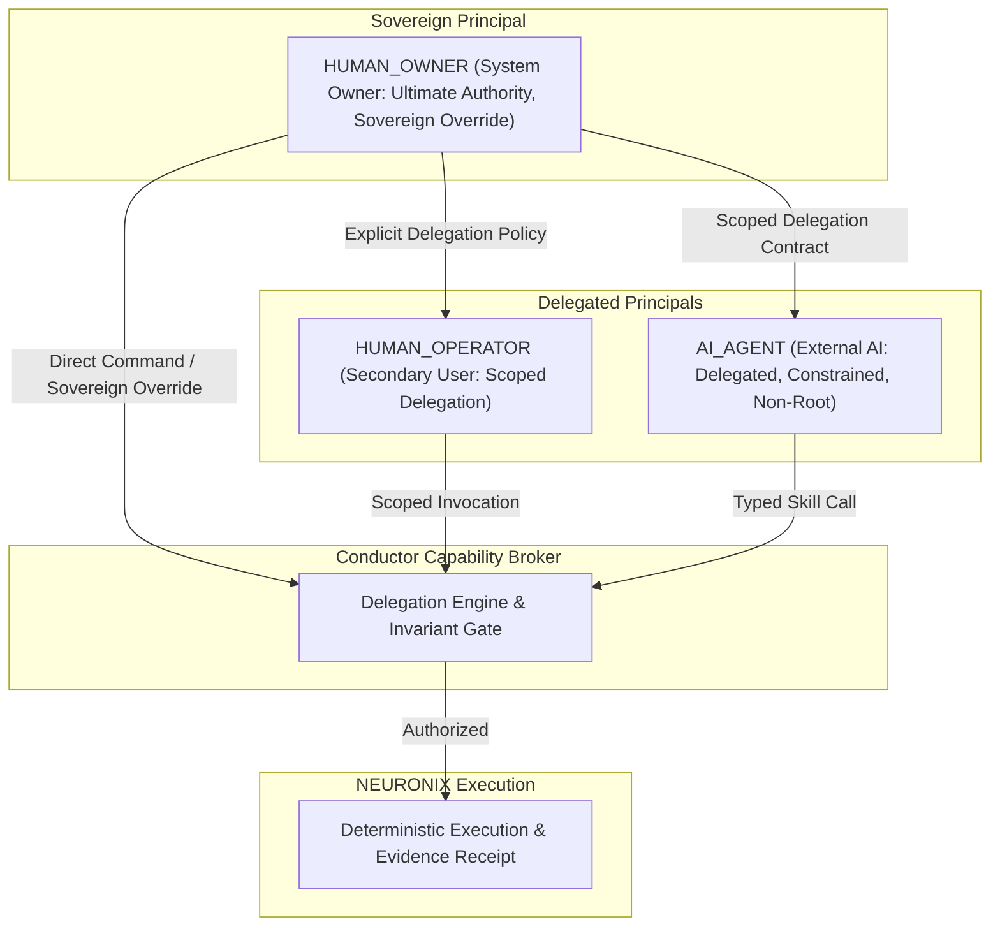
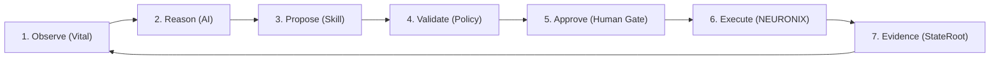
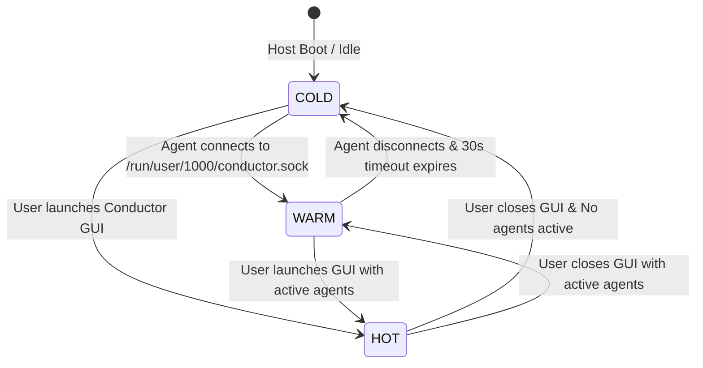

# Specification: Conductor Master Architecture Charter

## 1. Specification Metadata
- **Specification ID:** SPEC-NRX-CND-021
- **Title:** Conductor Master Architecture Charter, User Sovereignty, and Interaction Taxonomy
- **Version:** 1.1.0
- **Status:** RATIFIED_CHARTER
- **Scope:** Native Operating Surface, Universal Local Agent Substrate, User Sovereignty Doctrine, 3-Tier Principal Taxonomy, Guardrail vs Barrier Engineering, and Closed-Loop System Intelligence.
- **Reference Standards:** SPEC-NRX-CND-018, SPEC-NRX-SKL-019, SPEC-NRX-VTL-020, RFC 8785 (JCS).

---

## 2. Definitive Canonical Definition

**Conductor is the universal native operating surface and local agent substrate for NEURONIX OS.**

It is not a dashboard, not an AI chatbot, not an agent manager, not a system monitor, not an Electron web application, and not an expanded MCP server.

### The Canonical Formula:
```text
CONDUCTOR: One Surface. Every Capability.
Minimal Surface. Maximum Capability.
Vital sees. AI reasons. Skills act. The user remains sovereign.
```

### The Division of Responsibilities:
- **NixOS:** Declarative host substrate, Linux kernel, immutable store, and atomic rollback generations.
- **NEURONIX Control Plane:** Authoritative system intelligence, state engine, policy, capability bounds, and cryptographic evidence.
- **NEURONIX Skill Registry:** Canonical machine-readable operating manual and deterministic capability registry.
- **Vital:** High-fidelity machine observation, laboratory instrumentation, and sensing substrate.
- **Conductor Runtime:** Lightweight, event-driven, dormant capability broker.
- **Conductor GUI:** Minimalist, terminal-first native visual surface.
- **External AI Agents:** External reasoning, diagnosis, and planning layer (vendor-neutral).
- **neuronix CLI:** Command-line, automation, and CI/CD interface.
- **Human Owner:** Ultimate sovereign authority and final decision maker.

---

## 3. The Core Principles: User Sovereignty & Guardrail Engineering

### 3.1 Principle of User Sovereignty
> **"The system owner retains ultimate authority over their machine and may explicitly authorize high-risk operations."**  
> NEURONIX is not a paternalistic operating system. The platform does not own the machine; the user owns the machine. NEURONIX exists to empower the owner with complete visibility, rich telemetry, and deterministic safety nets, but never prevents an informed owner from executing their deliberate will.

### 3.2 The Guardrail vs Barrier Doctrine
> **"NEURONIX must protect the user from unintended consequences, not from their own explicitly intended decisions."**
- **Barrier (Paternalistic, Prohibited as Default):** Arbitrarily halts the owner with opaque denials.
- **Guardrail (Sovereign Engineering Standard):** Informs the owner of blast radius, checks rollback availability, verifies evidence requirements, and presents clear paths to proceed or abort.

### 3.3 The Legitimate Role of `sudo` and Privileged Operations
`sudo` and administrative escalation are not architectural flaws; they are standard privileged capabilities of the Linux substrate. For the `HUMAN_OWNER`, elevated capabilities remain accessible. For `AI_AGENT` principals, privilege escalation requires explicit, unbypassable human delegation.

---

## 4. The 3-Tier Principal Taxonomy & Transparent Delegation

Authority flows strictly downward through explicit delegation:



1. **`HUMAN_OWNER`:** Ultimate sovereign authority. Holds root ownership, can execute any skill, can override guardrails with explicit responsibility assumption.
2. **`HUMAN_OPERATOR`:** Delegated human operator. Operates within granted role-based capability boundaries.
3. **`AI_AGENT`:** Autonomous external intelligence. Operates strictly within delegated, schema-bounded skill contracts. **AI capability != root shell.** AI agents never inherit authority implicitly; all agent delegation is explicit, inspectable, and revocable.

---

## 5. The Five Core Signatures of Conductor

1. **One Window:** All visual interactions (terminal, system control, Vital telemetry, workspace, connected agents) reside within a single native window host.
2. **Terminal First:** 95% of the viewport is an uncompromised, zero-latency VT/ANSI terminal canvas. Chrome and system surfaces appear strictly on demand.
3. **Vital (Laboratory Observatory):** Machine telemetry is rich with provenance, freshness, quality, and explicit absence-of-data, yet represented in the UI as a clean, single-point indicator.
4. **Skills as Machine-Readable Operating Manual:** Every system capability is documented and executable as a deterministic machine contract with JSON schemas, invariant checks, and human approval gates.
5. **Universal Local Agent Substrate:** External agents (OpenCode, Claude Desktop, Codex, OpenWork) consume machine capabilities directly through a unified local socket and MCP interface.

---

## 6. Closed-Loop System Intelligence

Conductor formalizes the interaction between external intelligence and the operating system into an immutable closed loop:



1. **Observe (Vital):** AI inspects grounded machine facts via `vital.snapshot` or `vital.context`.
2. **Reason (AI):** AI formulates a plan without guessing or hallucinating system metrics.
3. **Propose (Skill):** AI issues a typed skill invocation (`storage.plan`, `system.rollback`).
4. **Validate (Policy):** NEURONIX evaluates LSM invariants, capability limits, and blast radius.
5. **Approve (Human Gate):** Mutative operations produce an ephemeral slide-over card in Conductor GUI for human engineer confirmation.
6. **Execute (NEURONIX):** The authoritative control plane applies the mutation atomically.
7. **Evidence (StateRoot):** Cryptographic receipts and StateRoot digests are committed.
8. **Re-Observe (Vital):** Postconditions are verified empirically through fresh sensor observation.

---

## 7. The Negative Architecture: What Conductor Explicitly Refuses to Build

| Prohibited Feature | Engineering Rationale |
| :--- | :--- |
| **Permanent Heavy Daemons** | Replaced by systemd socket activation and demand-driven execution (`COLD` -> `WARM` -> `HOT`). |
| **Giant Cluttered Dashboards** | Replaced by on-demand contextual overlays and the command palette. |
| **Electron / Web Technologies** | Replaced by high-performance native Rust (`alacritty_terminal` + `ratatui` + `portable-pty`). |
| **Embedded AI Chatbots / Avatars** | Conductor is vendor-neutral machine infrastructure; external agents connect via MCP/API. |
| **Arbitrary Root Shells for AI** | Replaced by typed, schema-validated skills with immutable security invariants. |
| **Paternalistic User Barriers** | Replaced by informative guardrails and sovereign owner overrides. |
| **Persistent Sensor Polling Walls** | Replaced by the "No Consumer, No Work" pull-based observation engine. |
| **Duplicate Business Logic in GUI** | Conductor GUI contains zero domain logic; all capabilities reside in the canonical skill registry. |

---

## 8. Lifecycle States: COLD, WARM, HOT



- **`COLD`:** Conductor GUI is closed. No agents connected. Resource usage: 0% CPU, 0 MB active heap. Socket managed by systemd.
- **`WARM`:** Headless capability broker active. External agents execute skills and pull telemetry via IPC/MCP. Zero GUI rendering overhead.
- **`HOT`:** Conductor GUI active. Full GPU-accelerated terminal canvas, interactive slide-over proposal cards, live topbar stream.
- **Window Close Invariant:** Terminating the GUI window immediately kills the visual process (`Conductor GUI = 0`), gracefully dropping back to `WARM` or `COLD` without interrupting background agent tasks.

---

## 9. Verification & Quality Invariants

1. **Deterministic Parity:** A skill invoked via CLI, Conductor GUI, or MCP must produce bit-exact identical execution results and evidence receipts.
2. **Typography Guarantee:** Strictly 0 Unicode em-dashes (`\xe2\x80\x94`) or en-dashes (`\xe2\x80\x93`) across all documentation, code, and configuration.
3. **Zero Secret Leakage:** Telemetry payloads and UI state must never expose decrypted private keys, Age identities, or sensitive container mounts.
