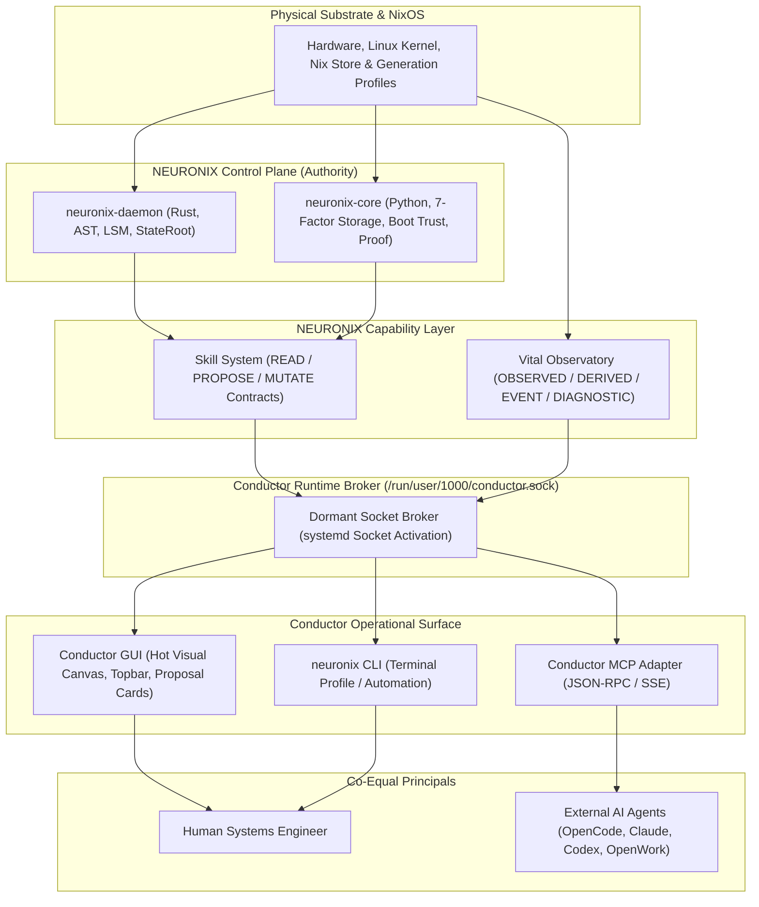
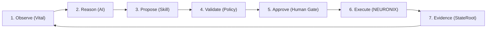
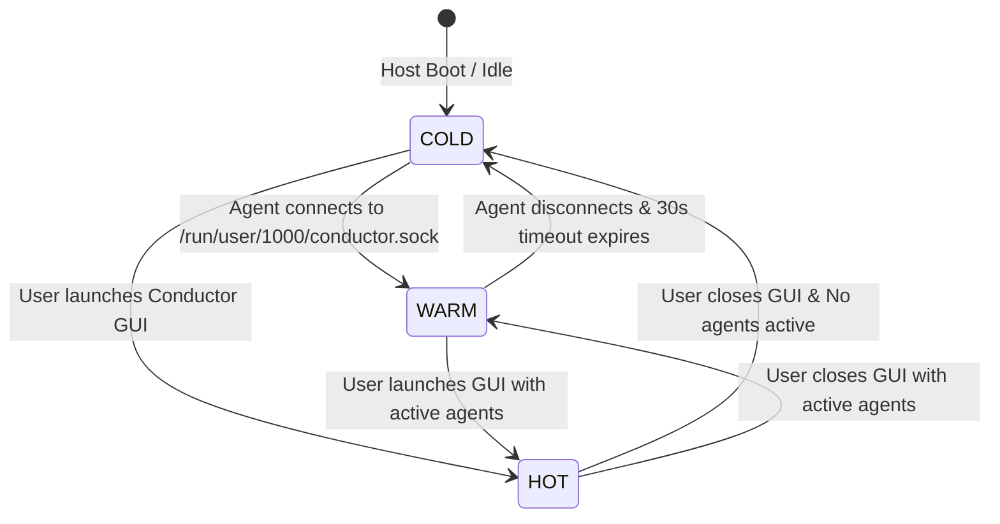

# Specification: Conductor Master Architecture Charter

## 1. Specification Metadata
- **Specification ID:** SPEC-NRX-CND-021
- **Title:** Conductor Master Architecture Charter, Definitive Doctrine, and Interaction Taxonomy
- **Version:** 1.0.0
- **Status:** RATIFIED_CHARTER
- **Scope:** Native Operating Surface, Universal Local Interface, 5 Core Signatures, Multi-Horizon Observability, and Closed-Loop System Intelligence.
- **Reference Standards:** SPEC-NRX-CND-018, SPEC-NRX-SKL-019, SPEC-NRX-VTL-020, RFC 8785 (JCS).

---

## 2. Definitive Canonical Definition

**Conductor is the universal native operating surface for NEURONIX OS.**

It is not a dashboard, not an AI chatbot, not an agent manager, not a system monitor, not an Electron web application, and not an expanded MCP server.

### The Canonical Formula:
```text
CONDUCTOR: One Surface. Every Capability.
Minimal Surface. Maximum Capability.
Observe with Vital. Reason with AI. Act through Skills. Enforce with NEURONIX.
```

### The Division of Responsibilities:
- **NixOS:** Declarative host substrate and Linux kernel.
- **NEURONIX Control Plane:** Authoritative intelligence, state engine, policy, capability bounds, and cryptographic evidence.
- **NEURONIX Skills:** Canonical, typed, deterministic machine-readable capabilities.
- **Vital:** High-fidelity machine observation, laboratory instrumentation, and sensing substrate.
- **Conductor Runtime:** Lightweight, event-driven, dormant capability broker.
- **Conductor GUI:** Minimalist, terminal-first native visual surface.
- **External AI Agents:** External reasoning, diagnosis, and planning layer (vendor-neutral).
- **neuronix CLI:** Command-line, automation, and CI/CD interface.
- **Human Engineer:** Ultimate principal and authoritative decision maker.

---

## 3. The Five Core Signatures of Conductor

1. **One Window:** All visual interactions (terminal, system control, Vital telemetry, workspace, connected agents) reside within a single native window host.
2. **Terminal First:** 95% of the viewport is an uncompromised, zero-latency VT/ANSI terminal canvas. Chrome and system surfaces appear strictly on demand.
3. **Vital (Laboratory Observatory):** Machine telemetry is rich with provenance, freshness, quality, and explicit absence-of-data, yet represented in the UI as a clean, single-point indicator.
4. **Skills as First-Class Contracts:** All system capabilities are deterministic machine contracts with JSON schemas, invariant checks, and human approval gates.
5. **External Agent Native:** AI agents (OpenCode, Claude Desktop, Codex, OpenWork) consume machine capabilities directly without requiring an arbitrary root bash shell.

---

## 4. The Unified Architectural Hierarchy



---

## 5. Closed-Loop System Intelligence

Conductor formalizes the interaction between external intelligence and the operating system into an immutable closed loop:



1. **Observe (Vital):** AI inspects grounded machine facts via `vital.snapshot` or `vital.context`.
2. **Reason (AI):** AI formulates a plan without guessing or hallucinating system metrics.
3. **Propose (Skill):** AI issues a typed skill invocation (`storage.plan`, `system.rollback`).
4. **Validate (Policy):** NEURONIX evaluates LSM invariants, capability limits, and blast radius.
5. **Approve (Human Gate):** Mutative operations produce an ephemeral slide-over card in Conductor GUI for human engineer confirmation.
6. **Execute (NEURONIX):** The authoritative control plane applies the mutation atomically.
7. **Evidence (StateRoot):** Cryptographic receipts and StateRoot digests are committed.
8. **Re-Observe (Vital):** Postconditions are verified empirically through fresh sensor observation.

---

## 6. The Negative Architecture: What Conductor Explicitly Refuses to Build

To maintain its purity, minimalism, and performance, Conductor enforces an absolute prohibition against:

| Prohibited Feature | Engineering Rationale |
| :--- | :--- |
| **Permanent Heavy Daemons** | Replaced by systemd socket activation and demand-driven execution (`COLD` $\to$ `WARM` $\to$ `HOT`). |
| **Giant Cluttered Dashboards** | Replaced by on-demand contextual overlays and the command palette. |
| **Electron / Web Technologies** | Replaced by high-performance native Rust (`alacritty_terminal` + `ratatui` + `portable-pty`). |
| **Embedded AI Chatbots / Avatars** | Conductor is vendor-neutral machine infrastructure; external agents connect via MCP/API. |
| **Arbitrary Root Shells for AI** | Replaced by typed, schema-validated skills with immutable security invariants. |
| **Persistent Sensor Polling Walls** | Replaced by the "No Consumer, No Work" pull-based observation engine. |
| **Duplicate Business Logic in GUI** | Conductor GUI contains zero domain logic; all capabilities reside in the canonical skill registry. |

---

## 7. Lifecycle States: COLD, WARM, HOT



- **`COLD`:** Conductor GUI is closed. No agents connected. Resource usage: 0% CPU, 0 MB active heap. Socket managed by systemd.
- **`WARM`:** Headless capability broker active. External agents execute skills and pull telemetry via IPC/MCP. Zero GUI rendering overhead.
- **`HOT`:** Conductor GUI active. Full GPU-accelerated terminal canvas, interactive slide-over proposal cards, live topbar stream.
- **Window Close Invariant:** Terminating the GUI window immediately kills the visual process (`Conductor GUI = 0`), gracefully dropping back to `WARM` or `COLD` without interrupting background agent tasks.

---

## 8. Verification & Quality Invariants

1. **Deterministic Parity:** A skill invoked via CLI, Conductor GUI, or MCP must produce bit-exact identical execution results and evidence receipts.
2. **Typography Guarantee:** Strictly 0 Unicode em-dashes (`\xe2\x80\x94`) or en-dashes (`\xe2\x80\x93`) across all documentation, code, and configuration.
3. **Zero Secret Leakage:** Telemetry payloads and UI state must never expose decrypted private keys, Age identities, or sensitive container mounts.
